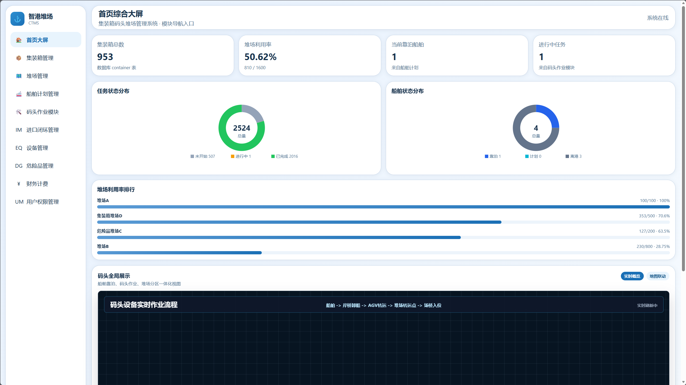

# Container-terminal-management-system
这是我们的信息管理系统课程设计——>集装箱码头堆场管理系统

系统展示

# **团队成员**：

祝秋  后端+前端+数据库

姚一闻  后端

刘景耀  前端

吴亦凡  前端

陈逸隽  数据库
# 系统主要模块
1.集装箱管理模块

2.堆场管理模块

3.船舶计划模块

4.作业任务模块

5.设备调度模块

6.集装箱进出口管理

7.危险品管理

8.财务计费

9.用户权限管理
等等

# 系统框架
前端：三件套

后端：Flask

数据库：Sqlite

# 各个子系统功能展示
## 首页
数字化可视大屏，主要嵌入了一个实时展示的作业展示系统以及码头核心指标

## 集装箱管理模块
主要功能：实现集装箱的增加、删除、更新、查询，纵观所有的集装箱

## 堆场管理模块
主要展示各个堆场的堆存情况，对堆场的编辑、更新等操作

### 智能堆位分配
主要分配规则：

1.危险品优先放置在危险品的堆场内

2.同一艘船优先放置在同一个堆场

3.堆场的利用率要高

堆场刨面图展示：能够查看每个堆场位置的集装箱信息

## 船舶计划模块
包含船舶信息一览、自动安排船舶靠泊计划、自动安排装卸计划、船期导入、作业工作流的查看
### 船舶信息一览

### 自动安排船舶靠泊计划
靠泊规则：贪婪的方法。哪里有泊位，就在哪里靠泊

### 自动安排装卸计划
  

### 船期导入
使用便捷的excel一次性批量导入
  

## 作业任务模块
### 作业大屏幕
主要是作业指标的展示以及实时的作业动态信息
  

### 作业单管理
作业单增、删、改、查
  

### 任务状态
  

## 设备管理/调度模块
主要涉及对码头的岸桥、场桥、AGV等的控制，涉及任务分配、故障处理和维护、任务分配等模块。
  

## 用户管理模块
主要是超级管理员进行用户权限的管理，包括设置权限账号、用户创建等

## 危险品模块
对于码头安全影响较大的危险品进行管理，查看危险集装箱的位置、状态
  

## 集装箱进出口管理
### 放行与预约
主要面向客户进行集装箱提箱操作
  
### 闸口管理
集成了yolo视觉检测模块，减少hc，车辆进行时，识别车牌，从而根据车牌与集装箱提箱预约的关联进行进出闸管理
  
### 异常处理
主要是人工解决进出口闸问题，避免自动识别出问题
  
### 作业记录
记录进出口闸车辆数据、提箱预约数据
  

## 财务计费

