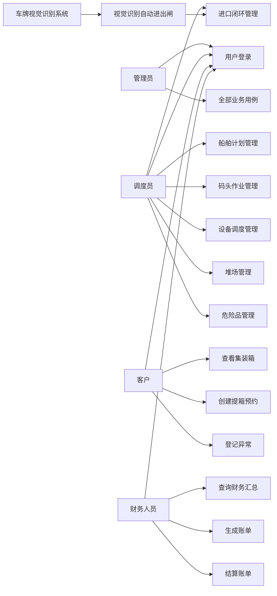
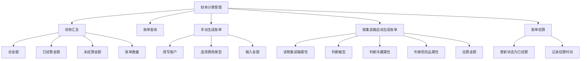
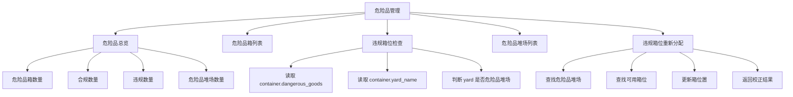
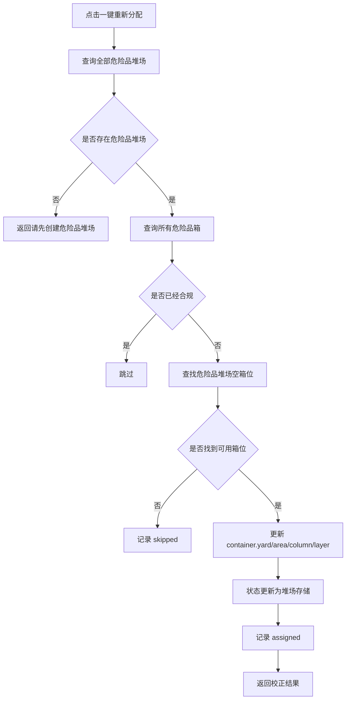
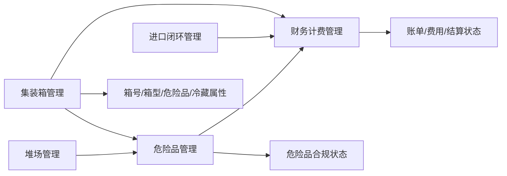

# 集装箱码头管理系统 UC 矩阵与财务计费、危险品管理核心功能分析

## 1. 文档说明

本文档用于补充集装箱码头管理系统的用例分析内容，重点包括：

- 系统参与者分析
- 系统 UC 矩阵
- 各角色与功能模块的关系
- 财务计费管理核心功能
- 危险品管理核心功能
- 财务计费与危险品管理的用例说明
- 两个模块与其他业务模块之间的数据关系

其中 UC 表示 Use Case，即用例。UC 矩阵用于说明不同角色能够参与哪些系统功能，是需求分析和权限设计的重要依据。

## 2. 系统参与者分析

当前系统主要参与者包括：

| 参与者 | 英文/系统角色 | 说明 |
|---|---|---|
| 管理员 | `admin` | 系统最高权限用户，可访问和操作全部模块 |
| 调度员 | `dispatcher` | 负责船舶、作业、设备、堆场、进口闭环、危险品等现场业务调度 |
| 客户 | `operator` / `customer` | 主要查看箱信息、创建提箱预约、登记异常 |
| 财务人员 | `finance` | 负责财务计费、账单生成、账单结算、财务统计 |
| 闸口识别系统 | Vision System | 作为外部智能识别模块，为闸口业务提供车牌号 |
| 后台自动作业线程 | Workflow Worker | 系统内部自动执行船舶卸船、AGV 转运、场桥入堆流程 |

说明：

- 管理员、调度员、客户、财务人员属于直接用户。
- 闸口识别系统和后台自动作业线程属于系统内部或外部辅助参与者。
- UC 矩阵中主要展示直接用户与主要业务用例的关系。

## 3. 系统用例总览

系统主要用例如下：

| 用例编号 | 用例名称 | 所属模块 |
|---|---|---|
| UC-01 | 用户登录 | 用户与权限管理 |
| UC-02 | 查看首页驾驶舱 | 首页驾驶舱 |
| UC-03 | 管理集装箱 | 集装箱管理 |
| UC-04 | 推进集装箱状态 | 集装箱管理 |
| UC-05 | 管理堆场 | 堆场管理 |
| UC-06 | 分配集装箱箱位 | 堆场管理 |
| UC-07 | 按船舶智能分配箱位 | 堆场管理 |
| UC-08 | 管理船舶计划 | 船舶计划 |
| UC-09 | 导入船舶 Excel 清单 | 船舶计划 |
| UC-10 | 启动后台自动作业 | 船舶计划 |
| UC-11 | 管理码头作业单 | 码头作业 |
| UC-12 | 推进作业单状态 | 码头作业 |
| UC-13 | 管理设备 | 设备调度 |
| UC-14 | 分配设备任务 | 设备调度 |
| UC-15 | 自动 AGV 调度 | 设备调度 |
| UC-16 | 海关/商检放行 | 进口闭环 |
| UC-17 | 创建提箱预约 | 进口闭环 |
| UC-18 | 视觉识别自动进出闸 | 进口闭环/车牌识别 |
| UC-19 | 人工备用进出闸 | 进口闭环 |
| UC-20 | 堆场提箱 | 进口闭环 |
| UC-21 | 登记和关闭异常 | 进口闭环 |
| UC-22 | 查询财务汇总 | 财务计费 |
| UC-23 | 生成账单 | 财务计费 |
| UC-24 | 结算账单 | 财务计费 |
| UC-25 | 查询危险品监管总览 | 危险品管理 |
| UC-26 | 危险品违规箱位校正 | 危险品管理 |

## 4. UC 矩阵

符号说明：

| 符号 | 含义 |
|---|---|
| `√` | 该角色可以执行该用例 |
| `△` | 该角色可查看或有限参与 |
| `-` | 该角色无权限或不参与 |

### 4.1 用户角色与用例矩阵

| 用例编号 | 用例名称 | 管理员 | 调度员 | 客户 | 财务人员 |
|---|---|---:|---:|---:|---:|
| UC-01 | 用户登录 | √ | √ | √ | √ |
| UC-02 | 查看首页驾驶舱 | √ | √ | √ | √ |
| UC-03 | 管理集装箱 | √ | △ | △ | △ |
| UC-04 | 推进集装箱状态 | √ | √ | - | - |
| UC-05 | 管理堆场 | √ | △ | - | - |
| UC-06 | 分配集装箱箱位 | √ | √ | - | - |
| UC-07 | 按船舶智能分配箱位 | √ | √ | - | - |
| UC-08 | 管理船舶计划 | √ | √ | △ | - |
| UC-09 | 导入船舶 Excel 清单 | √ | √ | - | - |
| UC-10 | 启动后台自动作业 | √ | √ | - | - |
| UC-11 | 管理码头作业单 | √ | √ | △ | - |
| UC-12 | 推进作业单状态 | √ | √ | - | - |
| UC-13 | 管理设备 | √ | √ | △ | - |
| UC-14 | 分配设备任务 | √ | √ | - | - |
| UC-15 | 自动 AGV 调度 | √ | √ | - | - |
| UC-16 | 海关/商检放行 | √ | √ | - | - |
| UC-17 | 创建提箱预约 | √ | △ | √ | - |
| UC-18 | 视觉识别自动进出闸 | √ | √ | - | - |
| UC-19 | 人工备用进出闸 | √ | √ | - | - |
| UC-20 | 堆场提箱 | √ | √ | - | - |
| UC-21 | 登记和关闭异常 | √ | √ | △ | - |
| UC-22 | 查询财务汇总 | √ | - | - | √ |
| UC-23 | 生成账单 | √ | - | - | √ |
| UC-24 | 结算账单 | √ | - | - | √ |
| UC-25 | 查询危险品监管总览 | √ | √ | - | - |
| UC-26 | 危险品违规箱位校正 | √ | √ | - | - |

说明：

- 管理员拥有全部用例权限。
- 调度员负责码头现场调度类业务，包括船舶、作业、堆场、设备、进口闭环和危险品。
- 客户主要参与提箱预约、箱信息查看和异常登记。
- 财务人员主要参与财务计费和结算。

### 4.2 子系统与用例矩阵

| 子系统 | 对应用例 |
|---|---|
| 用户与权限管理子系统 | UC-01 |
| 首页驾驶舱子系统 | UC-02 |
| 集装箱管理子系统 | UC-03、UC-04 |
| 堆场管理子系统 | UC-05、UC-06、UC-07 |
| 船舶计划管理子系统 | UC-08、UC-09、UC-10 |
| 码头作业管理子系统 | UC-11、UC-12 |
| 设备调度管理子系统 | UC-13、UC-14、UC-15 |
| 进口闭环管理子系统 | UC-16、UC-17、UC-18、UC-19、UC-20、UC-21 |
| 车牌视觉识别子系统 | UC-18 |
| 财务计费管理子系统 | UC-22、UC-23、UC-24 |
| 危险品管理子系统 | UC-25、UC-26 |

### 4.3 数据表与用例矩阵

| 用例 | 主要数据表 |
|---|---|
| 用户登录 | `user` |
| 查看首页驾驶舱 | `container`、`yard`、`ship`、`task`、`equipment` |
| 管理集装箱 | `container`、`yard` |
| 管理堆场 | `yard`、`container` |
| 管理船舶计划 | `ship` |
| 导入船舶清单 | `ship`、`manifest`、`manifest_item`、`container`、`task` |
| 启动后台自动作业 | `ship`、`container`、`task`、`equipment`、`yard` |
| 管理作业单 | `task`、`container`、`equipment` |
| 管理设备 | `equipment`、`task` |
| 进口闭环 | `container`、`customs_release`、`pickup_appointment`、`gate_transaction`、`exception_record`、`task` |
| 财务计费 | `billing_record`、`container`、`pickup_appointment` |
| 危险品管理 | `container`、`yard` |

## 5. UC 关系图



## 6. 财务计费管理核心功能

### 6.1 功能定位

财务计费管理模块用于对码头业务过程中产生的集装箱相关费用进行统一管理，补充系统的业务结算闭环。

该模块面向财务人员和管理员，主要负责：

- 查看财务汇总。
- 查询账单列表。
- 手动创建账单。
- 按集装箱自动生成账单。
- 结算账单。
- 统计未结算账单和已结算账单。

### 6.2 核心功能结构



### 6.3 财务计费用例

#### UC-F01 查询财务汇总

| 项目 | 内容 |
|---|---|
| 用例名称 | 查询财务汇总 |
| 参与者 | 财务人员、管理员 |
| 前置条件 | 用户已登录且具有 `finance:read` 权限 |
| 输入 | 财务汇总查询请求 |
| 处理 | 统计全部账单金额、已结算金额、未结算金额、账单数量、未结算数量 |
| 输出 | 财务汇总数据 |
| 关联接口 | `GET /api/finance/summary` |
| 关联数据表 | `billing_record` |

响应示例：

```json
{
  "totalAmount": 1000.0,
  "settledAmount": 400.0,
  "pendingAmount": 600.0,
  "billCount": 5,
  "pendingCount": 3
}
```

#### UC-F02 查询账单列表

| 项目 | 内容 |
|---|---|
| 用例名称 | 查询账单列表 |
| 参与者 | 财务人员、管理员 |
| 前置条件 | 用户已登录且具有 `finance:read` 权限 |
| 输入 | 查询请求 |
| 处理 | 查询全部账单，按 ID 倒序排列 |
| 输出 | 账单列表 |
| 关联接口 | `GET /api/finance/bills` |
| 关联数据表 | `billing_record`、`container` |

输出字段：

| 字段 | 说明 |
|---|---|
| `billNo` | 账单号 |
| `containerNo` | 箱号 |
| `customer` | 客户 |
| `chargeType` | 费用类型 |
| `amount` | 金额 |
| `status` | 未结算/已结算 |
| `generatedAt` | 生成时间 |
| `settledAt` | 结算时间 |

#### UC-F03 手动创建账单

| 项目 | 内容 |
|---|---|
| 用例名称 | 手动创建账单 |
| 参与者 | 财务人员、管理员 |
| 前置条件 | 用户已登录且具有 `finance:write` 权限 |
| 输入 | 箱号/箱 ID、客户、费用类型、金额、备注 |
| 处理 | 生成账单号，写入账单记录 |
| 输出 | 新账单数据 |
| 关联接口 | `POST /api/finance/bills` |
| 关联数据表 | `billing_record`、`container` |

请求示例：

```json
{
  "containerNo": "MSCU1234567",
  "customer": "客户A",
  "chargeType": "堆存费",
  "amount": 120,
  "remark": "人工生成"
}
```

响应示例：

```json
{
  "message": "账单已生成",
  "data": {
    "billNo": "BILL-20260608120000123",
    "containerNo": "MSCU1234567",
    "customer": "客户A",
    "chargeType": "堆存费",
    "amount": 120.0,
    "status": "未结算"
  }
}
```

#### UC-F04 按集装箱自动生成账单

| 项目 | 内容 |
|---|---|
| 用例名称 | 按集装箱自动生成账单 |
| 参与者 | 财务人员、管理员 |
| 前置条件 | 集装箱存在；用户具有 `finance:write` 权限 |
| 输入 | 集装箱 ID |
| 处理 | 查询箱属性，判断费用类型，估算金额，生成账单 |
| 输出 | 自动账单 |
| 关联接口 | `POST /api/finance/generate/container/{container_id}` |
| 关联数据表 | `billing_record`、`container`、`pickup_appointment` |

自动计费规则：

| 条件 | 金额规则 |
|---|---|
| 普通堆存费 | 基础金额 120 |
| 危险品附加费 | 基础金额 260 |
| 40 尺箱 | 基础金额 × 1.6 |
| 冷藏箱 | 额外增加 80 |
| 危险品箱 | 额外增加 180 |

系统处理逻辑：

```text
读取 container
  -> 判断是否已有账单
  -> 根据危险品属性确定费用类型
  -> 根据箱型、冷藏、危险品属性估算金额
  -> 写入 billing_record
```

#### UC-F05 结算账单

| 项目 | 内容 |
|---|---|
| 用例名称 | 结算账单 |
| 参与者 | 财务人员、管理员 |
| 前置条件 | 账单存在；用户具有 `finance:write` 权限 |
| 输入 | 账单 ID |
| 处理 | 将账单状态更新为 `已结算`，记录结算时间 |
| 输出 | 结算后的账单 |
| 关联接口 | `PUT /api/finance/bills/{bill_id}/settle` |
| 关联数据表 | `billing_record` |

响应示例：

```json
{
  "message": "账单已结算",
  "data": {
    "billNo": "BILL-20260608120000123",
    "status": "已结算",
    "settledAt": "2026-06-08 12:30:00"
  }
}
```

### 6.4 财务计费模块输入、处理、输出

| 输入 | 处理 | 输出 |
|---|---|---|
| 财务汇总请求 | 汇总账单金额和数量 | 总金额、已结算金额、未结算金额 |
| 账单查询请求 | 查询 billing_record | 账单列表 |
| 箱号/箱 ID、客户、费用类型、金额 | 创建账单 | 新账单 |
| 集装箱 ID | 自动估算费用 | 自动生成账单 |
| 账单 ID | 更新状态为已结算 | 结算结果 |

### 6.5 财务计费模块业务价值

财务计费模块的主要价值：

1. 将码头业务从“作业完成”延伸到“费用结算”。
2. 为财务人员提供独立工作入口。
3. 支持人工计费和自动计费两种方式。
4. 可以根据危险品、冷藏、箱型差异进行费用估算。
5. 支持未结算账单统计，便于财务跟进。

## 7. 危险品管理核心功能

### 7.1 功能定位

危险品管理模块用于对危险品集装箱进行安全合规监管，确保危险品箱必须存放在危险品堆场中，避免普通堆场混放危险品箱造成安全风险。

该模块面向调度员和管理员，主要负责：

- 查询危险品箱总数。
- 查询危险品堆场数量。
- 判断危险品箱是否合规存放。
- 统计违规危险品箱。
- 一键将违规危险品箱重新分配到危险品堆场。

### 7.2 核心功能结构



### 7.3 危险品管理用例

#### UC-D01 查询危险品监管总览

| 项目 | 内容 |
|---|---|
| 用例名称 | 查询危险品监管总览 |
| 参与者 | 调度员、管理员 |
| 前置条件 | 用户已登录且具有 `dangerous:read` 权限 |
| 输入 | 查询请求 |
| 处理 | 查询危险品箱、危险品堆场，判断合规状态 |
| 输出 | 危险品统计、危险品箱列表、违规箱列表、危险品堆场列表 |
| 关联接口 | `GET /api/dangerous/overview` |
| 关联数据表 | `container`、`yard` |

响应示例：

```json
{
  "stats": {
    "dangerousCount": 10,
    "compliantCount": 8,
    "violationCount": 2,
    "dangerousYardCount": 1
  },
  "containers": [],
  "violations": [],
  "dangerousYards": []
}
```

#### UC-D02 危险品违规箱位校正

| 项目 | 内容 |
|---|---|
| 用例名称 | 危险品违规箱位校正 |
| 参与者 | 调度员、管理员 |
| 前置条件 | 用户已登录且具有 `dangerous:write` 权限；系统存在危险品堆场 |
| 输入 | 一键校正请求 |
| 处理 | 查询违规危险品箱，查找危险品堆场可用箱位，更新箱位置 |
| 输出 | 已校正数量、跳过数量、校正明细、跳过原因 |
| 关联接口 | `POST /api/dangerous/reassign` |
| 关联数据表 | `container`、`yard` |

响应示例：

```json
{
  "message": "危险品箱位校正完成，已调整 2 个",
  "assignedCount": 2,
  "skippedCount": 0,
  "assigned": [],
  "skipped": []
}
```

失败响应：

```json
{
  "message": "暂无危险品堆场，请先在堆场管理中创建危险品堆场"
}
```

### 7.4 危险品合规判断规则

危险品箱判断：

```text
container.is_dangerous = true
```

危险品堆场判断：

```text
yard.yard_name 或 yard.usage_type 中包含“危险”
```

合规条件：

```text
危险品箱所在堆场是危险品堆场
```

违规条件：

```text
危险品箱没有堆场
或危险品箱所在堆场不是危险品堆场
或危险品箱没有有效区域/列/层
```

### 7.5 危险品校正处理流程



### 7.6 危险品管理模块输入、处理、输出

| 输入 | 处理 | 输出 |
|---|---|---|
| 危险品总览查询请求 | 查询危险品箱和危险品堆场 | 统计数据 |
| 危险品箱位置 | 判断是否处于危险品堆场 | 合规或违规 |
| 一键校正请求 | 查找危险品堆场空箱位 | 校正结果 |
| 无危险品堆场 | 终止校正 | 错误提示 |
| 危险品堆场无可用箱位 | 跳过该箱 | skipped 明细 |

### 7.7 危险品管理模块业务价值

危险品管理模块的主要价值：

1. 强化码头危险品安全监管能力。
2. 避免危险品箱与普通箱混放。
3. 自动发现违规箱位，降低人工检查成本。
4. 支持一键重新分配，提高调度处理效率。
5. 与堆场管理、集装箱管理形成联动，保证新增、修改、分配过程中的安全约束。

## 8. 财务计费与危险品管理的模块协同

财务计费和危险品管理并不是孤立模块，它们都与集装箱基础数据紧密关联。

### 8.1 协同关系图



### 8.2 协同说明

| 来源模块 | 目标模块 | 传递数据 | 作用 |
|---|---|---|---|
| 集装箱管理 | 危险品管理 | 危险品标志、堆场位置 | 判断危险品箱是否合规 |
| 堆场管理 | 危险品管理 | 堆场名称、堆场类型、可用箱位 | 查找危险品堆场和可用箱位 |
| 集装箱管理 | 财务计费 | 箱型、危险品、冷藏属性 | 自动估算费用 |
| 进口闭环管理 | 财务计费 | 客户、预约、提箱状态 | 获取客户并生成账单 |
| 危险品管理 | 财务计费 | 危险品属性 | 影响危险品附加费 |

## 9. 财务计费与危险品管理 UC 总表

| 用例编号 | 用例名称 | 参与者 | 输入 | 处理 | 输出 |
|---|---|---|---|---|---|
| UC-F01 | 查询财务汇总 | 财务人员、管理员 | 查询请求 | 汇总账单金额和数量 | 总金额、已结算、未结算 |
| UC-F02 | 查询账单列表 | 财务人员、管理员 | 查询请求 | 查询账单表 | 账单列表 |
| UC-F03 | 手动创建账单 | 财务人员、管理员 | 客户、费用类型、金额 | 写入账单记录 | 新账单 |
| UC-F04 | 自动生成账单 | 财务人员、管理员 | 集装箱 ID | 读取箱属性并估算金额 | 自动账单 |
| UC-F05 | 结算账单 | 财务人员、管理员 | 账单 ID | 更新状态和结算时间 | 已结算账单 |
| UC-D01 | 查询危险品总览 | 调度员、管理员 | 查询请求 | 判断危险品箱合规性 | 统计和违规列表 |
| UC-D02 | 危险品违规校正 | 调度员、管理员 | 校正请求 | 分配到危险品堆场 | 校正结果 |

## 10. 总结

UC 矩阵展示了当前系统中不同角色与功能用例之间的关系。管理员拥有全部功能权限，调度员负责现场作业和安全监管，客户主要参与预约和查询，财务人员负责账单和结算。

财务计费管理模块补充了系统的结算能力，使码头业务能够从作业执行延伸到账单生成和财务闭环。

危险品管理模块补充了系统的安全合规能力，使危险品箱能够被识别、检查和自动纠偏，避免危险品箱进入普通堆场。

两个模块共同增强了系统的完整性：

```text
危险品管理保障安全合规
财务计费管理保障费用结算
```

它们与集装箱管理、堆场管理、进口闭环管理共同形成了更加完整的码头管理业务体系。

