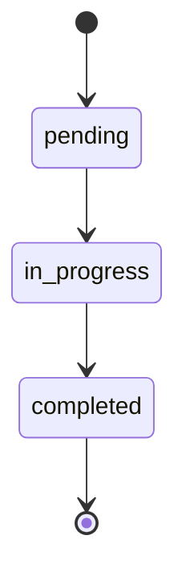
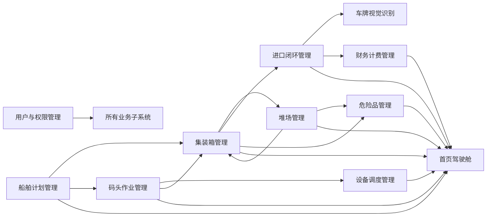

# 集装箱码头管理系统子系统与功能模块分析

## 1. 文档说明

本文档用于对集装箱码头管理系统进行子系统划分和功能模块分析，说明系统由哪些子系统构成，各子系统承担什么职责，子系统内部包含哪些功能模块，以及各模块之间如何协同完成码头业务闭环。

本文档适用于课程设计报告中的以下章节：

- 系统功能结构分析
- 子系统划分
- 功能模块设计
- 模块职责说明
- 模块间关系分析
- 系统业务协同分析

配套文档：

```text
系统操作说明与接口响应总览.md
系统模块输入处理输出设计图表.md
数据流程分析图_ER图_数据字典与数据库表设计.md
进口闭环闸口IO接口设计与操作说明.md
系统架构与核心设计分析报告.md
```

## 2. 系统总体功能定位

本系统面向集装箱码头日常业务管理，围绕船舶靠港、集装箱卸船、设备调度、堆场入堆、进口提箱、闸口进出、危险品监管和财务计费等业务，构建一套综合管理信息系统。

系统核心目标：

1. 实现集装箱基础信息统一管理。
2. 实现船舶计划和船舶清单导入管理。
3. 实现卸船、转运、入堆、提箱等作业单流程管理。
4. 实现岸桥、场桥、AGV 等设备调度管理。
5. 实现堆场与箱位分配管理。
6. 实现进口箱放行、预约、进闸、提箱、出闸闭环管理。
7. 实现基于 YOLOv5 + LPRNet 的车牌视觉识别自动闸口。
8. 实现危险品箱专用堆场监管。
9. 实现财务计费和账单结算。
10. 实现用户角色权限控制，保证不同角色访问不同功能。

## 3. 子系统划分

根据系统业务边界和功能职责，可将系统划分为以下子系统：

| 序号 | 子系统 | 主要职责 |
|---|---|---|
| 1 | 用户与权限管理子系统 | 负责登录认证、角色权限、页面访问和接口访问控制 |
| 2 | 首页驾驶舱子系统 | 负责系统 KPI、堆场利用率、设备状态、任务状态等总览展示 |
| 3 | 集装箱管理子系统 | 负责集装箱基础信息、状态、属性和位置管理 |
| 4 | 船舶计划管理子系统 | 负责船舶计划维护、Excel 清单导入和后台自动作业 |
| 5 | 堆场管理子系统 | 负责堆场基础信息、箱位分配和智能分配 |
| 6 | 码头作业管理子系统 | 负责作业单创建、编辑、状态推进和作业顺序控制 |
| 7 | 设备调度管理子系统 | 负责岸桥、场桥、AGV 设备维护和任务分配 |
| 8 | 进口闭环管理子系统 | 负责放行、预约、闸口、提箱、异常闭环 |
| 9 | 车牌视觉识别子系统 | 负责车牌检测、车牌识别和闸口自动识别输入 |
| 10 | 财务计费管理子系统 | 负责账单生成、账单查询、自动计费和结算 |
| 11 | 危险品管理子系统 | 负责危险品箱合规检查和危险品堆场纠偏 |

## 4. 系统功能结构图

```mermaid
flowchart TD
    A[集装箱码头管理系统]

    A --> B[用户与权限管理子系统]
    A --> C[首页驾驶舱子系统]
    A --> D[集装箱管理子系统]
    A --> E[船舶计划管理子系统]
    A --> F[堆场管理子系统]
    A --> G[码头作业管理子系统]
    A --> H[设备调度管理子系统]
    A --> I[进口闭环管理子系统]
    A --> J[车牌视觉识别子系统]
    A --> K[财务计费管理子系统]
    A --> L[危险品管理子系统]

    B --> B1[登录认证]
    B --> B2[角色管理]
    B --> B3[页面权限]
    B --> B4[接口权限]

    C --> C1[KPI 统计]
    C --> C2[堆场使用率]
    C --> C3[任务状态统计]
    C --> C4[设备状态统计]
    C --> C5[船舶状态统计]

    D --> D1[箱信息维护]
    D --> D2[箱状态流转]
    D --> D3[箱位信息维护]
    D --> D4[危险品/冷藏属性维护]

    E --> E1[船舶计划维护]
    E --> E2[Excel 清单导入]
    E --> E3[舱单明细生成]
    E --> E4[自动卸船入堆流程]

    F --> F1[堆场维护]
    F --> F2[箱位校验]
    F --> F3[指定箱位分配]
    F --> F4[按船舶智能分配]

    G --> G1[作业单维护]
    G --> G2[作业状态推进]
    G --> G3[作业顺序校验]
    G --> G4[箱状态同步]

    H --> H1[设备维护]
    H --> H2[设备任务分配]
    H --> H3[AGV 自动调度]
    H --> H4[故障与维修]

    I --> I1[海关放行]
    I --> I2[提箱预约]
    I --> I3[进闸处理]
    I --> I4[堆场提箱]
    I --> I5[出闸处理]
    I --> I6[异常闭环]

    J --> J1[图片上传]
    J --> J2[YOLOv5 车牌检测]
    J --> J3[LPRNet 车牌识别]
    J --> J4[车牌号输出]

    K --> K1[财务汇总]
    K --> K2[账单生成]
    K --> K3[自动计费]
    K --> K4[账单结算]

    L --> L1[危险品箱统计]
    L --> L2[违规箱位检查]
    L --> L3[危险品堆场校正]
```



## 5. 用户与权限管理子系统

### 5.1 子系统职责

用户与权限管理子系统负责系统登录认证、用户角色识别、页面访问控制和接口操作权限控制，是整个系统的安全入口。

该子系统保证：

- 未登录用户不能访问业务接口。
- 不同角色只能访问授权页面。
- 不同角色只能执行授权操作。
- 前端菜单根据角色动态展示。
- 后端接口仍进行二次校验，防止越权调用接口。

### 5.2 功能模块划分

| 功能模块 | 功能说明 |
|---|---|
| 登录认证模块 | 校验用户名和密码，登录成功后写入 session |
| 当前用户模块 | 返回当前登录用户、角色、权限、可访问页面 |
| 退出登录模块 | 清空 session，退出系统 |
| 页面权限模块 | 根据角色限制可访问页面 |
| 接口权限模块 | 根据角色限制接口操作 |
| 默认用户初始化模块 | 系统启动时初始化默认账号 |

### 5.3 角色设计

| 角色 | 角色值 | 默认账号 | 默认密码 | 功能定位 |
|---|---|---|---|---|
| 管理员 | `admin` | `admin01` | `admin123` | 系统最高权限，管理所有模块 |
| 调度员 | `dispatcher` | `dispatcher01` | `disp123` | 管理船舶、作业、设备、进口、危险品 |
| 客户 | `operator` | `customer01` | `cust123` | 查看箱信息，创建预约，登记异常 |
| 财务人员 | `finance` | `finance01` | `fin123` | 查看箱信息，处理账单和结算 |

### 5.4 输入、处理、输出

| 输入 | 处理 | 输出 |
|---|---|---|
| 用户名、密码 | 查询用户表，校验账号密码 | 登录成功或失败 |
| 访问页面路径 | 判断当前角色是否具备页面权限 | 允许访问或重定向首页 |
| 接口请求路径和方法 | 判断当前角色是否具备接口权限 | 允许执行或返回 403 |
| 当前 session | 查询当前用户信息 | 用户信息、权限列表、页面列表 |

### 5.5 关联接口

| 接口 | 方法 | 功能 |
|---|---|---|
| `/api/auth/login` | POST | 登录 |
| `/api/user/login` | POST | 兼容旧登录接口 |
| `/api/auth/me` | GET | 获取当前用户 |
| `/api/auth/logout` | POST | 退出登录 |

## 6. 首页驾驶舱子系统

### 6.1 子系统职责

首页驾驶舱子系统用于集中展示码头运行状态，是系统的总览入口。它从集装箱、堆场、船舶、作业单、设备等多个业务表中汇总数据，形成 KPI、统计图表和码头地图展示。

### 6.2 功能模块划分

| 功能模块 | 功能说明 |
|---|---|
| KPI 指标模块 | 展示箱总数、船舶数、任务数、设备数等 |
| 堆场统计模块 | 展示堆场容量、已用容量、使用率 |
| 船舶统计模块 | 统计计划中、已靠泊、已离港船舶 |
| 作业统计模块 | 统计未开始、进行中、已完成任务 |
| 设备统计模块 | 统计空闲、工作中、故障设备 |
| 地图展示模块 | 在首页码头地图中展示堆场、设备、船舶、集装箱概况 |

### 6.3 输入、处理、输出

| 输入 | 处理 | 输出 |
|---|---|---|
| 统计请求 | 查询多个业务表 | 首页 KPI |
| 集装箱数据 | 按箱型、状态统计 | 箱型分布 |
| 堆场数据 | 计算堆场使用率 | 堆场容量图 |
| 任务数据 | 按状态统计 | 作业状态图 |
| 设备数据 | 按状态统计 | 设备状态图 |
| 船舶数据 | 按状态统计 | 船舶状态图 |

### 6.4 关联接口

| 接口 | 方法 | 功能 |
|---|---|---|
| `/api/dashboard/stats` | GET | 获取首页统计数据 |

## 7. 集装箱管理子系统

### 7.1 子系统职责

集装箱管理子系统是整个系统的基础数据中心，用于维护集装箱的基础属性、业务状态、堆场位置和特殊属性。

集装箱是系统核心实体，船舶计划、堆场分配、码头作业、进口闭环、财务计费和危险品管理都围绕集装箱展开。

### 7.2 功能模块划分

| 功能模块 | 功能说明 |
|---|---|
| 集装箱查询模块 | 查询全部集装箱或单个集装箱 |
| 集装箱新增模块 | 新增箱号、箱型、重空、危险品、冷藏等基础信息 |
| 集装箱编辑模块 | 修改箱属性、箱状态、箱位、放行状态等 |
| 集装箱删除模块 | 删除指定集装箱 |
| 状态流转模块 | 推进箱状态，例如在船上到已卸船、转运中、堆场存储等 |
| 箱位更新模块 | 修改集装箱所在堆场、区域、列、层 |
| 危险品校验模块 | 防止危险品箱放入普通堆场，防止普通箱放入危险品堆场 |

### 7.3 主要业务状态

| 状态 | 含义 |
|---|---|
| 在船上 | 集装箱尚未卸船 |
| 已卸船 | 岸桥卸船完成 |
| 转运中 | AGV 正在转运 |
| 堆场存储 | 箱已进入堆场 |
| 等待提箱 | 箱已可预约或等待客户提箱 |
| 已装车待出闸 | 堆场提箱完成，等待出闸 |
| 离港 | 出闸完成 |

### 7.4 输入、处理、输出

| 输入 | 处理 | 输出 |
|---|---|---|
| 箱号、箱型 | 校验必填和唯一性 | 新增结果 |
| 重空、危险品、冷藏属性 | 写入箱属性 | 箱属性数据 |
| 堆场、区域、列、层 | 更新箱位 | 新箱位信息 |
| 当前状态 | 根据状态流转表计算下一状态 | 状态更新结果 |
| 危险品标志和堆场类型 | 校验危险品存放规则 | 允许保存或返回错误 |

### 7.5 关联接口

| 接口 | 方法 | 功能 |
|---|---|---|
| `/containers` | GET | 查询全部集装箱 |
| `/containers` | POST | 新增集装箱 |
| `/containers/{id}` | GET | 查询单个集装箱 |
| `/containers/{id}` | PUT | 修改集装箱 |
| `/containers/{id}` | DELETE | 删除集装箱 |
| `/containers/{id}/location` | PUT | 更新箱位 |
| `/containers/{id}/next_status` | PUT | 推进箱状态 |

## 8. 船舶计划管理子系统

### 8.1 子系统职责

船舶计划管理子系统用于维护船舶到港计划、导入船舶集装箱清单，并支持启动后台自动卸船入堆作业。

该子系统是码头作业的业务起点。船舶清单导入后，系统会生成船舶、集装箱、舱单记录和卸船任务，为后续作业调度提供数据基础。

### 8.2 功能模块划分

| 功能模块 | 功能说明 |
|---|---|
| 船舶查询模块 | 查询全部船舶计划 |
| 船舶新增模块 | 新增船名、航次、ETA、ETD、泊位 |
| 船舶编辑模块 | 修改船舶计划信息 |
| 船舶删除模块 | 删除船舶计划 |
| Excel 清单导入模块 | 解析 `.xlsx` 船舶清单，生成箱和任务 |
| 舱单记录模块 | 保存导入批次和导入明细 |
| 后台自动作业模块 | 模拟岸桥卸船、AGV 转运、场桥入堆流程 |
| 作业状态查询模块 | 查询后台自动作业进度 |

### 8.3 船舶自动作业流程


### 8.4 输入、处理、输出

| 输入 | 处理 | 输出 |
|---|---|---|
| 船名、航次、ETA、ETD、泊位 | 新增或修改船舶 | 船舶计划数据 |
| Excel 清单文件 | 解析表头和行数据 | 导入结果 |
| 箱号、箱型、危险品、冷藏等清单字段 | 创建或更新集装箱 | 集装箱数据 |
| 自动作业启动请求 | 启动后台线程 | 作业状态 |
| 作业状态查询请求 | 读取内存中的作业状态 | 当前进度和阶段 |

### 8.5 关联接口

| 接口 | 方法 | 功能 |
|---|---|---|
| `/ships` | GET | 查询船舶 |
| `/ships` | POST | 新增船舶 |
| `/ships/{id}` | PUT | 修改船舶 |
| `/ships/{id}` | DELETE | 删除船舶 |
| `/ships/import_manifest` | POST | 导入船舶清单 |
| `/ships/{id}/workflow` | POST | 启动后台自动作业 |
| `/ships/{id}/workflow/status` | GET | 查询自动作业状态 |

## 9. 堆场管理子系统

### 9.1 子系统职责

堆场管理子系统负责堆场基础信息维护、箱位合法性校验、集装箱入堆分配和按船舶批量智能分配。

该子系统直接影响码头堆场资源利用率和危险品箱安全合规。

### 9.2 功能模块划分

| 功能模块 | 功能说明 |
|---|---|
| 堆场查询模块 | 查询堆场列表、容量和使用率 |
| 堆场新增模块 | 创建普通堆场、进口堆场、危险品堆场等 |
| 堆场编辑模块 | 修改堆场名称、类型、容量、负责人等 |
| 堆场删除模块 | 删除空堆场 |
| 指定箱位分配模块 | 将指定集装箱放入指定堆场箱位 |
| 箱位占用校验模块 | 防止同一箱位重复存放未离港集装箱 |
| 智能分配模块 | 按船舶批量分配箱位 |
| 危险品堆场约束模块 | 危险品箱只能进入危险品堆场 |

### 9.3 智能分配规则

| 集装箱类型 | 优先分配堆场 |
|---|---|
| 危险品箱 | 危险品堆场 |
| 冷藏箱 | 冷藏堆场 |
| 重箱 | 进口箱堆场或综合堆场 |
| 空箱 | 出口箱堆场或综合堆场 |

### 9.4 输入、处理、输出

| 输入 | 处理 | 输出 |
|---|---|---|
| 堆场名称、类型、容量 | 保存堆场 | 堆场数据 |
| 集装箱 ID 和目标箱位 | 校验堆场、箱位、占用和危险品规则 | 分配结果 |
| 船舶 ID | 查询该船未离港箱并批量分配 | 智能分配结果 |
| 删除堆场请求 | 判断堆场是否仍有箱占用 | 删除成功或失败 |

### 9.5 关联接口

| 接口 | 方法 | 功能 |
|---|---|---|
| `/yards` | GET | 查询堆场 |
| `/yards` | POST | 新增堆场 |
| `/yards/{id}` | PUT | 修改堆场 |
| `/yards/{id}` | DELETE | 删除堆场 |
| `/yards/assign` | POST | 指定箱位分配 |
| `/yards/smart_assign_ship` | POST | 按船舶智能分配 |

## 10. 码头作业管理子系统

### 10.1 子系统职责

码头作业管理子系统用于管理岸桥卸船、AGV 转运、场桥入堆、堆场提箱等作业任务。它负责作业单的创建、修改、删除和状态推进，并通过作业规则控制集装箱状态不能跳跃。

### 10.2 功能模块划分

| 功能模块 | 功能说明 |
|---|---|
| 作业单查询模块 | 查询全部作业单 |
| 作业单新增模块 | 新增作业任务 |
| 作业单编辑模块 | 修改作业类型、起点、终点、状态等 |
| 作业单删除模块 | 删除作业单 |
| 作业状态推进模块 | pending -> in-progress -> completed |
| 作业顺序校验模块 | 防止未完成前置作业就执行后续作业 |
| 集装箱状态同步模块 | 作业完成后同步更新集装箱状态和位置 |

### 10.3 作业单生命周期



### 10.4 输入、处理、输出

| 输入 | 处理 | 输出 |
|---|---|---|
| 作业名称、箱号、起点、终点 | 创建作业单 | 作业单数据 |
| 作业状态推进请求 | 校验任务流转 | 新任务状态 |
| completed 状态 | 同步箱状态和设备状态 | 箱状态、设备状态变化 |
| 删除请求 | 删除任务记录 | 删除结果 |

### 10.5 关联接口

| 接口 | 方法 | 功能 |
|---|---|---|
| `/tasks` | GET | 查询作业单 |
| `/tasks` | POST | 新增作业单 |
| `/tasks/{id}` | PUT | 修改作业单 |
| `/tasks/{id}/next_status` | PUT | 推进作业状态 |
| `/tasks/{id}` | DELETE | 删除作业单 |

## 11. 设备调度管理子系统

### 11.1 子系统职责

设备调度管理子系统负责岸桥、场桥、AGV 等码头设备的基础信息维护、任务分配、自动调度、故障处理和维修恢复。

该子系统和作业单模块紧密关联，设备被分配任务后，任务进入进行中状态；设备释放后，任务完成并同步集装箱状态。

### 11.2 功能模块划分

| 功能模块 | 功能说明 |
|---|---|
| 设备查询模块 | 查询设备列表 |
| 设备统计模块 | 统计设备状态和类型分布 |
| 设备新增模块 | 新增岸桥、场桥、AGV |
| 设备编辑模块 | 修改设备基础信息 |
| 设备删除模块 | 删除非工作中设备 |
| 任务分配模块 | 将设备分配给作业单 |
| AGV 自动调度模块 | 自动将空闲 AGV 分配给 AGV 转运任务 |
| 设备释放模块 | 任务完成后释放设备 |
| 故障标记模块 | 标记设备故障并退回任务 |
| 维修恢复模块 | 将故障设备恢复为空闲 |

### 11.3 设备类型与作业匹配

| 作业类型关键词 | 匹配设备 |
|---|---|
| 岸桥、卸船、泊位 | 岸桥 |
| AGV、转运、运送 | AGV |
| 场桥、入堆、堆场 | 场桥 |

### 11.4 输入、处理、输出

| 输入 | 处理 | 输出 |
|---|---|---|
| 设备编号、名称、类型 | 校验并保存设备 | 设备数据 |
| 设备 ID 和任务 ID | 校验设备状态、任务状态、类型匹配 | 分配结果 |
| AGV 调度请求 | 查询空闲 AGV 和待分配 AGV 任务 | 自动调度结果 |
| 故障备注 | 标记设备故障，释放任务 | 故障结果 |
| 维修请求 | 恢复设备空闲 | 维修结果 |

### 11.5 关联接口

| 接口 | 方法 | 功能 |
|---|---|---|
| `/equipment` | GET | 查询设备 |
| `/equipment/summary` | GET | 查询设备统计 |
| `/equipment` | POST | 新增设备 |
| `/equipment/{id}` | PUT | 修改设备 |
| `/equipment/{id}` | DELETE | 删除设备 |
| `/equipment/{id}/assign_task` | POST | 分配任务 |
| `/equipment/agv_dispatch` | POST | 自动 AGV 调度 |
| `/equipment/{id}/release` | POST | 释放设备 |
| `/equipment/{id}/fault` | POST | 标记故障 |
| `/equipment/{id}/repair` | POST | 维修恢复 |

## 12. 进口闭环管理子系统

### 12.1 子系统职责

进口闭环管理子系统负责进口集装箱从海关放行、提箱预约、闸口进闸、堆场提箱、闸口出闸到异常处理的完整业务闭环。

该子系统是系统中业务链路最完整的模块之一，连接了集装箱、预约、闸口、异常、作业单和财务计费等多个对象。

### 12.2 功能模块划分

| 功能模块 | 功能说明 |
|---|---|
| 进口总览模块 | 展示在场箱、已放行箱、有效预约、未关闭异常等 |
| 海关放行模块 | 更新海关/商检放行状态 |
| 提箱预约模块 | 创建预约，绑定箱号、车牌、司机、客户和时间窗 |
| 预约取消模块 | 取消未进闸预约并释放箱锁定 |
| 视觉自动闸口模块 | 上传图片，识别车牌，自动进闸或出闸 |
| 人工备用闸口模块 | 自动识别失败时人工输入信息进出闸 |
| 堆场提箱模块 | 车辆进闸后完成堆场提箱 |
| 异常登记模块 | 登记车牌不符、超窗、监管未放行等异常 |
| 异常闭环模块 | 关闭异常并记录处理结果 |
| 闸口记录模块 | 记录每次进闸、出闸和拦截 |

### 12.3 进口闭环状态流转


### 12.4 输入、处理、输出

| 输入 | 处理 | 输出 |
|---|---|---|
| 放行状态 | 更新放行记录和箱放行状态 | 放行结果 |
| 预约信息 | 校验箱状态和放行状态，创建预约 | 预约单 |
| 闸口图片 | 调用车牌识别模块 | 识别车牌 |
| 车牌号 | 匹配预约单 | 预约匹配结果 |
| 进闸请求 | 校验预约状态、车牌、箱号、时间窗 | 进闸通过或拦截 |
| 提箱请求 | 校验车辆是否已进闸 | 提箱任务和状态变化 |
| 出闸请求 | 校验是否已提箱 | 出闸通过或拦截 |
| 异常信息 | 写入异常记录 | 异常闭环数据 |

### 12.5 关联接口

| 接口 | 方法 | 功能 |
|---|---|---|
| `/api/import/overview` | GET | 进口闭环总览 |
| `/api/import/containers/pickup-ready` | GET | 查询可预约箱 |
| `/api/import/customs/release` | POST | 更新放行状态 |
| `/api/import/appointments` | POST | 创建预约 |
| `/api/import/appointments/{id}/cancel` | PUT | 取消预约 |
| `/api/import/appointments/{id}/pickup` | POST | 堆场提箱 |
| `/api/import/gate/vision` | POST | 视觉识别自动闸口 |
| `/api/import/gate/in` | POST | 人工进闸 |
| `/api/import/gate/out` | POST | 人工出闸 |
| `/api/import/exceptions` | POST | 登记异常 |
| `/api/import/exceptions/{id}/resolve` | PUT | 关闭异常 |

## 13. 车牌视觉识别子系统

### 13.1 子系统职责

车牌视觉识别子系统负责闸口图片中的车牌检测和字符识别，为进口闭环自动进出闸提供车牌输入。

该子系统采用：

- YOLOv5：检测车牌区域。
- LPRNet：识别车牌字符。

系统只识别车牌号，不识别集装箱号。集装箱号由预约单中绑定的信息提供。

### 13.2 功能模块划分

| 功能模块 | 功能说明 |
|---|---|
| 图片上传模块 | 接收闸口图片并保存 |
| 中文路径兼容读取模块 | 使用 `np.fromfile` + `cv2.imdecode` 读取中文路径图片 |
| YOLOv5 检测模块 | 定位车牌区域 |
| 车牌裁剪模块 | 裁剪检测到的车牌区域 |
| LPRNet 识别模块 | 识别车牌字符 |
| 车牌规范化模块 | 去除非法字符并统一大小写 |
| 识别失败处理模块 | 返回检测失败、识别失败、图片解码失败等原因 |

### 13.3 输入、处理、输出

| 输入 | 处理 | 输出 |
|---|---|---|
| 闸口图片 | 保存图片 | 图片路径 |
| 图片路径 | 兼容中文路径读取 | OpenCV 图像对象 |
| 图像对象 | YOLOv5 检测车牌区域 | 车牌框 |
| 车牌框 | 裁剪并缩放 | 车牌图片 |
| 车牌图片 | LPRNet 字符识别 | 车牌号 |
| 车牌号 | 匹配预约单 | 自动闸口处理 |

### 13.4 关联文件和模型

| 项目 | 路径或说明 |
|---|---|
| 识别适配器 | `Management/Container/license_plate_recognizer.py` |
| YOLOv5 权重 | `detect/.../weights/yolov5_best.pt` |
| LPRNet 权重 | `detect/.../weights/lprnet_best.pth` |
| 调用接口 | `/api/import/gate/vision` |

## 14. 财务计费管理子系统

### 14.1 子系统职责

财务计费管理子系统用于对集装箱相关费用进行账单生成、账单查询、财务汇总和结算处理，补充码头业务的财务闭环。

### 14.2 功能模块划分

| 功能模块 | 功能说明 |
|---|---|
| 财务汇总模块 | 统计总金额、已结算金额、未结算金额 |
| 账单查询模块 | 查询全部账单 |
| 手动账单模块 | 手动输入客户、费用类型、金额生成账单 |
| 自动计费模块 | 根据集装箱属性自动估算费用 |
| 账单结算模块 | 将账单状态更新为已结算 |

### 14.3 计费规则

| 条件 | 金额规则 |
|---|---|
| 普通堆存费 | 基础金额 120 |
| 危险品附加费 | 基础金额 260 |
| 40 尺箱 | 基础金额乘以 1.6 |
| 冷藏箱 | 额外增加 80 |
| 危险品箱 | 额外增加 180 |

### 14.4 输入、处理、输出

| 输入 | 处理 | 输出 |
|---|---|---|
| 集装箱 ID 或箱号 | 查询箱信息 | 计费对象 |
| 客户、费用类型、金额 | 创建账单 | 账单记录 |
| 未输入金额 | 自动估算金额 | 自动费用 |
| 结算请求 | 更新状态和结算时间 | 结算结果 |
| 汇总请求 | 统计账单金额 | 财务汇总 |

### 14.5 关联接口

| 接口 | 方法 | 功能 |
|---|---|---|
| `/api/finance/summary` | GET | 财务汇总 |
| `/api/finance/bills` | GET | 查询账单 |
| `/api/finance/bills` | POST | 创建账单 |
| `/api/finance/bills/{id}/settle` | PUT | 结算账单 |
| `/api/finance/generate/container/{container_id}` | POST | 按集装箱生成账单 |

## 15. 危险品管理子系统

### 15.1 子系统职责

危险品管理子系统负责对危险品集装箱进行安全监管，检查危险品箱是否存放在危险品堆场，并提供一键重新分配功能。

该子系统强化了码头业务中的安全合规管理。

### 15.2 功能模块划分

| 功能模块 | 功能说明 |
|---|---|
| 危险品箱统计模块 | 统计危险品箱数量 |
| 危险品堆场统计模块 | 统计危险品堆场数量 |
| 合规检查模块 | 判断危险品箱是否位于危险品堆场 |
| 违规列表模块 | 输出违规危险品箱 |
| 违规纠偏模块 | 将违规危险品箱重新分配到危险品堆场 |

### 15.3 输入、处理、输出

| 输入 | 处理 | 输出 |
|---|---|---|
| 查询请求 | 查询危险品箱和危险品堆场 | 危险品总览 |
| 危险品箱位置 | 判断是否在危险品堆场 | 合规或违规 |
| 重新分配请求 | 查找危险品堆场空箱位 | 校正结果 |
| 无危险品堆场 | 返回错误提示 | 要求先创建危险品堆场 |

### 15.4 关联接口

| 接口 | 方法 | 功能 |
|---|---|---|
| `/api/dangerous/overview` | GET | 危险品总览 |
| `/api/dangerous/reassign` | POST | 违规危险品箱重新分配 |

## 16. 子系统之间的关系

### 16.1 子系统关系图



### 16.2 子系统协同关系表

| 来源子系统 | 目标子系统 | 协同内容 |
|---|---|---|
| 用户与权限管理 | 所有业务子系统 | 提供登录认证和权限控制 |
| 船舶计划管理 | 集装箱管理 | 导入清单后生成或更新集装箱 |
| 船舶计划管理 | 码头作业管理 | 生成卸船作业单 |
| 码头作业管理 | 设备调度管理 | 作业单需要匹配设备执行 |
| 设备调度管理 | 码头作业管理 | 设备释放后推动任务完成 |
| 码头作业管理 | 集装箱管理 | 作业完成后同步箱状态 |
| 堆场管理 | 集装箱管理 | 分配箱位后更新箱位置 |
| 集装箱管理 | 进口闭环管理 | 提供箱号、状态、放行、预约状态 |
| 进口闭环管理 | 车牌视觉识别 | 调用识别模块获取车牌号 |
| 进口闭环管理 | 财务计费管理 | 提箱离港后可生成费用账单 |
| 集装箱管理 | 危险品管理 | 提供危险品标志和箱位 |
| 堆场管理 | 危险品管理 | 提供危险品堆场信息 |
| 各业务子系统 | 首页驾驶舱 | 提供统计数据 |

## 17. 功能模块优先级分析

### 17.1 核心业务模块

| 模块 | 重要性 | 原因 |
|---|---|---|
| 集装箱管理 | 高 | 集装箱是系统核心业务对象 |
| 船舶计划管理 | 高 | 是卸船业务和清单导入的入口 |
| 码头作业管理 | 高 | 承载卸船、转运、入堆等核心作业 |
| 堆场管理 | 高 | 决定箱位资源和堆场容量 |
| 进口闭环管理 | 高 | 实现进口提箱完整业务链路 |

### 17.2 支撑业务模块

| 模块 | 重要性 | 原因 |
|---|---|---|
| 设备调度管理 | 中高 | 支撑作业执行效率 |
| 车牌视觉识别 | 中高 | 提升闸口自动化能力 |
| 危险品管理 | 中高 | 支撑安全监管 |
| 财务计费管理 | 中高 | 支撑业务结算闭环 |
| 首页驾驶舱 | 中 | 支撑管理决策和状态总览 |

### 17.3 基础保障模块

| 模块 | 重要性 | 原因 |
|---|---|---|
| 用户与权限管理 | 高 | 保证系统安全和角色分工 |
| 登录认证 | 高 | 业务系统入口 |
| 接口权限控制 | 高 | 防止越权操作 |

## 18. 子系统业务闭环分析

### 18.1 船舶卸船入堆闭环

```text
船舶计划 -> Excel 清单导入 -> 集装箱生成 -> 作业单生成 -> 设备调度 -> 岸桥卸船 -> AGV 转运 -> 场桥入堆 -> 堆场存储
```

涉及子系统：

- 船舶计划管理子系统
- 集装箱管理子系统
- 码头作业管理子系统
- 设备调度管理子系统
- 堆场管理子系统

### 18.2 进口提箱闭环

```text
堆场存储 -> 海关放行 -> 提箱预约 -> 视觉/人工进闸 -> 堆场提箱 -> 视觉/人工出闸 -> 离港
```

涉及子系统：

- 集装箱管理子系统
- 进口闭环管理子系统
- 车牌视觉识别子系统
- 码头作业管理子系统

### 18.3 财务结算闭环

```text
集装箱业务完成 -> 生成账单 -> 查询账单 -> 结算账单 -> 财务汇总
```

涉及子系统：

- 集装箱管理子系统
- 进口闭环管理子系统
- 财务计费管理子系统

### 18.4 危险品监管闭环

```text
标记危险品箱 -> 校验堆场类型 -> 发现违规 -> 重新分配危险品堆场 -> 合规统计
```

涉及子系统：

- 集装箱管理子系统
- 堆场管理子系统
- 危险品管理子系统

## 19. 子系统设计特点

### 19.1 模块边界清晰

系统按照业务领域划分模块，每个子系统负责一类明确业务，例如船舶计划、堆场管理、设备调度、进口闭环等，降低模块之间的耦合度。

### 19.2 以集装箱为核心主线

系统所有业务最终都围绕集装箱展开：

- 船舶清单生成集装箱。
- 作业单推动集装箱状态变化。
- 堆场管理维护集装箱位置。
- 进口闭环处理集装箱提离港。
- 财务计费按集装箱生成账单。
- 危险品管理按集装箱属性进行合规检查。

### 19.3 前后端模块一一对应

大部分业务模块都具有对应的页面、JS 文件和后端路由：

| 子系统 | 前端页面 | 前端脚本 | 后端路由 |
|---|---|---|---|
| 集装箱管理 | `container-management.html` | `container-management.js` | `container_route.py` |
| 堆场管理 | `yard-management.html` | `yard-management.js` | `yard_route.py` |
| 船舶计划 | `ship-plan-management.html` | `ship-plan-management.js` | `ship_route.py` |
| 码头作业 | `terminal-operations.html` | `terminal-operations.js` | `task_route.py` |
| 设备管理 | `equipment-management.html` | `equipment-management.js` | `equipment_route.py` |
| 进口闭环 | `import-lifecycle.html` | `import-lifecycle.js` | `import_lifecycle_route.py` |
| 财务计费 | `finance-billing.html` | `finance-billing.js` | `finance_route.py` |
| 危险品管理 | `dangerous-management.html` | `dangerous-management.js` | `dangerous_route.py` |

### 19.4 支持自动化与人工兜底

系统在自动化功能之外保留人工兜底：

- 船舶作业可后台自动执行，也可手动作业单推进。
- 闸口可视觉识别自动进出，也可人工备用进出闸。
- 堆场可智能分配，也可人工指定箱位。
- 财务可自动估算费用，也可人工输入金额。

这使系统既具备自动化能力，也具备人工干预能力，符合实际码头业务需求。

## 20. 总结

本系统按照码头业务流程划分为用户权限、首页驾驶舱、集装箱、船舶计划、堆场、作业单、设备调度、进口闭环、车牌识别、财务计费和危险品管理等多个子系统。

各子系统既相互独立，又通过集装箱、船舶、作业单、设备、预约、账单等核心数据对象形成完整业务链路。

整体上，系统形成了以下业务闭环：

```text
船舶计划与清单导入
  -> 集装箱生成
  -> 卸船转运入堆
  -> 堆场存储
  -> 海关放行
  -> 提箱预约
  -> 闸口进出
  -> 财务计费
  -> 危险品监管与异常闭环
```

该子系统与功能模块设计能够支撑课程设计中对系统结构、功能划分、业务流程和模块协同关系的分析要求。

