# 集装箱码头信息管理系统数据流与模块设计分析报告

## 1. 文档说明

本文档在系统总体架构分析的基础上，重点整理本项目的数据流、系统模块设计、数据流程分析、对象时序图、业务流程说明和核心子系统功能矩阵。文档内容依据当前项目代码结构、前端页面、后端接口和 SQLite 数据模型整理，可作为课程设计报告中“系统分析与设计”“数据流程分析”“模块设计”“业务流程设计”等章节使用。

## 2. 系统数据流总览

系统的数据流以“用户操作触发业务接口，业务接口校验并更新数据库，前端刷新状态展示”为主线。前端页面负责采集输入和展示结果，Flask 后端负责业务校验、状态推进、数据持久化，SQLite 数据库保存业务对象和流程记录。

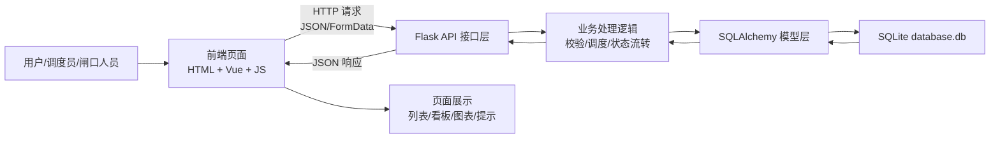

系统中的核心数据可以分为七类：

| 数据类别 | 主要实体 | 数据来源 | 数据去向 |
|---|---|---|---|
| 用户会话数据 | `user`、`session` | 登录页面输入 | 后端会话校验、前端登录状态 |
| 计划数据 | `ship`、`manifest`、`manifest_item` | 船舶计划录入、Manifest Excel 导入 | 船舶计划页面、作业任务生成、工作流启动 |
| 集装箱基础数据 | `container` | 手工录入、Manifest 导入、作业状态推进 | 集装箱管理、堆场、任务、进口流程 |
| 堆场位置数据 | `yard`、`yard_slot`、`container.yard/area/col/layer` | 堆场维护、智能分配、场桥入堆 | 堆场管理、看板、提箱作业 |
| 作业执行数据 | `task`、`equipment` | Manifest 导入、后台工作流、人工任务、设备调度 | 作业任务页面、设备页面、看板统计 |
| 进口提箱数据 | `customs_release`、`pickup_appointment`、`gate_transaction` | 放行登记、预约、闸口操作 | 进口生命周期页面、异常管理、箱状态更新 |
| 异常审计数据 | `exception_record` | 系统拦截、监管未放行、人工登记 | 异常列表、处理闭环、业务追踪 |

## 3. 数据流程分层分析

### 3.1 0 层数据流图

0 层数据流图描述系统与外部参与者之间的整体输入输出关系。

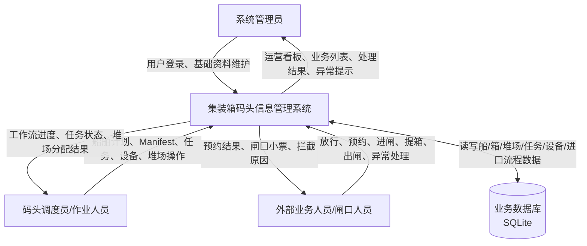

### 3.2 1 层数据流图

1 层数据流图将系统拆分为主要处理过程。

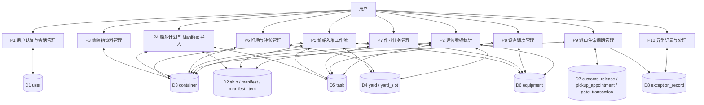

### 3.3 2 层数据流图：Manifest 导入

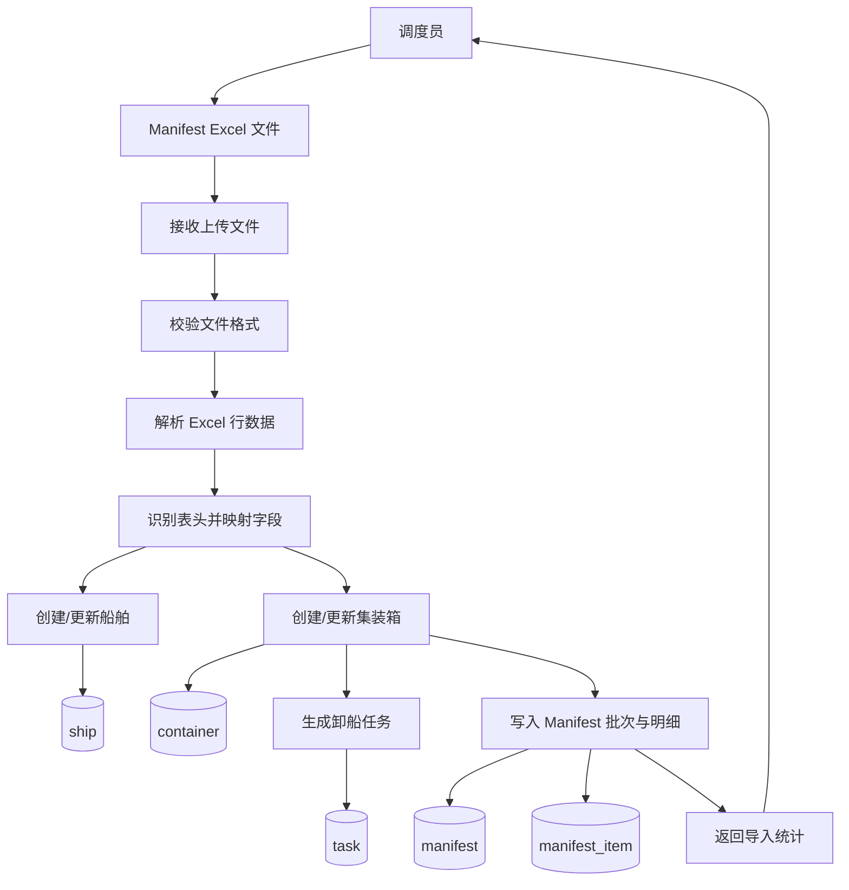

### 3.4 2 层数据流图：卸船入堆工作流

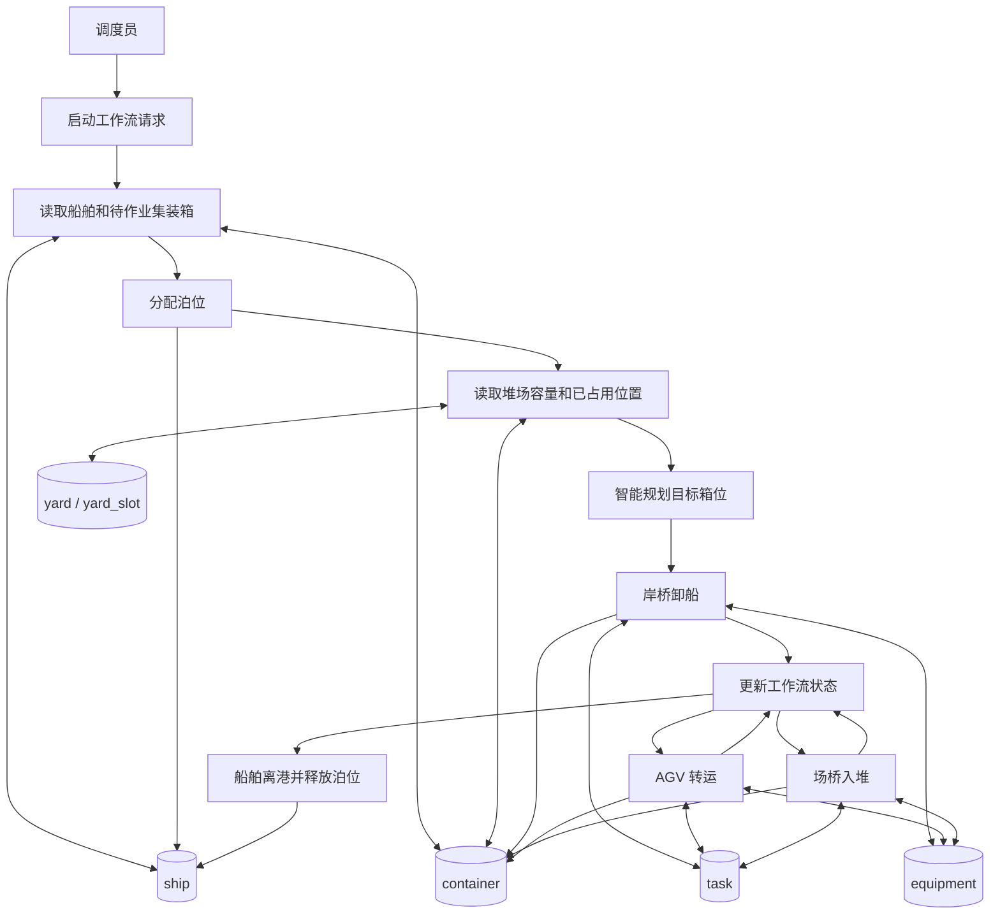

### 3.5 2 层数据流图：进口提箱闭环

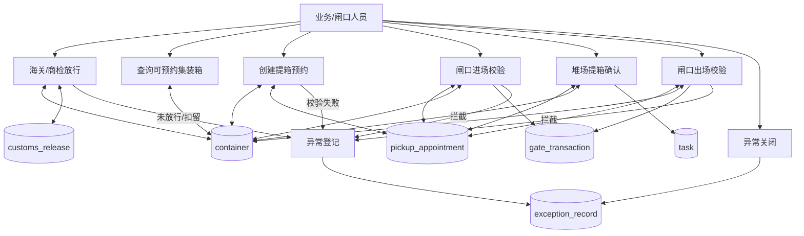

## 4. 数据字典与数据存储说明

### 4.1 数据存储清单

| 编号 | 数据存储 | 对应表 | 主要用途 |
|---|---|---|---|
| D1 | 用户数据 | `user` | 用户登录、角色保存、最近登录时间 |
| D2 | 船舶数据 | `ship` | 船名、航次、ETA、ETD、泊位、船舶状态 |
| D3 | 集装箱数据 | `container` | 箱号、箱型、箱状态、船舶归属、堆场位置、海关/预约/残损状态 |
| D4 | 堆场数据 | `yard` | 堆场名称、类型、容量、状态、负责人 |
| D5 | 箱位数据 | `yard_slot` | 精确箱位、占用、锁定、禁用状态 |
| D6 | 作业任务数据 | `task` | 卸船、转运、入堆、提箱等作业任务 |
| D7 | 设备数据 | `equipment` | 岸桥、场桥、AGV 的状态、位置、效率、当前任务 |
| D8 | Manifest 批次 | `manifest` | Excel 导入批次、导入人、导入时间、导入结果 |
| D9 | Manifest 明细 | `manifest_item` | 单箱 Manifest 明细、目标堆场和校验结果 |
| D10 | 海关放行数据 | `customs_release` | 海关/商检状态、放行号、扣留原因 |
| D11 | 提箱预约数据 | `pickup_appointment` | 预约号、车牌、司机、时间窗、预约状态 |
| D12 | 闸口流水数据 | `gate_transaction` | 进闸/出闸记录、核验结果、小票号、拦截原因 |
| D13 | 异常处理数据 | `exception_record` | 异常类型、对象、描述、状态、处理人、处理结果 |

### 4.2 关键数据项说明

| 数据项 | 所属对象 | 说明 |
|---|---|---|
| `container_no` | 集装箱 | 集装箱唯一业务编号，是 Manifest、任务、预约、闸口核验的核心匹配字段 |
| `container.status` | 集装箱 | 表示物理/作业状态，如在船上、已卸船、转运中、堆场存储、等待提箱、已装车待出闸、离港 |
| `customs_status` | 集装箱/放行记录 | 表示监管放行状态，未放行时禁止预约和闸口放行 |
| `appointment_status` | 集装箱 | 表示箱子在预约提箱链路中的状态 |
| `locked_by_appointment_id` | 集装箱 | 标识箱子被哪个预约锁定，防止重复预约 |
| `ship.status` | 船舶 | 计划中、已靠泊、已离港 |
| `task.status` | 作业任务 | pending、in-progress、completed |
| `equipment.status` | 设备 | 空闲、工作中、故障 |
| `appointment.status` | 提箱预约 | 已确认、已进闸、已提箱、已出闸、已取消 |
| `gate_transaction.check_result` | 闸口流水 | 通过或拦截 |
| `exception_record.status` | 异常记录 | 待处理或已关闭 |

## 5. 系统模块设计

### 5.1 模块划分原则

系统按“业务对象 + 业务流程”混合方式划分模块：

1. 以业务对象划分：集装箱、船舶、堆场、任务、设备。
2. 以业务流程划分：Manifest 导入、卸船入堆工作流、进口提箱生命周期。
3. 以支撑能力划分：用户认证、运营看板、异常处理。

### 5.2 模块结构图

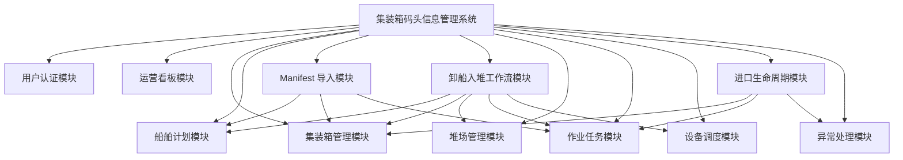

### 5.3 模块输入、处理、输出设计

| 模块 | 输入 | 处理 | 输出 | 涉及数据表 |
|---|---|---|---|---|
| 用户认证模块 | 用户名、密码 | 校验用户、写入 session、更新最近登录时间 | 登录成功/失败、当前用户信息 | `user` |
| 运营看板模块 | 看板查询请求 | 汇总箱、船、堆场、任务、设备数据 | KPI、图表数据、预警数量 | `container`、`yard`、`ship`、`task`、`equipment` |
| 集装箱管理模块 | 箱号、箱型、属性、位置、状态 | 新增、查询、修改、删除、状态推进 | 集装箱列表和详情 | `container` |
| 船舶计划模块 | 船名、航次、ETA、ETD、泊位、状态 | 船舶 CRUD、泊位计划维护 | 船舶列表、泊位占用状态 | `ship` |
| Manifest 导入模块 | Excel 文件、航次、自动运行标识 | 解析文件、创建/更新船舶和箱、生成任务、记录导入批次 | 导入统计、跳过原因、Manifest 记录 | `ship`、`container`、`task`、`manifest`、`manifest_item` |
| 卸船入堆工作流模块 | 船舶 ID、时间倍率 | 分配泊位、规划箱位、岸桥卸船、AGV 转运、场桥入堆 | 工作流状态、任务记录、箱状态和箱位 | `ship`、`container`、`yard`、`task`、`equipment` |
| 堆场管理模块 | 堆场资料、箱位信息、船舶 ID | 堆场 CRUD、单箱分配、按船智能分配 | 堆场容量、分配结果、冲突提示 | `yard`、`yard_slot`、`container` |
| 作业任务模块 | 任务名称、箱号、起终点、状态、优先级 | 任务 CRUD、状态推进、完成时同步箱状态 | 任务列表、任务状态 | `task`、`container`、`equipment` |
| 设备调度模块 | 设备资料、任务 ID、设备操作 | 设备 CRUD、任务分配、AGV 调度、故障/维修/释放 | 设备状态、任务绑定状态 | `equipment`、`task` |
| 进口生命周期模块 | 放行信息、预约信息、车牌、箱号、闸口操作 | 放行、预约、进闸校验、提箱、出闸校验 | 预约单、小票、闸口流水、箱离港状态 | `container`、`customs_release`、`pickup_appointment`、`gate_transaction`、`task` |
| 异常处理模块 | 异常对象、类型、描述、处理结果 | 自动登记或人工登记，关闭异常 | 异常列表、处理闭环 | `exception_record` |

### 5.4 前后端模块映射

| 前端页面 | 前端脚本 | 后端接口模块 | 主要功能 |
|---|---|---|---|
| `login.html` | `js/login.js` | `app.py` 认证接口 | 登录、跳转首页 |
| `index.html` | `js/home.js`、`js/home-dashboard.js`、`js/home-terminal-map.js` | `app.py` 看板接口 | 首页 KPI、图表、码头态势 |
| `container-management.html` | `js/container-management.js` | `container_route.py` | 集装箱增删改查、状态推进、位置更新 |
| `yard-management.html` | `js/yard-management.js` | `yard_route.py` | 堆场维护、箱位分配、智能分配 |
| `ship-plan-management.html` | `js/ship-plan-management.js` | `ship_route.py` | 船舶计划、泊位计划、Manifest 导入、工作流监控 |
| `terminal-operations.html` | `js/terminal-operations.js` | `task_route.py` | 作业任务维护、状态推进 |
| `equipment-management.html` | `js/equipment-management.js` | `equipment_route.py` | 设备维护、任务分配、AGV 调度、故障维修 |
| `import-lifecycle.html` | `js/import-lifecycle.js` | `import_lifecycle_route.py` | 放行、预约、闸口、提箱、异常 |

## 6. 核心子系统功能矩阵

### 6.1 子系统功能覆盖矩阵

| 子系统 | 新增 | 查询 | 修改 | 删除 | 状态流转 | 智能处理 | 异常处理 | 统计展示 |
|---|---:|---:|---:|---:|---:|---:|---:|---:|
| 用户认证 | 否 | 是 | 是 | 否 | 是 | 否 | 是 | 否 |
| 运营看板 | 否 | 是 | 否 | 否 | 否 | 否 | 否 | 是 |
| 集装箱管理 | 是 | 是 | 是 | 是 | 是 | 否 | 部分 | 部分 |
| 船舶计划 | 是 | 是 | 是 | 是 | 是 | 部分 | 部分 | 是 |
| Manifest 导入 | 是 | 是 | 是 | 否 | 是 | 是 | 是 | 是 |
| 卸船入堆工作流 | 是 | 是 | 是 | 否 | 是 | 是 | 是 | 是 |
| 堆场管理 | 是 | 是 | 是 | 是 | 是 | 是 | 是 | 是 |
| 作业任务管理 | 是 | 是 | 是 | 是 | 是 | 部分 | 部分 | 部分 |
| 设备调度管理 | 是 | 是 | 是 | 是 | 是 | 是 | 是 | 是 |
| 进口生命周期 | 是 | 是 | 是 | 部分 | 是 | 是 | 是 | 是 |
| 异常管理 | 是 | 是 | 是 | 否 | 是 | 否 | 是 | 是 |

### 6.2 子系统与数据实体矩阵

| 子系统 | User | Ship | Container | Yard | YardSlot | Task | Equipment | Manifest | Release | Appointment | Gate | Exception |
|---|---:|---:|---:|---:|---:|---:|---:|---:|---:|---:|---:|---:|
| 用户认证 | 主 |  |  |  |  |  |  |  |  |  |  |  |
| 运营看板 |  | 读 | 读 | 读 |  | 读 | 读 |  |  |  |  |  |
| 集装箱管理 |  | 辅 | 主 | 辅 | 辅 |  |  |  | 辅 | 辅 |  |  |
| 船舶计划 |  | 主 | 辅 |  |  |  |  |  |  |  |  |  |
| Manifest 导入 |  | 主 | 主 |  |  | 主 |  | 主 |  |  |  |  |
| 卸船入堆工作流 |  | 主 | 主 | 读 | 辅 | 主 | 主 |  |  |  |  | 辅 |
| 堆场管理 |  | 辅 | 主 | 主 | 主 |  |  |  |  |  |  |  |
| 作业任务管理 |  |  | 辅 |  |  | 主 | 辅 |  |  |  |  |  |
| 设备调度管理 |  |  |  |  |  | 辅 | 主 |  |  |  |  |  |
| 进口生命周期 |  |  | 主 | 辅 | 辅 | 辅 |  |  | 主 | 主 | 主 | 主 |
| 异常管理 |  |  | 辅 |  |  | 辅 | 辅 |  | 辅 | 辅 | 辅 | 主 |

说明：“主”表示该子系统主要维护该实体，“辅”表示该子系统读取或联动更新该实体，“读”表示主要用于统计展示。

### 6.3 子系统与接口矩阵

| 子系统 | 主要接口 | 说明 |
|---|---|---|
| 用户认证 | `/api/auth/login`、`/api/auth/me`、`/api/auth/logout` | 登录、当前用户、退出 |
| 运营看板 | `/api/dashboard/stats` | 首页 KPI 和图表统计 |
| 集装箱管理 | `/containers`、`/containers/<id>`、`/containers/<id>/location`、`/containers/<id>/next_status` | 集装箱 CRUD、位置、状态 |
| 船舶计划 | `/ships`、`/ships/<id>` | 船舶 CRUD |
| Manifest 导入 | `/ships/import_manifest` | Excel 导入船舶任务清单 |
| 卸船入堆工作流 | `/ships/<id>/workflow`、`/ships/<id>/workflow/status` | 启动和查询自动作业进度 |
| 堆场管理 | `/yards`、`/yards/<id>`、`/yards/assign`、`/yards/smart_assign_ship` | 堆场 CRUD、箱位分配 |
| 作业任务 | `/tasks`、`/tasks/<id>`、`/tasks/<id>/next_status` | 任务 CRUD、状态推进 |
| 设备调度 | `/equipment`、`/equipment/summary`、`/equipment/<id>/assign_task`、`/equipment/agv_dispatch`、`/equipment/<id>/fault`、`/equipment/<id>/repair` | 设备维护、任务分配、调度、故障维修 |
| 进口生命周期 | `/api/import/overview`、`/api/import/customs/release`、`/api/import/appointments`、`/api/import/gate/in`、`/api/import/gate/out`、`/api/import/containers/pickup-ready` | 放行、预约、闸口、提箱 |
| 异常管理 | `/api/import/exceptions`、`/api/import/exceptions/<id>/resolve` | 异常登记、查询、关闭 |

## 7. 主要业务流程说明

### 7.1 用户登录流程

1. 用户打开 `login.html`。
2. 前端提交用户名和密码到 `/api/auth/login`。
3. 后端校验用户名和密码。
4. 校验成功后，后端更新 `user.last_login_at`，并写入 `session`。
5. 前端跳转 `index.html`。
6. 后续业务接口由 `before_request` 检查是否已登录。

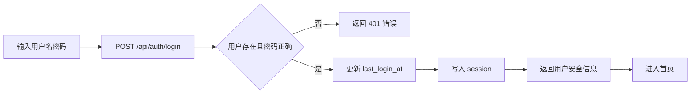

### 7.2 船舶计划与 Manifest 导入流程

1. 调度员在船舶计划页面维护船舶基础信息。
2. 上传 Manifest Excel。
3. 后端解析 Excel 中箱号、箱型、状态、堆场、箱位、危险品、冷藏等信息。
4. 系统创建或更新船舶记录。
5. 系统创建或更新集装箱记录。
6. 系统为每个箱生成卸船作业任务。
7. 系统写入 Manifest 批次和明细。
8. 前端展示导入结果，可继续启动自动工作流。

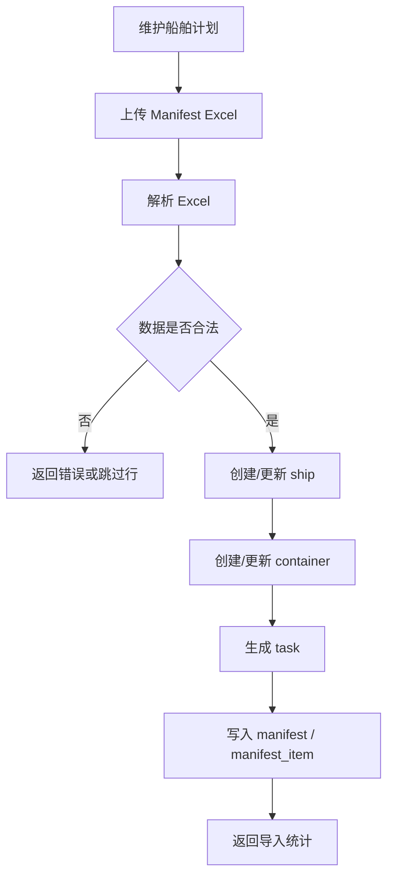

### 7.3 卸船入堆流程

1. 调度员选择船舶并启动工作流。
2. 系统检查船舶下是否存在未离港集装箱。
3. 系统检查是否存在可用堆场。
4. 系统分配空闲泊位，船舶状态变为“已靠泊”。
5. 系统根据箱属性和堆场状态规划目标箱位。
6. 岸桥执行卸船任务，集装箱状态变为“已卸船”。
7. AGV 执行水平运输，集装箱状态变为“转运中”。
8. 场桥执行入堆任务，集装箱状态变为“堆场存储”，并写入堆场位置。
9. 全部箱处理完成后，船舶状态变为“已离港”，泊位释放。

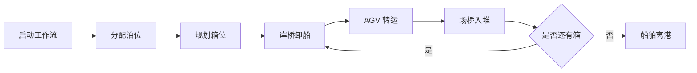

### 7.4 堆场分配流程

1. 用户选择集装箱和目标堆场位置，或选择船舶进行批量智能分配。
2. 系统校验堆场是否存在且启用。
3. 系统校验区域、列、层是否合法。
4. 系统检查目标箱位是否已被未离港集装箱占用。
5. 单箱分配时，校验通过后直接写入箱位。
6. 智能分配时，系统根据箱属性、堆场用途、集中度和容量计算最佳箱位。
7. 分配成功后，集装箱状态变为“堆场存储”。

### 7.5 作业任务流程

1. 用户创建作业任务，填写任务名称、箱号、起点、终点和优先级。
2. 系统根据箱号绑定 `container_id`。
3. 任务初始状态为 `pending`。
4. 用户推进任务状态到 `in-progress`，系统记录开始时间。
5. 用户推进任务状态到 `completed`，系统记录结束时间。
6. 如果任务绑定设备，任务完成后释放设备。
7. 系统根据任务类型同步集装箱状态。

### 7.6 设备调度流程

1. 用户维护设备基础资料，包括编号、名称、类型、状态、位置和效率。
2. 用户选择设备并分配任务。
3. 系统校验设备是否故障、任务是否已完成、设备类型是否匹配任务类型。
4. 校验通过后，设备状态变为“工作中”，任务状态变为 `in-progress`。
5. 任务完成或设备释放后，设备状态恢复“空闲”。
6. 若设备发生故障，系统将设备状态置为“故障”，并将未完成任务回退为 `pending`。
7. 维修完成后，设备恢复“空闲”。

### 7.7 进口提箱流程

1. 操作员登记海关/商检放行状态。
2. 系统筛选可预约提箱的集装箱。
3. 用户创建提箱预约，填写车牌、司机、客户和时间窗。
4. 系统校验箱状态、海关状态、残损状态和重复预约。
5. 预约成功后，箱子变为“等待提箱”，预约状态为“已确认”。
6. 外部车辆到达闸口后进行进闸核验。
7. 进闸通过后，预约状态变为“已进闸”，系统生成进闸流水和小票。
8. 车辆进入堆场完成提箱，系统生成“堆场提箱”任务，箱状态变为“已装车待出闸”。
9. 车辆出闸时再次核验车牌、箱号、提箱状态和放行状态。
10. 出闸通过后，箱状态变为“离港”，预约状态变为“已出闸”。

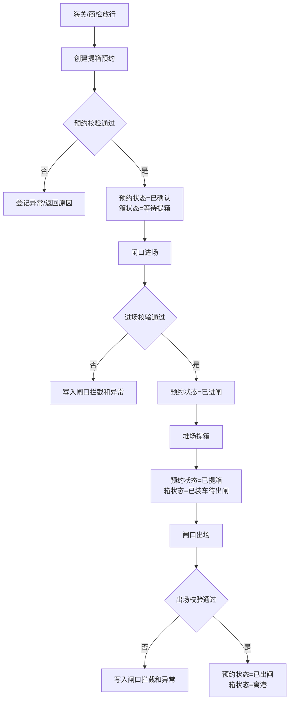

### 7.8 异常处理流程

1. 系统在放行失败、预约失败、闸口拦截时自动写入异常。
2. 用户也可以手工登记异常。
3. 异常记录包括对象类型、对象 ID、异常类型、描述和状态。
4. 处理人员查看异常列表。
5. 处理完成后填写处理人和处理结果。
6. 系统将异常状态改为“已关闭”。

## 8. 关键时序图

### 8.1 登录与会话校验时序图

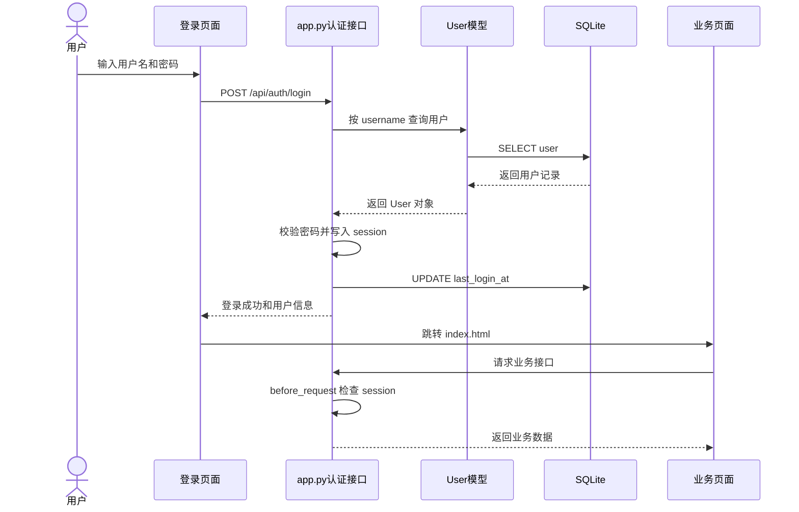

### 8.2 Manifest 导入时序图

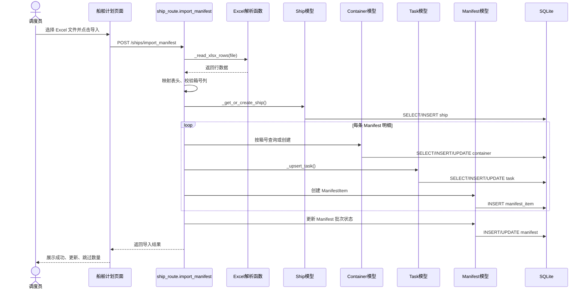

### 8.3 自动卸船入堆工作流时序图

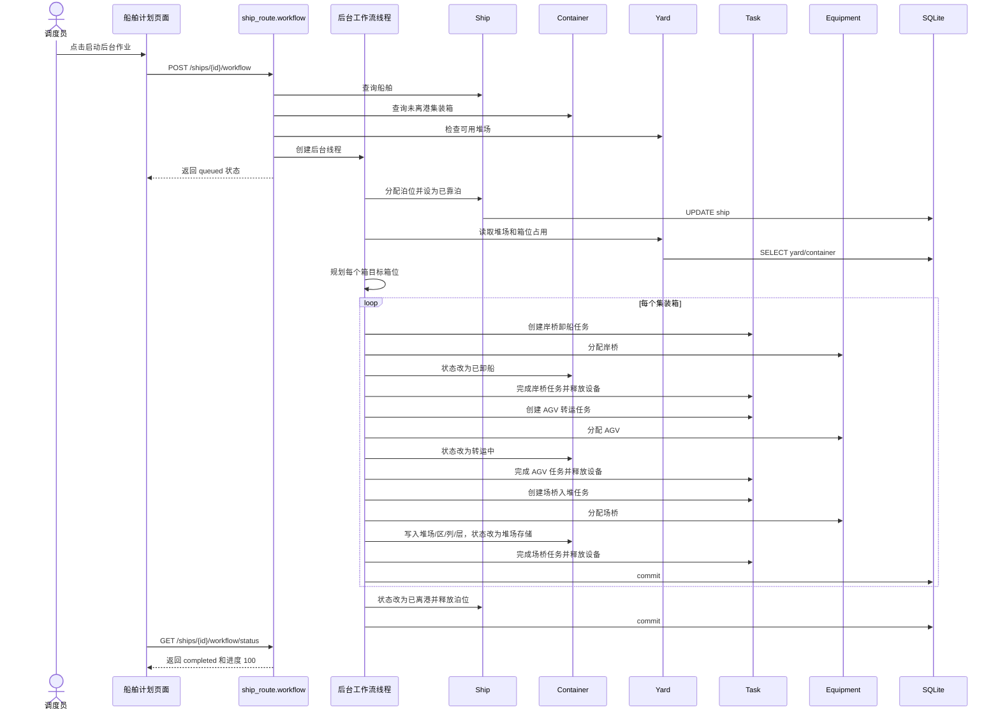

### 8.4 提箱预约时序图

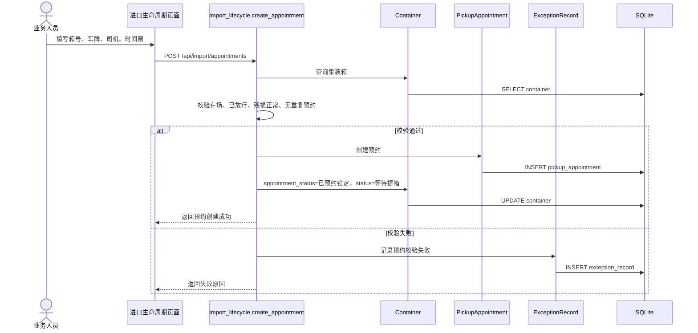

### 8.5 闸口进场与出场时序图

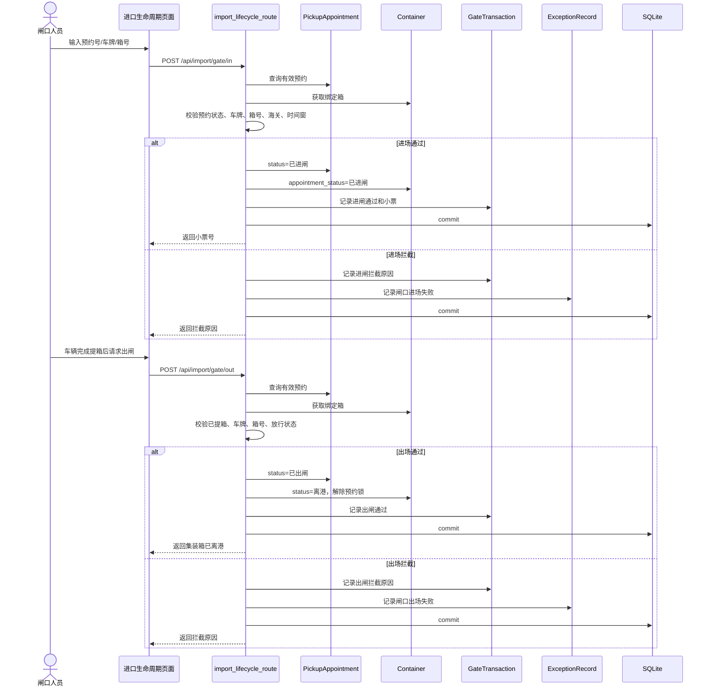

### 8.6 设备故障处理时序图

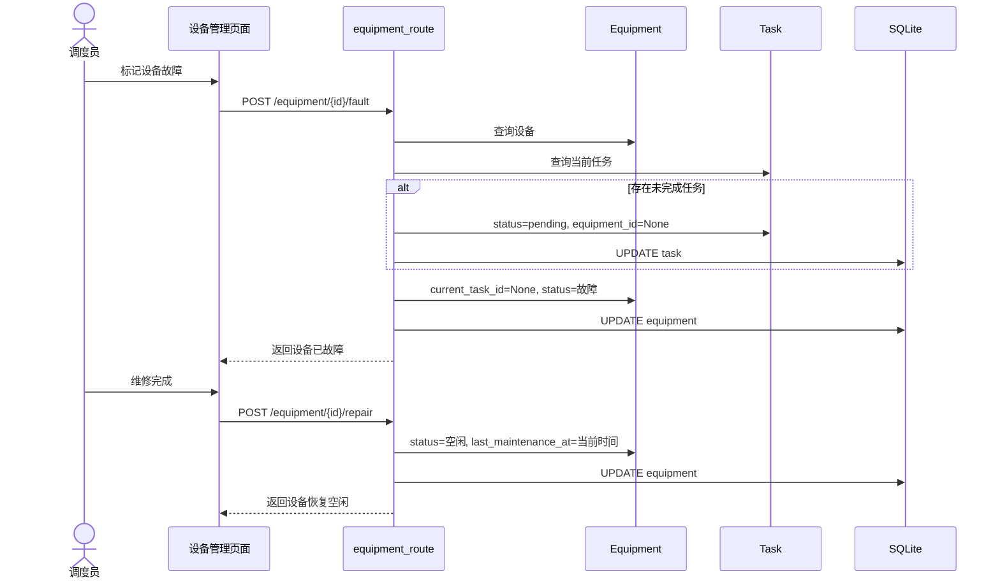

## 9. 业务数据状态流转分析

### 9.1 集装箱状态流转

| 当前状态 | 触发事件 | 下一状态 | 写入位置 |
|---|---|---|---|
| 在船上 | 岸桥卸船任务完成 | 已卸船 | `container.status` |
| 已卸船 | AGV 转运任务开始/完成 | 转运中 | `container.status` |
| 转运中 | 场桥入堆任务完成 | 堆场存储 | `container.status`、`yard_name`、`area`、`col`、`layer` |
| 堆场存储 | 创建提箱预约 | 等待提箱 | `container.status`、`appointment_status`、`locked_by_appointment_id` |
| 等待提箱 | 闸口进场通过 | 等待提箱 | `appointment_status=已进闸` |
| 等待提箱 | 堆场提箱完成 | 已装车待出闸 | `container.status`、`appointment_status` |
| 已装车待出闸 | 闸口出场通过 | 离港 | `container.status`、`appointment_status` |

### 9.2 船舶状态流转

| 当前状态 | 触发事件 | 下一状态 |
|---|---|---|
| 计划中 | 人工设置靠泊计划或工作流分配泊位 | 已靠泊 |
| 已靠泊 | 卸船入堆工作流全部完成 | 已离港 |
| 已离港 | 流程结束 | 已离港 |

### 9.3 任务状态流转

| 当前状态 | 触发事件 | 下一状态 |
|---|---|---|
| pending | 人工推进或设备分配 | in-progress |
| in-progress | 人工推进或工作流完成任务 | completed |
| in-progress | 设备故障 | pending |

### 9.4 预约状态流转

| 当前状态 | 触发事件 | 下一状态 |
|---|---|---|
| 已确认 | 取消预约 | 已取消 |
| 已确认 | 闸口进场通过 | 已进闸 |
| 已进闸 | 堆场提箱完成 | 已提箱 |
| 已提箱 | 闸口出场通过 | 已出闸 |

### 9.5 异常状态流转

| 当前状态 | 触发事件 | 下一状态 |
|---|---|---|
| 待处理 | 处理人员填写处理结果 | 已关闭 |
| 已关闭 | 流程结束 | 已关闭 |

## 10. 数据流程中的关键校验点

| 流程 | 校验点 | 校验目的 | 失败处理 |
|---|---|---|---|
| 登录 | 用户名和密码非空，用户存在，密码正确 | 防止未授权访问 | 返回 400/401 |
| Manifest 导入 | 文件存在、格式为 `.xlsx`、包含箱号列 | 保证导入数据可解析 | 返回错误或跳过明细 |
| 集装箱新增 | 箱号和箱型必填，箱号唯一 | 保证箱基础数据有效 | 返回 400/409 |
| 堆场分配 | 堆场存在且启用，箱位合法，箱位未占用 | 防止箱位冲突 | 返回 400/404/409 |
| 工作流启动 | 船舶有待处理箱，存在可用堆场，没有重复运行工作流 | 防止无效后台作业 | 返回 400 或复用运行状态 |
| 设备分配 | 设备非故障，任务未完成，设备类型匹配 | 防止错误调度 | 返回 400 |
| 创建预约 | 箱在场、已放行、残损可提、无活动预约、车牌和时间窗有效 | 防止未放行、重复或错误提箱 | 返回 400 并记录异常 |
| 闸口进场 | 预约有效、状态已确认、车牌一致、箱号一致、已放行、时间窗有效 | 防止无预约/错车/错箱/超窗进场 | 写入拦截流水和异常 |
| 堆场提箱 | 预约状态为已进闸 | 保证车辆已合法进场 | 返回 400 |
| 闸口出场 | 预约状态已提箱、车牌一致、箱号一致、仍已放行 | 防止未提箱或错箱出场 | 写入拦截流水和异常 |

## 11. 数据流程特点与评价

### 11.1 数据流设计特点

1. 以集装箱为核心主数据，船舶、任务、堆场、设备、预约、闸口流水均围绕集装箱展开。
2. Manifest 导入承担计划数据到作业数据的转换，自动生成船、箱、任务和导入批次记录。
3. 卸船入堆工作流将计划任务转化为可追踪的作业状态，持续更新箱、船、任务和设备。
4. 进口生命周期将监管状态、预约状态、闸口流水和箱状态拆开管理，避免把所有业务信息混入单一状态字段。
5. 异常记录贯穿多个流程，闸口拦截和预约失败不会只返回错误，而是形成可审计记录。

### 11.2 数据流风险点

1. 工作流运行状态目前保存在内存中，服务重启后进度会丢失。
2. `yard_slot` 表已有设计，但实际箱位占用判断仍主要依赖 `container` 表位置字段，强锁机制不足。
3. 多个关键关联字段缺少数据库层外键约束，主要依赖业务代码保证一致性。
4. SQLite 在高并发写入下容易出现锁等待，不适合真实大规模生产环境。
5. 状态值大量使用字符串，若前后端写法不统一，可能导致统计或流程判断失效。

### 11.3 数据流优化建议

1. 建立 `workflow_run` 和 `workflow_step` 表，持久化后台工作流进度。
2. 将 `yard_slot` 作为箱位占用的唯一来源，入堆、提箱和预约锁定均通过箱位表完成。
3. 为 `container_no`、`appointment_no`、`task_no`、`equipment.code`、`yard.code` 等关键字段建立唯一约束和索引。
4. 为常用查询字段增加索引，如 `container.ship_id`、`container.status`、`task.status`、`pickup_appointment.status`。
5. 将状态字段抽象为统一枚举，前后端共享状态字典。
6. 在预约、出闸、箱位分配等关键操作中增强事务控制，避免重复预约、重复出闸和箱位并发冲突。

## 12. 总结

本系统的数据流程以集装箱状态流转为主线，以船舶计划、Manifest 导入、卸船入堆、堆场管理、任务执行、设备调度、进口提箱和异常处理为主要业务链条。系统通过 Flask 接口和 SQLAlchemy 模型把前端用户操作转化为数据库中的业务记录，并通过状态字段和流水记录实现流程追踪。

从模块设计角度看，系统已经形成清晰的子系统边界：基础资料类模块负责船、箱、场、设备的维护；流程类模块负责 Manifest 导入、自动工作流和进口生命周期；支撑类模块负责登录、看板和异常处理。各模块既相互独立，又通过集装箱、任务和状态字段形成业务联动。

从课程设计表达角度看，本文档中的数据流图、模块结构图、功能矩阵、时序图和业务流程说明，可以与数据库设计、类图、用例图共同组成完整的系统分析与设计材料。
