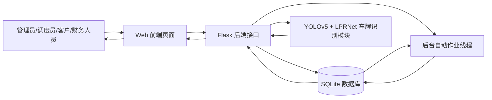
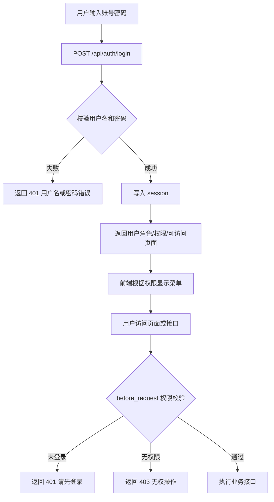
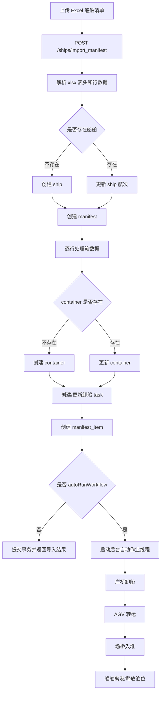
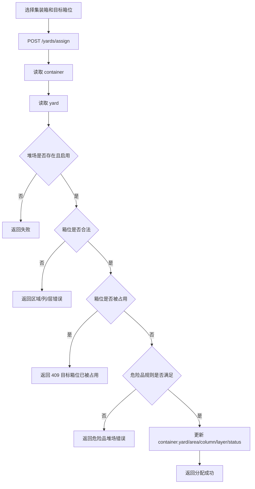
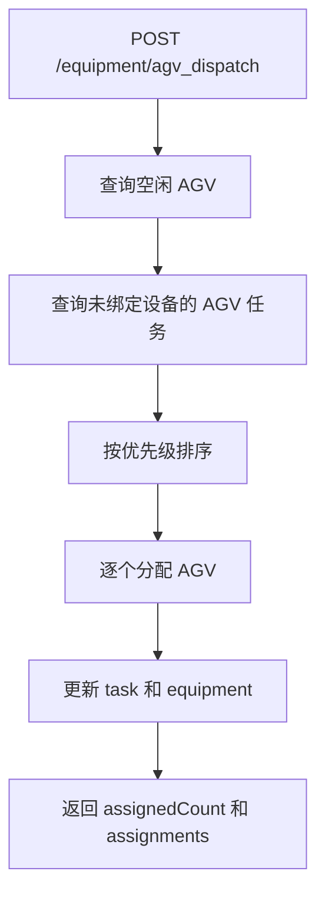
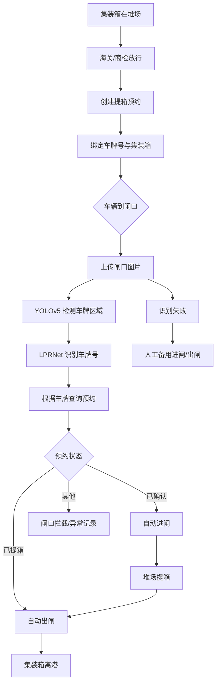
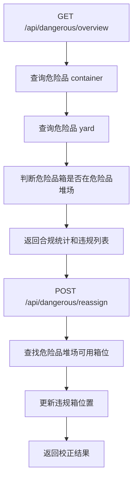
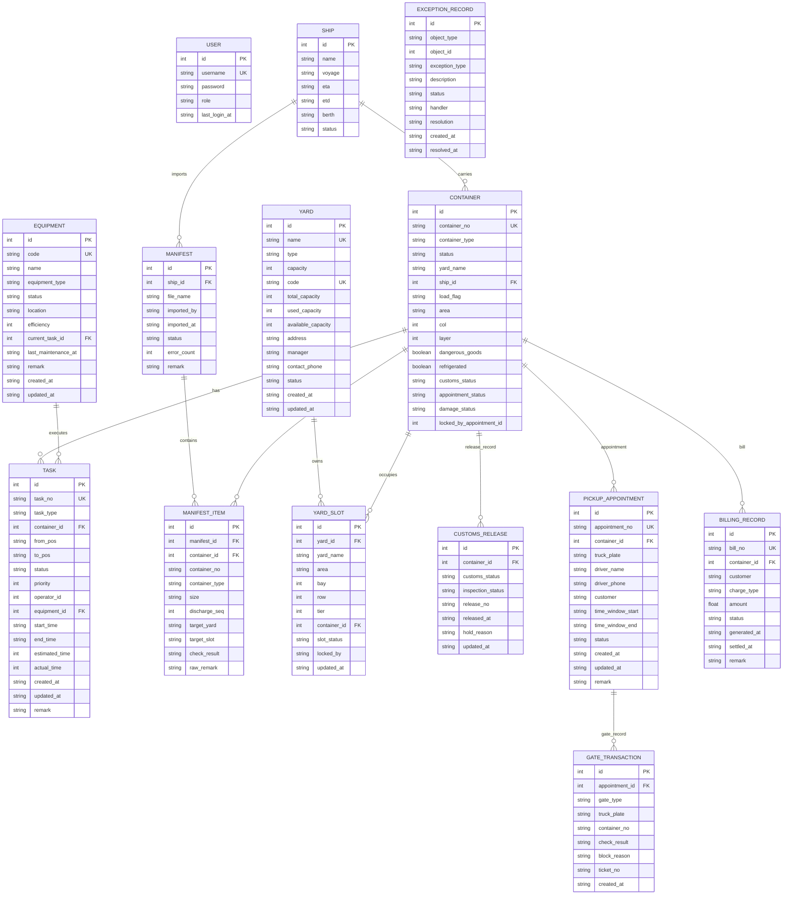
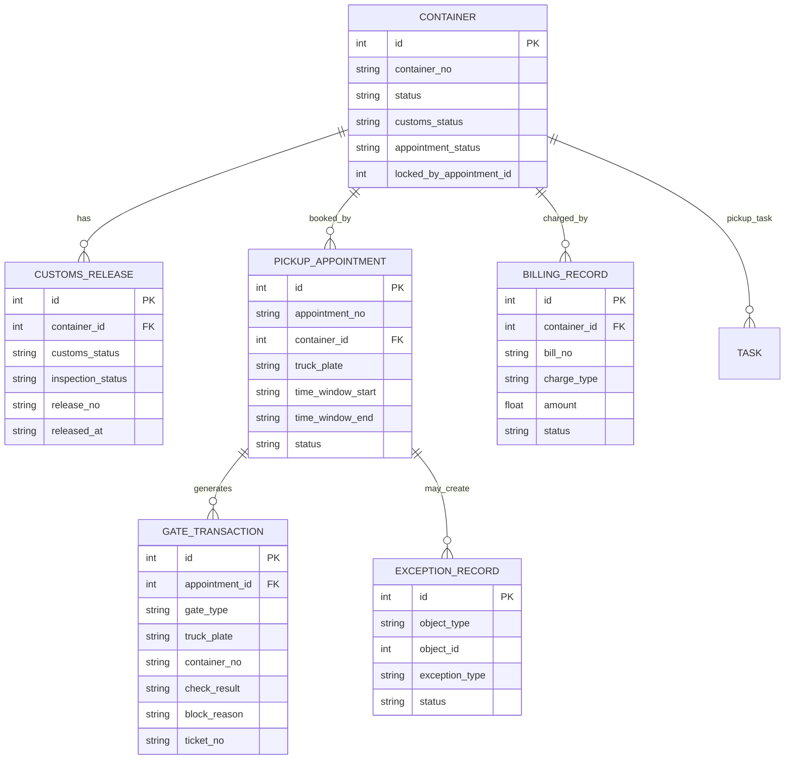
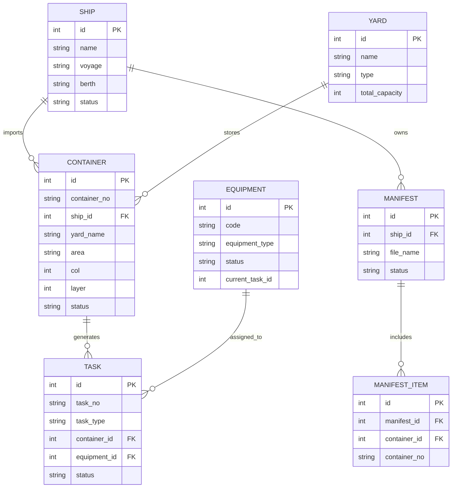

# 集装箱码头管理系统数据流程分析图、ER 图、数据字典与数据库表设计

## 1. 文档说明

本文档用于说明集装箱码头管理系统的数据流转关系、实体关系模型、数据字典和数据库表设计。文档重点面向课程设计中的“系统分析与数据库设计”部分，可与以下文档配套使用：

```text
系统操作说明与接口响应总览.md
进口闭环闸口IO接口设计与操作说明.md
系统架构与核心设计分析报告.md
```

系统当前主要业务模块包括：

- 用户登录与权限管理
- 首页驾驶舱统计
- 集装箱管理
- 堆场与箱位管理
- 船舶计划与清单导入
- 码头作业单管理
- 设备调度管理
- 进口闭环管理
- 财务计费管理
- 危险品管理

数据库主要实体包括：

- `user`
- `container`
- `yard`
- `ship`
- `task`
- `equipment`
- `manifest`
- `manifest_item`
- `yard_slot`
- `customs_release`
- `pickup_appointment`
- `gate_transaction`
- `exception_record`
- `billing_record`

## 2. 数据流程分析

### 2.1 系统顶层数据流程图

下图描述外部用户、前端页面、后端接口和数据库之间的整体数据流。



数据流说明：

| 编号 | 数据流 | 说明 |
|---|---|---|
| D1 | 用户操作数据 | 用户在页面上发起新增、修改、删除、查询、上传等操作 |
| D2 | HTTP 请求数据 | 前端通过 `fetch` 向 Flask 接口发送 JSON 或表单数据 |
| D3 | 业务校验数据 | 后端根据权限、业务规则、数据库状态进行校验 |
| D4 | 数据库存取数据 | 后端读取或写入业务表 |
| D5 | 响应数据 | 后端返回 JSON 响应，前端刷新页面状态 |
| D6 | 车牌识别数据 | 闸口图片进入识别模块，输出车牌号 |
| D7 | 自动作业数据 | 后台线程持续更新船舶、任务、设备和箱状态 |

### 2.2 登录与权限数据流程



关键数据表：

- `user`

关键数据项：

- `username`
- `password`
- `role`
- `last_login_at`

### 2.3 船舶清单导入与卸船入堆数据流程



涉及表：

| 表 | 作用 |
|---|---|
| `ship` | 保存船舶计划 |
| `manifest` | 保存导入批次 |
| `manifest_item` | 保存清单明细 |
| `container` | 保存或更新集装箱 |
| `task` | 生成卸船、转运、入堆作业 |
| `equipment` | 自动作业中占用和释放设备 |
| `yard` | 查找可用堆场 |

### 2.4 堆场分配数据流程



核心规则：

- 一个未离港箱位同一时间只能放一个集装箱。
- 危险品箱必须进入危险品堆场。
- 非危险品箱不能进入危险品堆场。
- 分配成功后，集装箱状态变为 `堆场存储`。

### 2.5 码头作业单数据流程

```mermaid
flowchart TD
    A[创建或更新作业单] --> B[/tasks 接口]
    B --> C[解析任务类型/起点/终点/箱号]
    C --> D[根据箱号关联 container]
    D --> E[作业顺序校验 validate_task_transition]
    E -- 不通过 --> F[返回 400 业务校验失败]
    E -- 通过 --> G[写入 task]
    G --> H{任务是否 completed}
    H -- 否 --> I[返回任务数据]
    H -- 是 --> J[sync_container_after_task]
    J --> K[同步集装箱状态/位置]
    K --> I
```

作业状态：

```text
pending -> in-progress -> completed
```


作业完成后可能同步：

- 集装箱状态
- 集装箱位置
- 设备空闲状态
- 任务开始/结束时间

### 2.6 设备调度数据流程

```mermaid
flowchart TD
    A[选择设备分配任务] --> B[POST /equipment/{id}/assign_task]
    B --> C[读取 equipment]
    C --> D[读取 task]
    D --> E{设备是否故障}
    E -- 是 --> F[返回故障设备不能分配任务]
    E -- 否 --> G{任务是否已完成}
    G -- 是 --> H[返回任务无需分配]
    G -- 否 --> I{设备类型是否匹配任务}
    I -- 否 --> J[返回设备类型不匹配]
    I -- 是 --> K[任务状态变为 in-progress]
    K --> L[设备状态变为 工作中]
    L --> M[写入 current_task_id]
    M --> N[返回 equipment 和 task]
```

AGV 自动调度流程：



### 2.7 进口闭环数据流程



核心数据表：

| 表 | 作用 |
|---|---|
| `container` | 记录箱状态、放行状态、预约状态 |
| `customs_release` | 记录海关/商检放行 |
| `pickup_appointment` | 记录提箱预约 |
| `gate_transaction` | 记录闸口进出和拦截 |
| `exception_record` | 记录异常闭环 |
| `task` | 记录堆场提箱任务 |

### 2.8 财务计费数据流程

```mermaid
flowchart TD
    A[选择集装箱或手动填写账单] --> B[POST /api/finance/bills]
    B --> C[解析计费类型和金额]
    C --> D{是否指定金额}
    D -- 是 --> E[使用人工金额]
    D -- 否 --> F[按箱型/危险品/冷藏估算金额]
    E --> G[创建 billing_record]
    F --> G
    G --> H[返回账单]
    H --> I[PUT /api/finance/bills/{id}/settle]
    I --> J[状态更新为 已结算]
```

计费规则：

| 条件 | 金额影响 |
|---|---|
| 普通堆存费 | 基础 `120` |
| 危险品附加费 | 基础 `260` |
| 40 尺箱 | 基础金额乘以 `1.6` |
| 冷藏箱 | 额外加 `80` |
| 危险品箱 | 额外加 `180` |

### 2.9 危险品管理数据流程



## 3. ER 图

### 3.1 系统核心 ER 图



### 3.2 进口闭环专题 ER 图



### 3.3 船舶作业专题 ER 图



## 4. 数据字典

### 4.1 用户表 user

| 字段 | 中文名 | 类型 | 约束 | 说明 |
|---|---|---|---|---|
| `id` | 用户 ID | Integer | PK | 主键 |
| `username` | 用户名 | String(50) | UNIQUE, NOT NULL | 登录账号 |
| `password` | 密码 | String(100) | NOT NULL | 登录密码，当前为明文存储 |
| `role` | 角色 | String(20) | NOT NULL | `admin`、`dispatcher`、`operator`、`finance` |
| `last_login_at` | 最后登录时间 | String(30) | 可空 | 最近一次登录时间 |

角色说明：

| 值 | 含义 |
|---|---|
| `admin` | 管理员 |
| `dispatcher` | 调度员 |
| `operator` | 客户 |
| `finance` | 财务人员 |

### 4.2 集装箱表 container

| 字段 | 中文名 | 类型 | 约束 | 说明 |
|---|---|---|---|---|
| `id` | 集装箱 ID | Integer | PK | 主键 |
| `container_no` | 箱号 | String(30) | UNIQUE, NOT NULL | 集装箱唯一编号 |
| `container_type` | 箱型 | String(10) | NOT NULL | 如 `20GP`、`40HQ` |
| `status` | 箱状态 | String(20) | 默认 `在船上` | 集装箱业务状态 |
| `yard_name` | 堆场名称 | String(30) | 可空 | 当前所在堆场 |
| `ship_id` | 船舶 ID | Integer | FK | 所属船舶 |
| `load_flag` | 重空标志 | String(20) | 默认 `空箱` | `重箱`、`空箱` |
| `area` | 区域 | String(20) | 可空 | 堆场区域 |
| `col` | 列 | Integer | 可空 | 箱位列号 |
| `layer` | 层 | Integer | 可空 | 箱位层号 |
| `dangerous_goods` | 是否危险品 | Boolean | 默认 False | 危险品箱标志 |
| `refrigerated` | 是否冷藏 | Boolean | 默认 False | 冷藏箱标志 |
| `customs_status` | 放行状态 | String(20) | 默认 `未放行` | 海关/商检状态 |
| `appointment_status` | 预约状态 | String(20) | 默认 `未预约` | 提箱预约状态 |
| `damage_status` | 残损状态 | String(20) | 默认 `正常` | 箱体残损情况 |
| `locked_by_appointment_id` | 锁定预约 ID | Integer | 可空 | 当前锁定该箱的预约 |

状态取值：

| 状态 | 说明 |
|---|---|
| `在船上` | 箱还在船上 |
| `已卸船` | 岸桥卸船完成 |
| `转运中` | AGV 转运中 |
| `堆场存储` | 已进入堆场 |
| `等待提箱` | 已预约或等待提箱 |
| `已装车待出闸` | 已提箱装车 |
| `离港` | 已出闸离港 |

### 4.3 堆场表 yard

| 字段 | 中文名 | 类型 | 约束 | 说明 |
|---|---|---|---|---|
| `id` | 堆场 ID | Integer | PK | 主键 |
| `name` | 堆场名称 | String(30) | UNIQUE, NOT NULL | 堆场名称 |
| `type` | 堆场类型 | String(30) | 默认 `综合堆场` | 进口箱、出口箱、冷藏箱、危险品堆场等 |
| `capacity` | 容量 | Integer | 默认 0 | 兼容字段 |
| `code` | 堆场编号 | String(20) | UNIQUE | 如 `Y-A` |
| `total_capacity` | 总容量 | Integer | 默认 240 | 堆场总容量 |
| `used_capacity` | 已用容量 | Integer | 默认 0 | 数据库字段，实际多为动态计算 |
| `available_capacity` | 可用容量 | Integer | 默认 240 | 剩余容量 |
| `address` | 地址 | String(100) | 可空 | 堆场地址 |
| `manager` | 负责人 | String(30) | 可空 | 堆场负责人 |
| `contact_phone` | 联系电话 | String(30) | 可空 | 负责人电话 |
| `status` | 状态 | String(20) | 默认 active | `active`、`启用` 等 |
| `created_at` | 创建时间 | String(30) | 可空 | 创建时间 |
| `updated_at` | 更新时间 | String(30) | 可空 | 更新时间 |

### 4.4 船舶表 ship

| 字段 | 中文名 | 类型 | 约束 | 说明 |
|---|---|---|---|---|
| `id` | 船舶 ID | Integer | PK | 主键 |
| `name` | 船名 | String(80) | NOT NULL | 船舶名称 |
| `voyage` | 航次 | String(40) | NOT NULL | 航次编号 |
| `ETA` | 预计到港 | String(30) | 可空 | Estimated Time of Arrival |
| `ETD` | 预计离港 | String(30) | 可空 | Estimated Time of Departure |
| `berth` | 泊位 | String(30) | 可空 | 当前或计划泊位 |
| `status` | 船舶状态 | String(20) | 默认 `计划中` | 计划中、已靠泊、已离港 |

### 4.5 作业单表 task

| 字段 | 中文名 | 类型 | 约束 | 说明 |
|---|---|---|---|---|
| `id` | 作业 ID | Integer | PK | 主键 |
| `task_no` | 作业单号 | String(40) | UNIQUE | 系统生成或前端传入 |
| `task_type` | 作业类型 | String(80) | 可空 | 岸桥卸船、AGV 转运、场桥入堆、堆场提箱等 |
| `container_id` | 集装箱 ID | Integer | FK | 关联集装箱 |
| `from_pos` | 起点 | String(80) | 可空 | 作业起点 |
| `to_pos` | 终点 | String(80) | 可空 | 作业终点 |
| `status` | 作业状态 | String(30) | 默认 pending | pending、in-progress、completed |
| `priority` | 优先级 | Integer | 默认 3 | 数值越高越优先 |
| `operator_id` | 操作员 ID | Integer | 可空 | 预留字段 |
| `equipment_id` | 设备 ID | Integer | FK | 当前绑定设备 |
| `start_time` | 开始时间 | String(30) | 可空 | 作业开始时间 |
| `end_time` | 结束时间 | String(30) | 可空 | 作业结束时间 |
| `estimated_time` | 预计耗时 | Integer | 可空 | 分钟 |
| `actual_time` | 实际耗时 | Integer | 可空 | 分钟 |
| `created_at` | 创建时间 | String(30) | 可空 | 创建时间 |
| `updated_at` | 更新时间 | String(30) | 可空 | 更新时间 |
| `remark` | 备注 | String(200) | 可空 | 箱位、说明等 |

状态取值：

| 状态 | 含义 |
|---|---|
| `pending` / `未开始` | 未开始 |
| `in-progress` / `processing` / `进行中` | 进行中 |
| `completed` / `已完成` | 已完成 |

### 4.6 设备表 equipment

| 字段 | 中文名 | 类型 | 约束 | 说明 |
|---|---|---|---|---|
| `id` | 设备 ID | Integer | PK | 主键 |
| `code` | 设备编号 | String(30) | UNIQUE, NOT NULL | 如 `QC01`、`AGV01` |
| `name` | 设备名称 | String(50) | NOT NULL | 岸桥1、AGV1 |
| `equipment_type` | 设备类型 | String(30) | NOT NULL | 岸桥、场桥、AGV |
| `status` | 设备状态 | String(20) | 默认 `空闲` | 空闲、工作中、故障 |
| `location` | 位置 | String(80) | 可空 | 当前设备位置 |
| `efficiency` | 作业效率 | Integer | 默认 0 | 每小时或仿真效率 |
| `current_task_id` | 当前任务 ID | Integer | FK | 正在执行的任务 |
| `last_maintenance_at` | 最近维护时间 | String(30) | 可空 | 维修完成时间 |
| `remark` | 备注 | String(200) | 可空 | 故障说明等 |
| `created_at` | 创建时间 | String(30) | 可空 | 创建时间 |
| `updated_at` | 更新时间 | String(30) | 可空 | 更新时间 |

### 4.7 舱单导入批次表 manifest

| 字段 | 中文名 | 类型 | 约束 | 说明 |
|---|---|---|---|---|
| `id` | 舱单 ID | Integer | PK | 主键 |
| `ship_id` | 船舶 ID | Integer | FK | 所属船舶 |
| `file_name` | 文件名 | String(120) | 可空 | 上传 Excel 文件名 |
| `imported_by` | 导入人 | String(50) | 可空 | 当前系统写入 `system` |
| `imported_at` | 导入时间 | String(30) | 可空 | 导入时间 |
| `status` | 导入状态 | String(20) | 默认 `已导入` | 已导入、部分失败、导入失败 |
| `error_count` | 错误数量 | Integer | 默认 0 | 跳过/失败行数 |
| `remark` | 备注 | String(200) | 可空 | 导入说明 |

### 4.8 舱单明细表 manifest_item

| 字段 | 中文名 | 类型 | 约束 | 说明 |
|---|---|---|---|---|
| `id` | 明细 ID | Integer | PK | 主键 |
| `manifest_id` | 舱单 ID | Integer | FK | 所属导入批次 |
| `container_id` | 集装箱 ID | Integer | FK | 关联集装箱 |
| `container_no` | 箱号 | String(30) | 可空 | 导入箱号 |
| `container_type` | 箱型 | String(10) | 可空 | 导入箱型 |
| `size` | 尺寸 | String(10) | 可空 | 预留字段 |
| `discharge_seq` | 卸船顺序 | Integer | 可空 | 预留字段 |
| `target_yard` | 目标堆场 | String(30) | 可空 | 计划堆场 |
| `target_slot` | 目标箱位 | String(80) | 可空 | 计划箱位 |
| `check_result` | 校验结果 | String(80) | 默认 `通过` | 导入校验结果 |
| `raw_remark` | 原始备注 | String(200) | 可空 | Excel 备注 |

### 4.9 箱位表 yard_slot

| 字段 | 中文名 | 类型 | 约束 | 说明 |
|---|---|---|---|---|
| `id` | 箱位 ID | Integer | PK | 主键 |
| `yard_id` | 堆场 ID | Integer | FK | 所属堆场 |
| `yard_name` | 堆场名称 | String(30) | 可空 | 冗余堆场名称 |
| `area` | 区域 | String(20) | 可空 | 区域 |
| `bay` | 贝位/列 | Integer | 可空 | 箱位贝位 |
| `row` | 行/列 | Integer | 可空 | 行号 |
| `tier` | 层 | Integer | 可空 | 层号 |
| `container_id` | 集装箱 ID | Integer | FK | 当前占用箱 |
| `slot_status` | 箱位状态 | String(20) | 默认 `空闲` | 空闲、占用、锁定 |
| `locked_by` | 锁定来源 | String(40) | 可空 | 锁定业务 |
| `updated_at` | 更新时间 | String(30) | 可空 | 更新时间 |

说明：

- 当前主要业务通过 `container.yard/area/column/layer` 动态表示箱位占用。
- `yard_slot` 可作为后续更精细化箱位管理的扩展表。

### 4.10 海关放行表 customs_release

| 字段 | 中文名 | 类型 | 约束 | 说明 |
|---|---|---|---|---|
| `id` | 放行记录 ID | Integer | PK | 主键 |
| `container_id` | 集装箱 ID | Integer | FK | 关联集装箱 |
| `customs_status` | 海关状态 | String(20) | 默认 `未放行` | 已放行、未放行 |
| `inspection_status` | 商检状态 | String(20) | 默认 `未商检` | 已通过、未商检等 |
| `release_no` | 放行单号 | String(40) | 可空 | 放行编号 |
| `released_at` | 放行时间 | String(30) | 可空 | 放行时间 |
| `hold_reason` | 扣留原因 | String(200) | 可空 | 未放行原因 |
| `updated_at` | 更新时间 | String(30) | 可空 | 更新时间 |

### 4.11 提箱预约表 pickup_appointment

| 字段 | 中文名 | 类型 | 约束 | 说明 |
|---|---|---|---|---|
| `id` | 预约 ID | Integer | PK | 主键 |
| `appointment_no` | 预约号 | String(40) | UNIQUE, NOT NULL | 系统生成 |
| `container_id` | 集装箱 ID | Integer | FK | 预约箱 |
| `truck_plate` | 车牌号 | String(30) | NOT NULL | 提箱车辆车牌 |
| `driver_name` | 司机姓名 | String(40) | 可空 | 司机 |
| `driver_phone` | 司机电话 | String(30) | 可空 | 电话 |
| `customer` | 客户/货代 | String(80) | 可空 | 客户 |
| `time_window_start` | 预约开始 | String(30) | 可空 | 时间窗开始 |
| `time_window_end` | 预约结束 | String(30) | 可空 | 时间窗结束 |
| `status` | 预约状态 | String(20) | 默认 `已确认` | 已确认、已进闸、已提箱、已出闸、已取消 |
| `created_at` | 创建时间 | String(30) | 可空 | 创建时间 |
| `updated_at` | 更新时间 | String(30) | 可空 | 更新时间 |
| `remark` | 备注 | String(200) | 可空 | 预约备注 |

状态流转：

```text
已确认 -> 已进闸 -> 已提箱 -> 已出闸
```

取消：

```text
待确认/已确认 -> 已取消
```

### 4.12 闸口记录表 gate_transaction

| 字段 | 中文名 | 类型 | 约束 | 说明 |
|---|---|---|---|---|
| `id` | 闸口记录 ID | Integer | PK | 主键 |
| `appointment_id` | 预约 ID | Integer | FK | 关联预约 |
| `gate_type` | 闸口类型 | String(10) | 可空 | 进闸、出闸、视觉闸口 |
| `truck_plate` | 车牌号 | String(30) | 可空 | 实际识别或输入车牌 |
| `container_no` | 箱号 | String(30) | 可空 | 预约绑定箱号 |
| `check_result` | 校验结果 | String(20) | 可空 | 通过、拦截 |
| `block_reason` | 拦截原因 | String(200) | 可空 | 失败原因 |
| `ticket_no` | 小票号 | String(40) | 可空 | 进闸/出闸票据 |
| `created_at` | 创建时间 | String(30) | 可空 | 闸口记录时间 |

### 4.13 异常记录表 exception_record

| 字段 | 中文名 | 类型 | 约束 | 说明 |
|---|---|---|---|---|
| `id` | 异常 ID | Integer | PK | 主键 |
| `object_type` | 对象类型 | String(30) | 可空 | container、appointment、gate、manual |
| `object_id` | 对象 ID | Integer | 可空 | 关联对象 ID |
| `exception_type` | 异常类型 | String(40) | 可空 | 闸口拦截、监管未放行等 |
| `description` | 异常描述 | String(240) | 可空 | 异常内容 |
| `status` | 异常状态 | String(20) | 默认 `待处理` | 待处理、已关闭 |
| `handler` | 处理人 | String(40) | 可空 | 关闭异常的人 |
| `resolution` | 处理结果 | String(240) | 可空 | 处理说明 |
| `created_at` | 创建时间 | String(30) | 可空 | 异常创建时间 |
| `resolved_at` | 关闭时间 | String(30) | 可空 | 异常关闭时间 |

### 4.14 财务账单表 billing_record

| 字段 | 中文名 | 类型 | 约束 | 说明 |
|---|---|---|---|---|
| `id` | 账单 ID | Integer | PK | 主键 |
| `bill_no` | 账单号 | String(40) | UNIQUE, NOT NULL | 系统生成 |
| `container_id` | 集装箱 ID | Integer | FK | 计费对象 |
| `customer` | 客户 | String(80) | 可空 | 客户/货代 |
| `charge_type` | 费用类型 | String(30) | 默认 `堆存费` | 堆存费、危险品附加费等 |
| `amount` | 金额 | Float | 默认 0 | 应收金额 |
| `status` | 账单状态 | String(20) | 默认 `未结算` | 未结算、已结算 |
| `generated_at` | 生成时间 | String(30) | 可空 | 账单生成时间 |
| `settled_at` | 结算时间 | String(30) | 可空 | 账单结算时间 |
| `remark` | 备注 | String(200) | 可空 | 计费说明 |

## 5. 数据库表设计

### 5.1 表设计总览

| 表名 | 中文名称 | 主键 | 主要用途 |
|---|---|---|---|
| `user` | 用户表 | `id` | 登录认证与角色权限 |
| `container` | 集装箱表 | `id` | 箱基础信息、状态、位置、放行和预约状态 |
| `yard` | 堆场表 | `id` | 堆场基础信息和容量 |
| `ship` | 船舶表 | `id` | 船舶计划 |
| `task` | 作业单表 | `id` | 卸船、转运、入堆、提箱等任务 |
| `equipment` | 设备表 | `id` | 岸桥、场桥、AGV 设备状态 |
| `manifest` | 舱单导入批次表 | `id` | Excel 船舶清单导入批次 |
| `manifest_item` | 舱单明细表 | `id` | 清单内集装箱明细 |
| `yard_slot` | 箱位表 | `id` | 预留箱位精细管理 |
| `customs_release` | 海关放行表 | `id` | 放行记录 |
| `pickup_appointment` | 提箱预约表 | `id` | 提箱预约与车牌绑定 |
| `gate_transaction` | 闸口记录表 | `id` | 进闸、出闸、拦截记录 |
| `exception_record` | 异常记录表 | `id` | 异常登记与闭环 |
| `billing_record` | 财务账单表 | `id` | 计费与结算 |

### 5.2 user 表设计

```sql
CREATE TABLE user (
    id INTEGER PRIMARY KEY,
    username VARCHAR(50) UNIQUE NOT NULL,
    password VARCHAR(100) NOT NULL,
    role VARCHAR(20) NOT NULL,
    last_login_at VARCHAR(30)
);
```

设计说明：

- `username` 唯一，作为登录账号。
- `role` 与后端权限映射表配合使用。
- 当前课程设计版本密码为明文存储；正式系统应改为哈希存储。

### 5.3 container 表设计

```sql
CREATE TABLE container (
    id INTEGER PRIMARY KEY,
    container_no VARCHAR(30) UNIQUE NOT NULL,
    container_type VARCHAR(10) NOT NULL,
    status VARCHAR(20) DEFAULT '在船上',
    yard_name VARCHAR(30),
    ship_id INTEGER,
    load_flag VARCHAR(20) DEFAULT '空箱',
    area VARCHAR(20),
    col INTEGER,
    layer INTEGER,
    dangerous_goods BOOLEAN DEFAULT 0,
    refrigerated BOOLEAN DEFAULT 0,
    customs_status VARCHAR(20) DEFAULT '未放行',
    appointment_status VARCHAR(20) DEFAULT '未预约',
    damage_status VARCHAR(20) DEFAULT '正常',
    locked_by_appointment_id INTEGER
);
```

设计说明：

- `container_no` 唯一，保证箱号不重复。
- `ship_id` 关联船舶。
- `yard_name + area + col + layer` 表示当前箱位。
- `dangerous_goods` 用于危险品堆场规则。
- `customs_status`、`appointment_status` 支撑进口闭环。
- `locked_by_appointment_id` 防止同一箱被多个有效预约重复锁定。

### 5.4 yard 表设计

```sql
CREATE TABLE yard (
    id INTEGER PRIMARY KEY,
    name VARCHAR(30) UNIQUE NOT NULL,
    type VARCHAR(30) DEFAULT '综合堆场',
    capacity INTEGER DEFAULT 0,
    code VARCHAR(20) UNIQUE,
    total_capacity INTEGER DEFAULT 240,
    used_capacity INTEGER DEFAULT 0,
    available_capacity INTEGER DEFAULT 240,
    address VARCHAR(100),
    manager VARCHAR(30),
    contact_phone VARCHAR(30),
    status VARCHAR(20) DEFAULT 'active',
    created_at VARCHAR(30),
    updated_at VARCHAR(30)
);
```

设计说明：

- `name` 表示堆场名称。
- `type` 用于判断堆场用途，例如危险品堆场、冷藏箱堆场。
- `total_capacity` 为容量统计提供基础数据。
- 实际已用容量主要通过 `container` 表动态统计。

### 5.5 ship 表设计

```sql
CREATE TABLE ship (
    id INTEGER PRIMARY KEY,
    name VARCHAR(80) NOT NULL,
    voyage VARCHAR(40) NOT NULL,
    ETA VARCHAR(30),
    ETD VARCHAR(30),
    berth VARCHAR(30),
    status VARCHAR(20) DEFAULT '计划中'
);
```

设计说明：

- `name + voyage` 共同表达一条船舶计划。
- `berth` 表示靠泊泊位。
- `status` 支持计划中、已靠泊、已离港等状态。

### 5.6 task 表设计

```sql
CREATE TABLE task (
    id INTEGER PRIMARY KEY,
    task_type VARCHAR(80),
    container_id INTEGER,
    from_pos VARCHAR(80),
    to_pos VARCHAR(80),
    status VARCHAR(30) DEFAULT 'pending',
    task_no VARCHAR(40) UNIQUE,
    priority INTEGER DEFAULT 3,
    operator_id INTEGER,
    equipment_id INTEGER,
    start_time VARCHAR(30),
    end_time VARCHAR(30),
    estimated_time INTEGER,
    actual_time INTEGER,
    created_at VARCHAR(30),
    updated_at VARCHAR(30),
    remark VARCHAR(200)
);
```

设计说明：

- `container_id` 关联作业对象。
- `equipment_id` 记录当前执行设备。
- `status` 记录作业状态。
- `priority` 用于 AGV 调度排序。
- `remark` 可记录最终箱位、业务备注等。

### 5.7 equipment 表设计

```sql
CREATE TABLE equipment (
    id INTEGER PRIMARY KEY,
    code VARCHAR(30) UNIQUE NOT NULL,
    name VARCHAR(50) NOT NULL,
    equipment_type VARCHAR(30) NOT NULL,
    status VARCHAR(20) DEFAULT '空闲',
    location VARCHAR(80),
    efficiency INTEGER DEFAULT 0,
    current_task_id INTEGER,
    last_maintenance_at VARCHAR(30),
    remark VARCHAR(200),
    created_at VARCHAR(30),
    updated_at VARCHAR(30)
);
```

设计说明：

- `code` 唯一，表示设备编号。
- `equipment_type` 限定为岸桥、场桥、AGV。
- `current_task_id` 表示设备正在执行的任务。
- 故障时会释放任务并将设备状态置为 `故障`。

### 5.8 manifest 表设计

```sql
CREATE TABLE manifest (
    id INTEGER PRIMARY KEY,
    ship_id INTEGER,
    file_name VARCHAR(120),
    imported_by VARCHAR(50),
    imported_at VARCHAR(30),
    status VARCHAR(20) DEFAULT '已导入',
    error_count INTEGER DEFAULT 0,
    remark VARCHAR(200)
);
```

设计说明：

- 记录一次 Excel 清单导入批次。
- `error_count` 用于统计跳过或失败行。
- 与 `manifest_item` 是一对多关系。

### 5.9 manifest_item 表设计

```sql
CREATE TABLE manifest_item (
    id INTEGER PRIMARY KEY,
    manifest_id INTEGER,
    container_id INTEGER,
    container_no VARCHAR(30),
    container_type VARCHAR(10),
    size VARCHAR(10),
    discharge_seq INTEGER,
    target_yard VARCHAR(30),
    target_slot VARCHAR(80),
    check_result VARCHAR(80) DEFAULT '通过',
    raw_remark VARCHAR(200)
);
```

设计说明：

- 记录舱单导入中的每个箱明细。
- 既保留 `container_id`，也保留导入时的 `container_no`，便于追溯。

### 5.10 yard_slot 表设计

```sql
CREATE TABLE yard_slot (
    id INTEGER PRIMARY KEY,
    yard_id INTEGER,
    yard_name VARCHAR(30),
    area VARCHAR(20),
    bay INTEGER,
    row INTEGER,
    tier INTEGER,
    container_id INTEGER,
    slot_status VARCHAR(20) DEFAULT '空闲',
    locked_by VARCHAR(40),
    updated_at VARCHAR(30)
);
```

设计说明：

- 为更精细化箱位管理预留。
- 当前系统箱位主要保存在 `container` 表中。
- 后续可将动态箱位占用迁移到该表。

### 5.11 customs_release 表设计

```sql
CREATE TABLE customs_release (
    id INTEGER PRIMARY KEY,
    container_id INTEGER,
    customs_status VARCHAR(20) DEFAULT '未放行',
    inspection_status VARCHAR(20) DEFAULT '未商检',
    release_no VARCHAR(40),
    released_at VARCHAR(30),
    hold_reason VARCHAR(200),
    updated_at VARCHAR(30)
);
```

设计说明：

- 记录集装箱放行状态。
- 同步更新 `container.customs_status`。
- 如果未放行，会产生异常记录。

### 5.12 pickup_appointment 表设计

```sql
CREATE TABLE pickup_appointment (
    id INTEGER PRIMARY KEY,
    appointment_no VARCHAR(40) UNIQUE NOT NULL,
    container_id INTEGER,
    truck_plate VARCHAR(30) NOT NULL,
    driver_name VARCHAR(40),
    driver_phone VARCHAR(30),
    customer VARCHAR(80),
    time_window_start VARCHAR(30),
    time_window_end VARCHAR(30),
    status VARCHAR(20) DEFAULT '已确认',
    created_at VARCHAR(30),
    updated_at VARCHAR(30),
    remark VARCHAR(200)
);
```

设计说明：

- 预约绑定车牌号和箱号。
- 视觉识别只识别车牌，系统再通过车牌匹配预约。
- 有效预约会锁定集装箱，防止重复预约。

### 5.13 gate_transaction 表设计

```sql
CREATE TABLE gate_transaction (
    id INTEGER PRIMARY KEY,
    appointment_id INTEGER,
    gate_type VARCHAR(10),
    truck_plate VARCHAR(30),
    container_no VARCHAR(30),
    check_result VARCHAR(20),
    block_reason VARCHAR(200),
    ticket_no VARCHAR(40),
    created_at VARCHAR(30)
);
```

设计说明：

- 记录所有闸口行为，包括通过和拦截。
- 自动视觉识别和人工备用闸口都会写入该表。
- `ticket_no` 用于通过时生成闸口小票。

### 5.14 exception_record 表设计

```sql
CREATE TABLE exception_record (
    id INTEGER PRIMARY KEY,
    object_type VARCHAR(30),
    object_id INTEGER,
    exception_type VARCHAR(40),
    description VARCHAR(240),
    status VARCHAR(20) DEFAULT '待处理',
    handler VARCHAR(40),
    resolution VARCHAR(240),
    created_at VARCHAR(30),
    resolved_at VARCHAR(30)
);
```

设计说明：

- 用于业务异常闭环。
- 闸口拦截、预约校验失败、监管未放行等都可以登记为异常。
- 关闭异常时记录处理人、处理结果和关闭时间。

### 5.15 billing_record 表设计

```sql
CREATE TABLE billing_record (
    id INTEGER PRIMARY KEY,
    bill_no VARCHAR(40) UNIQUE NOT NULL,
    container_id INTEGER,
    customer VARCHAR(80),
    charge_type VARCHAR(30) DEFAULT '堆存费',
    amount FLOAT DEFAULT 0,
    status VARCHAR(20) DEFAULT '未结算',
    generated_at VARCHAR(30),
    settled_at VARCHAR(30),
    remark VARCHAR(200)
);
```

设计说明：

- 记录集装箱相关费用。
- 可手动生成，也可按集装箱自动生成。
- 结算后 `status` 变为 `已结算`。

## 6. 表间关系说明

### 6.1 船舶与集装箱

关系：

```text
ship 1 : N container
```

说明：

- 一条船舶可携带多个集装箱。
- `container.ship_id` 指向 `ship.id`。

### 6.2 船舶与舱单

关系：

```text
ship 1 : N manifest
manifest 1 : N manifest_item
```

说明：

- 每次导入 Excel 产生一条 `manifest`。
- 每个导入批次有多条 `manifest_item`。

### 6.3 集装箱与作业单

关系：

```text
container 1 : N task
```

说明：

- 一个集装箱在生命周期中会产生多个任务。
- 例如卸船、AGV 转运、场桥入堆、提箱。

### 6.4 设备与作业单

关系：

```text
equipment 1 : N task
```

说明：

- 一个设备可以先后执行多个作业单。
- 同一时刻设备通过 `current_task_id` 只能绑定一个当前任务。

### 6.5 集装箱与进口闭环

关系：

```text
container 1 : N customs_release
container 1 : N pickup_appointment
pickup_appointment 1 : N gate_transaction
```

说明：

- 一个箱可以有多条放行记录。
- 一个箱理论上可有多次预约历史，但同一时间只能有一个有效预约锁定。
- 一个预约可能产生进闸、出闸、拦截等多条闸口记录。

### 6.6 集装箱与财务账单

关系：

```text
container 1 : N billing_record
```

说明：

- 一个集装箱可以产生堆存费、危险品附加费等多条费用。
- 当前自动生成接口会避免同一箱重复生成账单。

### 6.7 异常记录与业务对象

关系：

```text
exception_record.object_type + exception_record.object_id -> 任意业务对象
```

说明：

- 异常记录采用弱关联方式。
- `object_type` 可为 `container`、`appointment`、`gate`、`manual`。
- `object_id` 保存对应业务对象 ID。

## 7. 数据完整性与业务约束

### 7.1 唯一性约束

| 表 | 字段 | 说明 |
|---|---|---|
| `user` | `username` | 用户名唯一 |
| `container` | `container_no` | 箱号唯一 |
| `yard` | `name` | 堆场名称唯一 |
| `yard` | `code` | 堆场编号唯一 |
| `task` | `task_no` | 作业单号唯一 |
| `equipment` | `code` | 设备编号唯一 |
| `pickup_appointment` | `appointment_no` | 预约号唯一 |
| `billing_record` | `bill_no` | 账单号唯一 |

### 7.2 危险品约束

业务规则：

```text
危险品集装箱必须存放在危险品堆场。
非危险品集装箱不能存放在危险品堆场。
```

涉及字段：

- `container.dangerous_goods`
- `container.yard_name`
- `yard.type`
- `yard.name`

### 7.3 箱位占用约束

业务规则：

```text
同一堆场、同一区域、同一列、同一层，只允许一个未离港集装箱占用。
```

判断字段：

- `container.yard_name`
- `container.area`
- `container.col`
- `container.layer`
- `container.status != '离港'`

### 7.4 作业顺序约束

业务规则：

```text
集装箱必须按作业阶段顺序推进，不能在前置作业未完成时直接完成后续作业。
```

典型顺序：

```text
岸桥卸船 -> AGV 转运 -> 场桥入堆
```

### 7.5 进口闭环约束

业务规则：

```text
未放行不能预约。
未预约不能进闸。
未进闸不能提箱。
未提箱不能出闸。
```

状态流转：

```text
container.customs_status: 未放行 -> 已放行
pickup_appointment.status: 已确认 -> 已进闸 -> 已提箱 -> 已出闸
container.status: 堆场存储/等待提箱 -> 已装车待出闸 -> 离港
```

### 7.6 设备调度约束

业务规则：

```text
故障设备不能分配任务。
工作中设备不能删除。
设备类型必须与任务类型匹配。
任务完成后设备恢复空闲。
```

设备类型匹配：

| 任务关键词 | 所需设备 |
|---|---|
| 岸桥、卸船、泊位 | 岸桥 |
| AGV、转运、运送 | AGV |
| 场桥、入堆、堆场 | 场桥 |

## 8. 数据库设计特点

### 8.1 适合课程设计演示的轻量化设计

系统使用 SQLite 数据库，具有以下特点：

- 部署简单。
- 不需要额外数据库服务器。
- 适合课程设计、演示和原型开发。
- Flask 启动时会自动创建表和补充缺失字段。

### 8.2 中英文兼容字段输出

后端 `to_dict()` 方法通常同时返回两类字段：

```json
{
  "container_no": "MSCU1234567",
  "containerNo": "MSCU1234567"
}
```

设计目的：

- 兼容 Python 后端蛇形命名。
- 兼容前端 JavaScript 驼峰命名。
- 减少前端字段转换成本。

### 8.3 业务状态集中在主表中

例如集装箱表保存：

- `status`
- `customs_status`
- `appointment_status`
- `damage_status`

优点：

- 查询简单。
- 页面展示方便。
- 适合当前系统规模。

后续扩展：

- 可增加状态流水表。
- 可记录每次状态变更的操作人、时间、原因。

### 8.4 弱外键设计

当前模型中大量字段以 ID 方式关联，但没有强制声明数据库外键约束。

例如：

- `container.ship_id`
- `task.container_id`
- `task.equipment_id`
- `pickup_appointment.container_id`
- `gate_transaction.appointment_id`

优点：

- 原型开发灵活。
- SQLite 迁移成本低。
- 便于课程设计阶段快速扩展。

缺点：

- 需要通过业务代码保证数据一致性。
- 删除数据时需要注意孤立记录。

## 9. 可扩展设计建议

### 9.1 增加操作日志表

建议新增：

```text
operation_log
```

字段：

| 字段 | 说明 |
|---|---|
| `id` | 日志 ID |
| `user_id` | 操作用户 |
| `module` | 操作模块 |
| `action` | 操作动作 |
| `object_type` | 对象类型 |
| `object_id` | 对象 ID |
| `before_data` | 修改前数据 |
| `after_data` | 修改后数据 |
| `created_at` | 操作时间 |

### 9.2 增加状态流水表

建议新增：

```text
status_history
```

用于记录：

- 集装箱状态流转
- 作业单状态流转
- 预约状态流转
- 设备状态流转

### 9.3 强化箱位表

当前箱位主要存储在 `container` 表，后续可将 `yard_slot` 作为主箱位表：

```text
yard_slot 1 : 1 container
```

优势：

- 方便查询空箱位。
- 方便锁定箱位。
- 方便实现图形化堆场。

### 9.4 密码加密

当前用户密码为明文，正式系统应使用：

- Werkzeug password hash
- bcrypt
- argon2

示例：

```text
password_hash = generate_password_hash(password)
```

## 10. 总结

本系统数据库设计以集装箱为核心实体，围绕船舶、堆场、作业、设备、进口预约、闸口、异常、财务账单建立业务关联。

核心数据主线可以概括为：

```text
船舶清单导入
  -> 集装箱生成
  -> 作业单生成
  -> 设备调度执行
  -> 堆场箱位更新
  -> 海关放行
  -> 提箱预约
  -> 闸口进出
  -> 财务计费
```

该设计能够支撑课程设计所需的完整业务闭环，也为后续扩展操作日志、状态流水、精细箱位和更严格外键约束保留了空间。

