# 集装箱码头信息管理系统架构与核心设计分析报告

## 1. 项目概述

本项目是一个面向集装箱码头作业场景的课程设计系统，核心目标是对集装箱从船舶计划、Manifest 导入、卸船、水平运输、堆场入堆、海关放行、提箱预约、闸口进出到最终离港的业务链路进行信息化管理。

系统采用前后端分离风格实现：

- 前端：HTML + CSS + Vue 运行时 + 原生 JavaScript，多页面方式组织业务界面。
- 后端：Python Flask，按业务域拆分 Blueprint 路由。
- ORM：Flask-SQLAlchemy。
- 数据库：SQLite，统一使用项目根目录 `database.db`。
- 图表与交互：前端使用 ECharts 展示船舶装卸统计、首页看板和业务状态。

从业务覆盖来看，系统已经形成了较完整的集装箱码头管理框架，包括：

1. 用户登录与会话控制。
2. 首页运营看板。
3. 集装箱基础资料管理。
4. 堆场及箱位管理。
5. 船舶计划与 Manifest 导入。
6. 后台自动卸船入堆工作流。
7. 作业任务管理。
8. 设备调度与维护状态管理。
9. 进口箱全生命周期：放行、预约、进闸、提箱、出闸、异常记录。

## 2. 总体架构设计

### 2.1 系统分层架构

系统整体可以划分为表现层、接口层、业务服务层、数据模型层和数据持久层。

```mermaid
flowchart TB
    subgraph Client["表现层：浏览器前端"]
        Login["login.html / login.js\n登录页面"]
        Home["index.html\n首页运营看板"]
        Pages["pages/*.html\n业务管理页面"]
        JS["js/*.js\nVue 页面逻辑与 API 调用"]
        CSS["css/style.css\n统一样式"]
    end

    subgraph Flask["接口层：Flask 应用"]
        App["app.py\n应用工厂、登录拦截、静态资源、看板接口"]
        Auth["/api/auth/*\n登录、当前用户、退出"]
        BP1["container_bp\n集装箱接口"]
        BP2["yard_bp\n堆场接口"]
        BP3["ship_bp\n船舶与 Manifest 接口"]
        BP4["task_bp\n作业任务接口"]
        BP5["equipment_bp\n设备接口"]
        BP6["import_bp\n进口生命周期接口"]
    end

    subgraph Service["业务服务层"]
        Manifest["Manifest 解析与导入"]
        Workflow["卸船入堆后台工作流"]
        Slot["智能箱位分配"]
        Dispatch["设备分配与 AGV 调度"]
        ImportFlow["放行-预约-闸口-提箱-离港闭环"]
        Exception["异常登记与关闭"]
    end

    subgraph Model["数据模型层：SQLAlchemy Models"]
        M1["Container"]
        M2["Ship"]
        M3["Task"]
        M4["Yard / YardSlot"]
        M5["Equipment"]
        M6["Manifest / ManifestItem"]
        M7["CustomsRelease / PickupAppointment / GateTransaction / ExceptionRecord"]
        M8["User"]
    end

    subgraph DB["数据持久层"]
        SQLite["SQLite database.db"]
    end

    Client --> Flask
    Flask --> Service
    Service --> Model
    Model --> SQLite
```

### 2.2 后端模块组织

后端代码位于 `Management/Container` 下，主要结构如下：

| 文件/目录 | 作用 |
|---|---|
| `app.py` | Flask 应用入口，注册各业务蓝图，处理登录拦截、静态资源返回、仪表盘统计、初始化数据库和种子数据 |
| `config.py` | 数据库连接配置，统一指向项目根目录 `database.db` |
| `models/container_model.py` | 数据模型定义，包含箱、堆场、船舶、任务、设备、用户、Manifest、海关放行、预约、闸口、异常等实体 |
| `routes/container_route.py` | 集装箱 CRUD、位置更新、状态推进 |
| `routes/yard_route.py` | 堆场 CRUD、单箱分配、按船舶智能分配堆场 |
| `routes/ship_route.py` | 船舶 CRUD、Manifest Excel 导入、卸船入堆后台工作流 |
| `routes/task_route.py` | 作业任务 CRUD、任务状态推进、任务完成后同步集装箱状态 |
| `routes/equipment_route.py` | 设备 CRUD、设备分配任务、AGV 调度、故障/维修/释放 |
| `routes/import_lifecycle_route.py` | 进口全流程：海关放行、提箱预约、进闸、堆场提箱、出闸、异常管理 |

### 2.3 前端模块组织

前端页面和 JS 代码位于项目根目录：

| 页面/脚本 | 功能 |
|---|---|
| `login.html`、`js/login.js` | 用户登录 |
| `index.html`、`js/home*.js` | 首页运营看板、码头地图、统计数据 |
| `pages/container-management.html`、`js/container-management.js` | 集装箱管理 |
| `pages/yard-management.html`、`js/yard-management.js` | 堆场管理与箱位分配 |
| `pages/ship-plan-management.html`、`js/ship-plan-management.js` | 船舶计划、Manifest 导入、后台工作流监控 |
| `pages/terminal-operations.html`、`js/terminal-operations.js` | 作业任务管理 |
| `pages/equipment-management.html`、`js/equipment-management.js` | 设备管理与调度 |
| `pages/import-lifecycle.html`、`js/import-lifecycle.js` | 进口箱放行、预约、闸口、提箱、异常处理 |
| `js/auth-guard.js` | 前端登录校验 |

## 3. 子系统与功能模块分析

### 3.1 用户与权限子系统

主要功能：

- 用户登录：`POST /api/auth/login`。
- 兼容旧接口：`POST /api/user/login`。
- 获取当前用户：`GET /api/auth/me`。
- 退出登录：`POST /api/auth/logout`。
- 后端请求拦截：`before_request` 对主要业务接口进行登录校验。

当前系统按用户角色保存 `role` 字段，但业务接口尚未进一步细化到角色级权限控制。课程设计中可将其解释为基础身份认证已实现，角色授权可作为后续扩展。

### 3.2 首页运营看板子系统

主要接口：`GET /api/dashboard/stats`。

统计内容包括：

- 集装箱总数。
- 堆场总容量、已用容量、使用率。
- 船舶总数、已靠泊船舶数。
- 作业任务总数、进行中任务数。
- 设备总数、工作中设备、故障设备。
- 高堆场占用率预警。
- 任务状态分布、船舶状态分布、箱型分布、堆场使用率、设备状态分布。

该模块用于给调度员和管理者提供实时运营态势。

### 3.3 集装箱管理子系统

主要接口：

- `POST /containers`：新增集装箱。
- `GET /containers`：查询全部集装箱。
- `GET /containers/<id>`：查询单个集装箱。
- `PUT /containers/<id>`：修改集装箱基础信息。
- `PUT /containers/<id>/location`：更新箱位。
- `PUT /containers/<id>/next_status`：推进集装箱状态。
- `DELETE /containers/<id>`：删除集装箱。

核心管理字段：

- 箱号、箱型、空重状态。
- 危险品、冷藏属性。
- 所属船舶。
- 当前堆场、区域、列、层。
- 物理状态：在船上、已卸船、转运中、堆场存储、等待提箱、已装车待出闸、离港。
- 监管状态：未放行、已放行等。
- 预约状态：未预约、已预约锁定、已进闸、已提箱、已出闸。
- 残损状态：正常、轻微残损等。

### 3.4 船舶计划与 Manifest 子系统

主要接口：

- `GET /ships`：船舶列表。
- `POST /ships`：新增船舶。
- `PUT /ships/<ship_id>`：修改船舶。
- `DELETE /ships/<ship_id>`：删除船舶。
- `POST /ships/import_manifest`：导入 Manifest Excel。
- `POST /ships/<ship_id>/workflow`：启动后台自动卸船入堆工作流。
- `GET /ships/<ship_id>/workflow/status`：查询工作流状态。

Manifest 导入流程：

1. 前端上传 `.xlsx` 文件。
2. 后端解压并解析 Excel XML 内容。
3. 根据表头识别箱号、箱型、装载状态、堆场、区域、列层、危险品、冷藏等字段。
4. 按文件名生成或匹配船舶。
5. 对每一行 Manifest 明细执行新增或更新集装箱。
6. 为每个箱生成卸船作业任务。
7. 写入 `manifest` 和 `manifest_item`，保存导入批次和明细。
8. 可选择导入后自动启动后台工作流。

### 3.5 后台自动卸船入堆工作流子系统

该子系统位于 `ship_route.py`，通过后台线程模拟码头真实流水作业：

1. 船舶自动分配泊位并置为“已靠泊”。
2. 根据集装箱属性和堆场类型进行智能箱位规划。
3. 岸桥卸船：箱状态由“在船上”变为“已卸船”。
4. AGV 转运：箱状态由“已卸船”变为“转运中”。
5. 场桥入堆：更新 `yard/area/column/layer`，箱状态变为“堆场存储”。
6. 所有箱处理完成后，船舶置为“已离港”并释放泊位。

工作流内置的资源约束：

- 泊位分配：从泊位1到泊位6中选择空闲泊位。
- 岸桥-AGV 交接缓冲区容量：`BERTH_FRONT_CAPACITY = 2`。
- AGV-场桥交接点容量：`YARD_TRANSFER_CAPACITY = 1`。
- 设备效率：岸桥 30 箱/小时、AGV 20 箱/小时、场桥 25 箱/小时。
- 设备占用与释放：任务开始时分配设备并置为工作中，任务结束后释放为空闲。

### 3.6 堆场管理子系统

主要接口：

- `GET /yards`：查询堆场列表。
- `POST /yards`：新增堆场。
- `PUT /yards/<yard_id>`：修改堆场。
- `DELETE /yards/<yard_id>`：删除空堆场。
- `POST /yards/assign`：单箱分配到指定箱位。
- `POST /yards/smart_assign_ship`：按船舶批量智能分配堆场。

核心规则：

- 堆场必须存在且启用。
- 箱位区域、列、层必须在堆场范围内。
- 同一堆场、区域、列、层只能存放一个未离港集装箱。
- 危险品箱优先危险品堆场。
- 冷藏箱优先冷藏堆场。
- 重箱优先进口/重箱/综合堆场。
- 同一船舶的箱优先集中分配，便于后续作业。

### 3.7 作业任务管理子系统

主要接口：

- `GET /tasks`：任务列表。
- `POST /tasks`：新增任务。
- `PUT /tasks/<task_id>`：修改任务。
- `PUT /tasks/<task_id>/next_status`：推进任务状态。
- `DELETE /tasks/<task_id>`：删除任务。

任务状态流：

```text
pending -> in-progress -> completed
```

任务完成后的业务联动：

- 卸船/岸桥任务完成：集装箱状态变为“已卸船”。
- AGV/转运任务完成：集装箱状态变为“转运中”。
- 入堆/场桥任务完成：集装箱状态变为“堆场存储”，并同步堆场位置。
- 提箱任务完成：集装箱状态变为“已装车待出闸”，预约状态变为“已提箱”。

### 3.8 设备调度管理子系统

主要接口：

- `GET /equipment`：设备列表。
- `GET /equipment/summary`：设备统计。
- `POST /equipment`：新增设备。
- `PUT /equipment/<equipment_id>`：修改设备。
- `DELETE /equipment/<equipment_id>`：删除设备。
- `POST /equipment/<equipment_id>/assign_task`：设备分配任务。
- `POST /equipment/agv_dispatch`：AGV 贪婪调度。
- `POST /equipment/<equipment_id>/release`：释放设备。
- `POST /equipment/<equipment_id>/fault`：标记故障。
- `POST /equipment/<equipment_id>/repair`：维修完成。

设备类型：

- 岸桥。
- 场桥。
- AGV。

设备状态：

- 空闲。
- 工作中。
- 故障。

调度规则：

- 故障设备不可分配任务。
- 已完成任务不可重复分配设备。
- 任务类型与设备类型必须匹配，例如 AGV 任务只能分配给 AGV。
- AGV 调度按空闲 AGV 和待分配 AGV 任务进行顺序匹配。
- 设备故障时，当前未完成任务回退为 pending 并解除设备绑定。

### 3.9 进口全生命周期子系统

主要接口：

- `GET /api/import/overview`：进口流程总览。
- `GET /api/import/customs/releases`：放行记录列表。
- `POST /api/import/customs/release`：更新海关/商检放行状态。
- `GET /api/import/appointments`：预约列表。
- `POST /api/import/appointments`：创建提箱预约。
- `PUT /api/import/appointments/<id>/cancel`：取消预约。
- `POST /api/import/appointments/<id>/pickup`：完成堆场提箱。
- `POST /api/import/gate/in`：闸口进场。
- `POST /api/import/gate/out`：闸口出场。
- `GET /api/import/exceptions`：异常列表。
- `POST /api/import/exceptions`：人工登记异常。
- `PUT /api/import/exceptions/<id>/resolve`：关闭异常。
- `GET /api/import/containers/pickup-ready`：查询可预约提箱的箱。

完整进口状态闭环：

```text
堆场存储
  -> 海关/商检已放行
  -> 创建提箱预约，箱子变为等待提箱，预约状态为已确认
  -> 闸口进场校验通过，预约状态为已进闸
  -> 堆场提箱完成，箱子变为已装车待出闸，预约状态为已提箱
  -> 闸口出场校验通过，箱子变为离港，预约状态为已出闸
```

闸口拦截规则：

- 未找到有效预约则拦截。
- 预约状态不正确则拦截。
- 车牌与预约不一致则拦截。
- 箱号与预约不一致则拦截。
- 海关未放行则拦截。
- 未完成堆场提箱不能出闸。
- 时间窗超前或超期则拦截。

系统在拦截时会写入 `gate_transaction` 和 `exception_record`，保证异常可追踪。

## 4. 面向对象设计

### 4.1 三类参与者定义

系统核心参与者可以划分为三类：

| 参与者 | 角色定位 | 典型操作 |
|---|---|---|
| 系统管理员 | 负责账号、基础数据和系统维护 | 登录系统、维护用户、查看全局看板、初始化堆场/设备/基础资料 |
| 码头调度员/作业人员 | 负责船舶、堆场、设备、任务调度 | 导入 Manifest、安排靠泊、启动卸船工作流、分配箱位、调度设备、处理作业任务 |
| 外部业务人员/闸口人员 | 负责进口提箱和闸口核验 | 海关放行登记、创建提箱预约、车辆进闸、堆场提箱、车辆出闸、登记异常 |

### 4.2 用例图

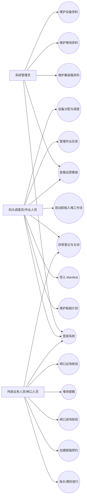

### 4.3 主要用例定义

#### 用例 1：导入 Manifest

| 项目 | 内容 |
|---|---|
| 参与者 | 码头调度员 |
| 前置条件 | 用户已登录，准备好 `.xlsx` 格式 Manifest 文件 |
| 后置条件 | 船舶、集装箱、Manifest 批次、Manifest 明细、卸船任务被写入数据库 |
| 主流程 | 上传 Excel -> 后端解析表头和数据 -> 创建/更新船舶 -> 创建/更新集装箱 -> 生成卸船任务 -> 写入导入结果 |
| 异常流程 | 文件为空、格式不是 `.xlsx`、缺少箱号列、单行缺少箱号、数据解析失败 |

#### 用例 2：启动卸船入堆工作流

| 项目 | 内容 |
|---|---|
| 参与者 | 码头调度员 |
| 前置条件 | 船舶下存在未离港集装箱，系统存在可用堆场 |
| 后置条件 | 集装箱完成从在船上到堆场存储的状态迁移，船舶释放泊位并离港 |
| 主流程 | 选择船舶 -> 启动工作流 -> 分配泊位 -> 规划箱位 -> 岸桥卸船 -> AGV 转运 -> 场桥入堆 -> 船舶离港 |
| 异常流程 | 没有可用泊位、没有可用堆场、没有可用箱位、设备故障、缓冲区满 |

#### 用例 3：创建提箱预约

| 项目 | 内容 |
|---|---|
| 参与者 | 外部业务人员/闸口人员 |
| 前置条件 | 集装箱在场或等待提箱，海关已放行，残损状态允许提箱，没有未完成预约 |
| 后置条件 | 生成预约单，箱子被预约锁定 |
| 主流程 | 选择可提箱集装箱 -> 填写车牌、司机、时间窗 -> 后端校验 -> 创建预约 -> 锁定箱子 |
| 异常流程 | 海关未放行、箱子不在场、箱子严重残损、已有未完成预约、时间窗无效、车牌为空 |

#### 用例 4：闸口进场

| 项目 | 内容 |
|---|---|
| 参与者 | 闸口人员 |
| 前置条件 | 存在有效预约，预约状态为已确认 |
| 后置条件 | 通过时生成进闸流水和小票，预约状态变为已进闸；拦截时生成异常 |
| 主流程 | 输入预约号/车牌/箱号 -> 校验预约、车牌、箱号、海关状态、时间窗 -> 通过进闸 -> 生成小票 |
| 异常流程 | 无预约、车牌不一致、箱号不一致、海关未放行、超出时间窗 |

#### 用例 5：闸口出场

| 项目 | 内容 |
|---|---|
| 参与者 | 闸口人员 |
| 前置条件 | 预约状态为已提箱，车辆已完成堆场提箱 |
| 后置条件 | 集装箱状态变为离港，预约状态变为已出闸 |
| 主流程 | 输入预约号/车牌/箱号 -> 校验提箱完成、车牌、箱号、放行状态 -> 通过出闸 -> 集装箱离港 |
| 异常流程 | 未提箱、车牌不一致、车载箱号不一致、海关状态异常 |

### 4.4 业务流程图/活动图

#### 4.4.1 集装箱进口全生命周期活动图

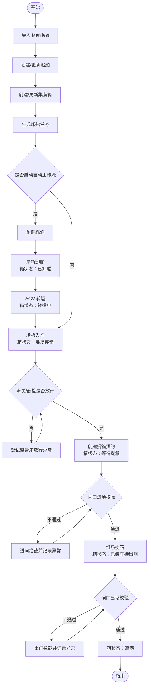

#### 4.4.2 卸船入堆流水作业活动图

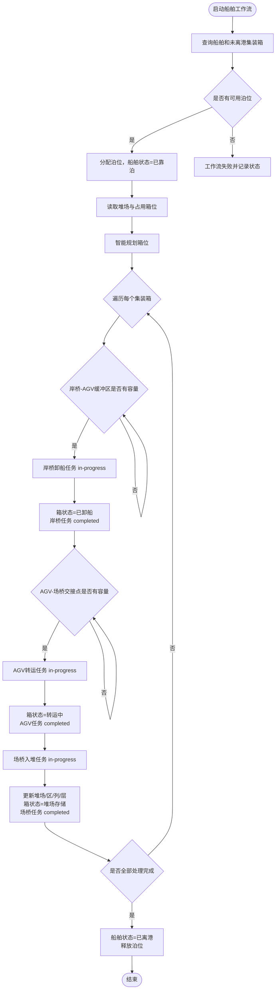

### 4.5 对象时序图

#### 4.5.1 Manifest 导入时序图

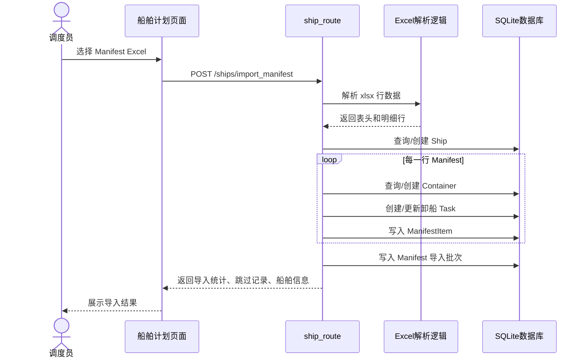

#### 4.5.2 闸口进场时序图

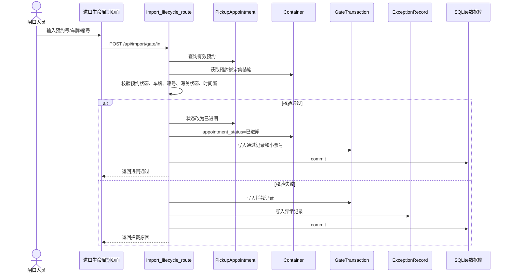

#### 4.5.3 设备分配任务时序图

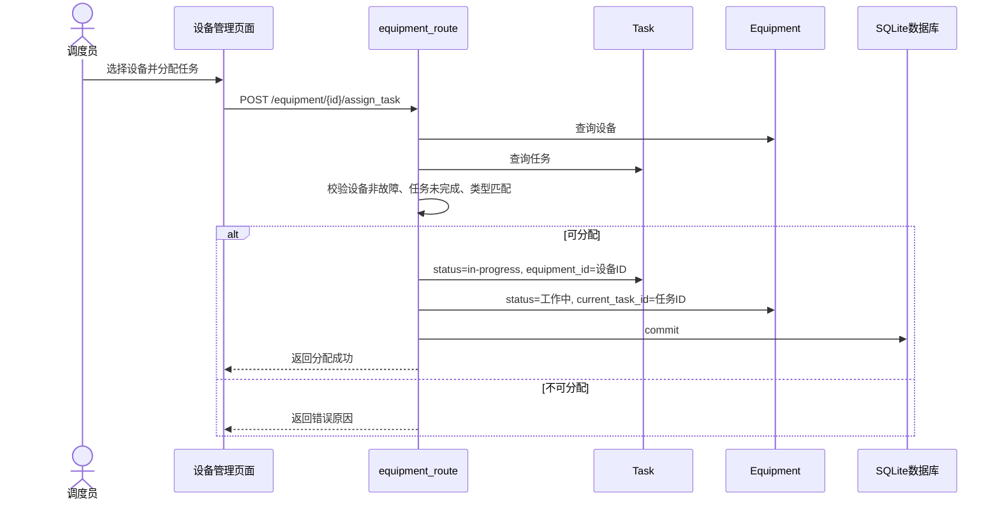

### 4.6 类设计

系统使用 SQLAlchemy Model 作为主要领域对象。核心类关系如下：

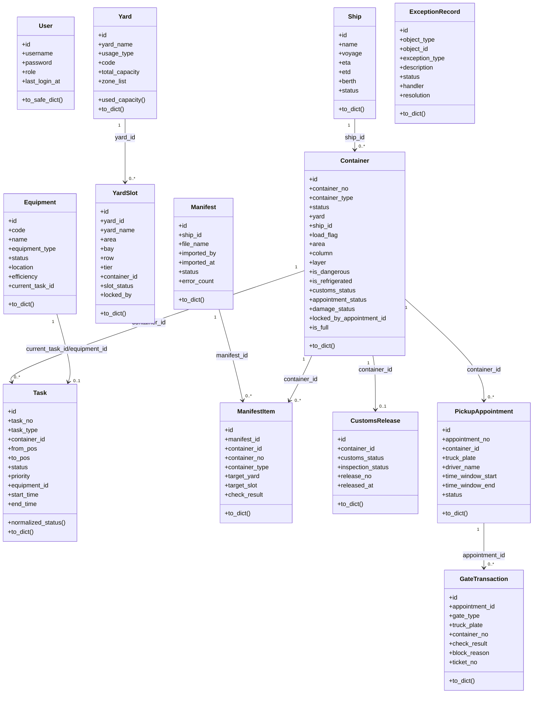

## 5. 结构化设计

### 5.1 代码设计

系统后端采用“应用入口 + 路由蓝图 + 数据模型”的结构化组织方式：

```text
Management/Container
├── app.py
├── config.py
├── models
│   └── container_model.py
└── routes
    ├── container_route.py
    ├── equipment_route.py
    ├── import_lifecycle_route.py
    ├── ship_route.py
    ├── task_route.py
    └── yard_route.py
```

代码设计特点：

1. 应用工厂集中初始化：`create_app()` 负责创建 Flask 应用、加载配置、初始化数据库、注册蓝图。
2. 蓝图按业务域拆分：集装箱、堆场、船舶、任务、设备、进口生命周期各自独立，便于维护。
3. ORM 模型集中定义：所有业务实体位于 `container_model.py`，便于统一管理字段和序列化。
4. API 返回 JSON：前端通过 fetch 调用后端接口，接口返回 `message` 和 `data`。
5. 状态推进封装在接口中：任务完成、设备释放、闸口拦截等业务动作由后端完成，避免前端直接修改关键状态。
6. 数据库兼容升级：`app.py` 中通过 `ensure_*_schema()` 对旧数据库补充字段，提升运行兼容性。
7. 后台线程模拟作业流：船舶工作流使用 `threading.Thread` 执行，并通过内存字典保存当前工作流状态。

### 5.2 模块设计 HIPO 图

#### 5.2.1 总体 HIPO 图

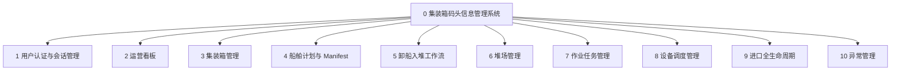

#### 5.2.2 船舶与 Manifest HIPO 图

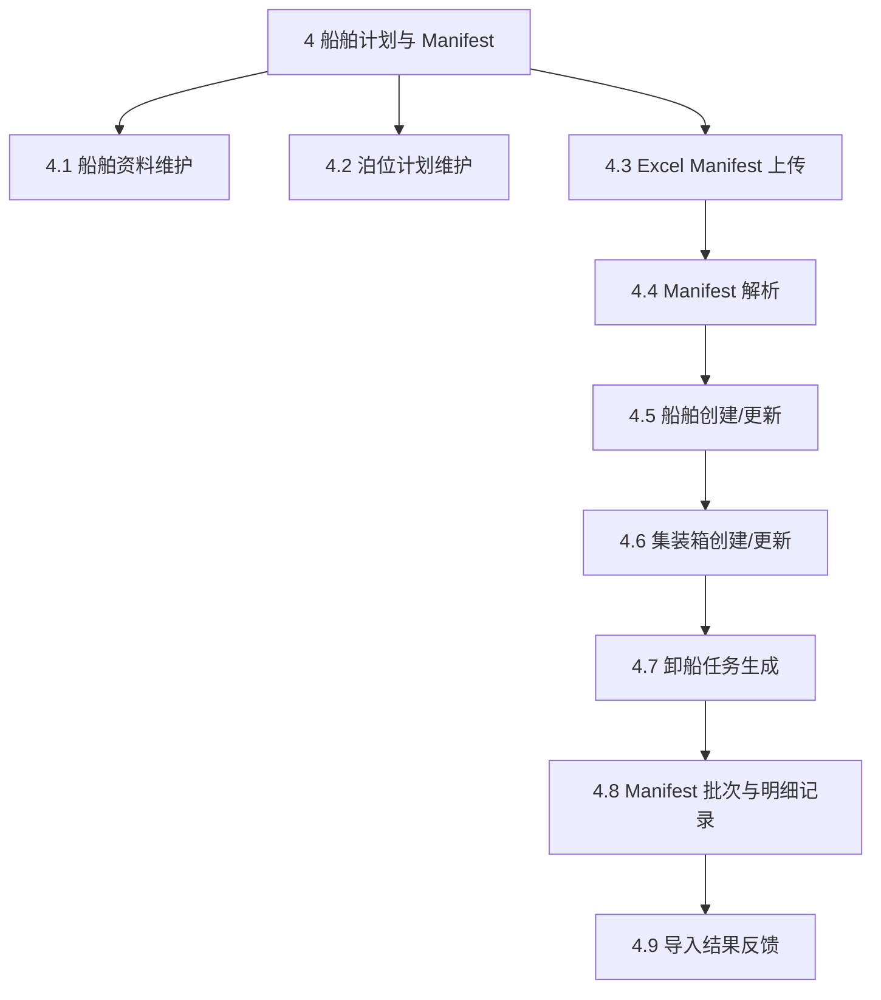

#### 5.2.3 进口生命周期 HIPO 图

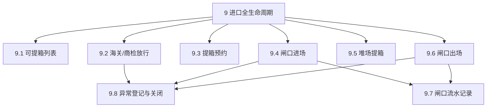

### 5.3 输入-处理-输出 IPO 表

| 模块 | 输入 | 处理 | 输出 |
|---|---|---|---|
| 用户登录 | 用户名、密码 | 查询用户、校验密码、写入 session | 登录成功信息、用户安全信息 |
| Manifest 导入 | Excel 文件、航次、是否自动运行 | 解析 Excel、映射字段、创建/更新船舶和集装箱、生成任务、保存导入批次 | 导入数量、更新数量、跳过数量、Manifest 记录 |
| 智能箱位分配 | 船舶 ID、集装箱属性、堆场容量 | 过滤可用堆场、计算候选箱位评分、避免占用冲突 | 箱位分配结果、跳过原因 |
| 卸船入堆工作流 | 船舶 ID | 分配泊位、岸桥卸船、AGV 转运、场桥入堆、更新状态 | 工作流进度、任务记录、集装箱位置、船舶离港状态 |
| 设备调度 | 设备 ID、任务 ID | 校验故障状态、任务状态、设备类型匹配，绑定任务 | 设备工作中、任务进行中 |
| 海关放行 | 箱号/箱 ID、放行状态、商检状态 | 更新 `customs_release` 和 `container.customs_status` | 放行记录、箱状态 |
| 提箱预约 | 箱号、车牌、司机、时间窗 | 校验箱在场、已放行、无未完成预约、时间窗有效，锁定集装箱 | 预约单、箱预约状态 |
| 闸口进场 | 预约号、车牌、箱号 | 校验预约、车牌、箱号、海关、时间窗 | 通过小票或拦截记录 |
| 堆场提箱 | 预约 ID | 校验车辆已进闸，生成提箱任务，更新箱和预约状态 | 已提箱状态、提箱任务 |
| 闸口出场 | 预约号、车牌、箱号 | 校验已提箱、车牌、箱号、海关状态 | 箱离港、出闸流水 |

## 6. 数据库概念模型

### 6.1 核心实体

系统数据库概念模型围绕“集装箱”这一核心实体展开：

- 用户：记录系统登录身份。
- 船舶：记录船名、航次、ETA/ETD、泊位和状态。
- 集装箱：记录箱号、箱型、箱状态、属性、位置和监管/预约状态。
- 堆场：记录堆场名称、类型、容量、负责人和启用状态。
- 箱位：记录堆场内精确 bay/row/tier 占用和锁定状态。
- 作业任务：记录卸船、转运、入堆、提箱等作业指令。
- 设备：记录岸桥、场桥、AGV 的状态和当前任务。
- Manifest：记录导入批次。
- ManifestItem：记录 Manifest 明细。
- 海关放行：记录集装箱监管状态。
- 提箱预约：记录车辆、司机、时间窗和预约状态。
- 闸口流水：记录进闸/出闸核验结果。
- 异常记录：记录业务异常和处理结果。

### 6.2 E-R 概念模型

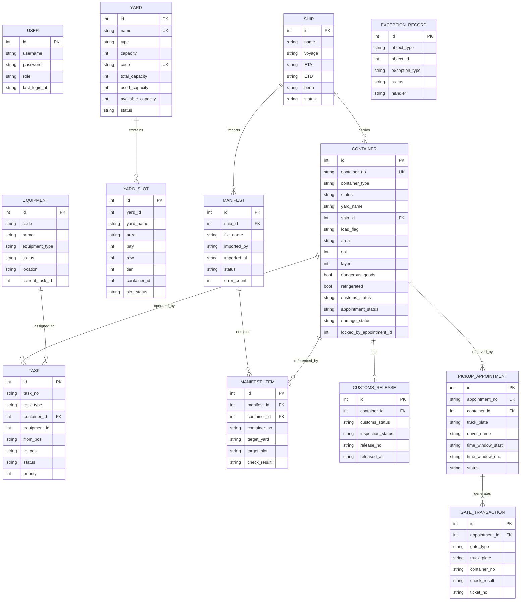

## 7. 数据表设计

以下表结构依据 SQLAlchemy 模型和实际 SQLite 数据库结构整理。

### 7.1 `user` 用户表

| 字段 | 类型 | 约束/说明 |
|---|---|---|
| `id` | Integer | 主键 |
| `username` | String(50) | 唯一，非空 |
| `password` | String(100) | 非空，当前为明文保存 |
| `role` | String(20) | 角色 |
| `last_login_at` | String(30) | 最近登录时间 |

### 7.2 `ship` 船舶表

| 字段 | 类型 | 约束/说明 |
|---|---|---|
| `id` | Integer | 主键 |
| `name` | Text/String | 船名，非空 |
| `voyage` | Text/String | 航次，非空 |
| `ETA` | Text/String | 预计到港时间 |
| `ETD` | Text/String | 预计/实际离港时间 |
| `berth` | Text/String | 泊位 |
| `status` | Text/String | 计划中、已靠泊、已离港 |

### 7.3 `container` 集装箱表

| 字段 | 类型 | 约束/说明 |
|---|---|---|
| `id` | Integer | 主键 |
| `container_no` | Text/String(30) | 箱号，唯一，非空 |
| `container_type` | Text/String(10) | 箱型，如 20GP、40HQ |
| `status` | Text/String(20) | 物理/作业状态 |
| `yard_name` | Text/String(30) | 当前堆场 |
| `ship_id` | Integer | 所属船舶 ID |
| `load_flag` | Text/String(20) | 空箱/重箱/已装载 |
| `area` | Text/String(20) | 堆场区域 |
| `col` | Integer | 列 |
| `layer` | Integer | 层 |
| `dangerous_goods` | Boolean/Integer | 是否危险品 |
| `refrigerated` | Boolean/Integer | 是否冷藏 |
| `customs_status` | Text/String(20) | 海关状态，默认未放行 |
| `appointment_status` | Text/String(20) | 预约状态，默认未预约 |
| `damage_status` | Text/String(20) | 残损状态，默认正常 |
| `locked_by_appointment_id` | Integer | 锁定该箱的预约 ID |

### 7.4 `yard` 堆场表

| 字段 | 类型 | 约束/说明 |
|---|---|---|
| `id` | Integer | 主键 |
| `name` | Text/String(30) | 堆场名称，唯一，非空 |
| `type` | Text/String(30) | 堆场类型，如进口箱、出口箱、冷藏箱、综合堆场 |
| `capacity` | Integer | 旧容量字段 |
| `code` | Text/String(20) | 堆场编码，唯一 |
| `total_capacity` | Integer | 总容量 |
| `used_capacity` | Integer | 已用容量字段，当前主要动态计算 |
| `available_capacity` | Integer | 可用容量 |
| `address` | Text/String(100) | 地址 |
| `manager` | Text/String(30) | 负责人 |
| `contact_phone` | Text/String(30) | 联系电话 |
| `status` | Text/String(20) | active/启用等 |
| `created_at` | Text/String(30) | 创建时间 |
| `updated_at` | Text/String(30) | 更新时间 |

### 7.5 `yard_slot` 箱位表

| 字段 | 类型 | 约束/说明 |
|---|---|---|
| `id` | Integer | 主键 |
| `yard_id` | Integer | 堆场 ID |
| `yard_name` | String(30) | 堆场名称 |
| `area` | String(20) | 区域 |
| `bay` | Integer | 贝位/列 |
| `row` | Integer | 排 |
| `tier` | Integer | 层 |
| `container_id` | Integer | 当前占用箱 ID |
| `slot_status` | String(20) | 空闲、占用、锁定、禁用 |
| `locked_by` | String(40) | 锁定来源 |
| `updated_at` | String(30) | 更新时间 |

说明：当前业务逻辑仍主要通过 `container.yard/area/col/layer` 判断箱位占用，`yard_slot` 已建模，后续可加强为强箱位锁。

### 7.6 `task` 作业任务表

| 字段 | 类型 | 约束/说明 |
|---|---|---|
| `id` | Integer | 主键 |
| `task_no` | Text/String(40) | 任务号 |
| `task_type` | Text/String(80) | 任务类型 |
| `container_id` | Integer | 关联集装箱 |
| `from_pos` | Text/String(80) | 起点 |
| `to_pos` | Text/String(80) | 终点 |
| `status` | Text/String(30) | pending、in-progress、completed |
| `priority` | Integer | 优先级 |
| `operator_id` | Integer | 操作员 ID |
| `equipment_id` | Integer | 分配设备 ID |
| `start_time` | Text/String(30) | 开始时间 |
| `end_time` | Text/String(30) | 结束时间 |
| `estimated_time` | Integer | 预计耗时 |
| `actual_time` | Integer | 实际耗时 |
| `created_at` | Text/String(30) | 创建时间 |
| `updated_at` | Text/String(30) | 更新时间 |
| `remark` | Text/String(200) | 备注/箱位信息 |

### 7.7 `equipment` 设备表

| 字段 | 类型 | 约束/说明 |
|---|---|---|
| `id` | Integer | 主键 |
| `code` | Text/String(30) | 设备编号 |
| `name` | Text/String(50) | 设备名称 |
| `equipment_type` | Text/String(30) | 岸桥、场桥、AGV |
| `status` | Text/String(20) | 空闲、工作中、故障 |
| `location` | Text/String(80) | 所在位置 |
| `efficiency` | Integer | 效率 |
| `current_task_id` | Integer | 当前任务 ID |
| `last_maintenance_at` | Text/String(30) | 最近维护时间 |
| `remark` | Text/String(200) | 备注 |
| `created_at` | Text/String(30) | 创建时间 |
| `updated_at` | Text/String(30) | 更新时间 |

说明：实际库中仍保留旧字段 `equipment_no`、`model`、`task_id` 等，系统通过兼容升级逻辑补齐新字段。

### 7.8 `manifest` Manifest 批次表

| 字段 | 类型 | 约束/说明 |
|---|---|---|
| `id` | Integer | 主键 |
| `ship_id` | Integer | 船舶 ID |
| `file_name` | String(120) | 文件名 |
| `imported_by` | String(50) | 导入人 |
| `imported_at` | String(30) | 导入时间 |
| `status` | String(20) | 已导入、部分失败、导入失败 |
| `error_count` | Integer | 错误数量 |
| `remark` | String(200) | 备注 |

### 7.9 `manifest_item` Manifest 明细表

| 字段 | 类型 | 约束/说明 |
|---|---|---|
| `id` | Integer | 主键 |
| `manifest_id` | Integer | Manifest 批次 ID |
| `container_id` | Integer | 集装箱 ID |
| `container_no` | String(30) | 箱号 |
| `container_type` | String(10) | 箱型 |
| `size` | String(10) | 尺寸 |
| `discharge_seq` | Integer | 卸船顺序 |
| `target_yard` | String(30) | 目标堆场 |
| `target_slot` | String(80) | 目标箱位 |
| `check_result` | String(80) | 校验结果 |
| `raw_remark` | String(200) | 原始备注 |

### 7.10 `customs_release` 海关放行表

| 字段 | 类型 | 约束/说明 |
|---|---|---|
| `id` | Integer | 主键 |
| `container_id` | Integer | 集装箱 ID |
| `customs_status` | String(20) | 未放行、已放行等 |
| `inspection_status` | String(20) | 未商检、已通过等 |
| `release_no` | String(40) | 放行指令号 |
| `released_at` | String(30) | 放行时间 |
| `hold_reason` | String(200) | 扣留原因 |
| `updated_at` | String(30) | 更新时间 |

### 7.11 `pickup_appointment` 提箱预约表

| 字段 | 类型 | 约束/说明 |
|---|---|---|
| `id` | Integer | 主键 |
| `appointment_no` | String(40) | 预约号，唯一，非空 |
| `container_id` | Integer | 集装箱 ID |
| `truck_plate` | String(30) | 车牌，非空 |
| `driver_name` | String(40) | 司机姓名 |
| `driver_phone` | String(30) | 司机电话 |
| `customer` | String(80) | 客户 |
| `time_window_start` | String(30) | 预约开始时间 |
| `time_window_end` | String(30) | 预约结束时间 |
| `status` | String(20) | 待确认、已确认、已进闸、已提箱、已出闸、已取消 |
| `created_at` | String(30) | 创建时间 |
| `updated_at` | String(30) | 更新时间 |
| `remark` | String(200) | 备注 |

### 7.12 `gate_transaction` 闸口流水表

| 字段 | 类型 | 约束/说明 |
|---|---|---|
| `id` | Integer | 主键 |
| `appointment_id` | Integer | 预约 ID |
| `gate_type` | String(10) | 进闸/出闸 |
| `truck_plate` | String(30) | 识别车牌 |
| `container_no` | String(30) | 识别箱号 |
| `check_result` | String(20) | 通过/拦截 |
| `block_reason` | String(200) | 拦截原因 |
| `ticket_no` | String(40) | 小票号 |
| `created_at` | String(30) | 记录时间 |

### 7.13 `exception_record` 异常记录表

| 字段 | 类型 | 约束/说明 |
|---|---|---|
| `id` | Integer | 主键 |
| `object_type` | String(30) | 异常对象类型，如 container、appointment、gate |
| `object_id` | Integer | 异常对象 ID |
| `exception_type` | String(40) | 异常类型 |
| `description` | String(240) | 异常描述 |
| `status` | String(20) | 待处理、已关闭 |
| `handler` | String(40) | 处理人 |
| `resolution` | String(240) | 处理结果 |
| `created_at` | String(30) | 创建时间 |
| `resolved_at` | String(30) | 关闭时间 |

## 8. 数据库实现过程

系统数据库实现过程如下：

1. 在 `config.py` 中配置 SQLite 路径：

```python
DB_PATH = (BASE_DIR.parents[1] / 'database.db').as_posix()
SQLALCHEMY_DATABASE_URI = f"sqlite:///{DB_PATH}"
```

2. 在 `models/container_model.py` 中通过 SQLAlchemy 定义实体类和字段。

3. 在 `app.py` 的 `create_app()` 中初始化数据库：

```python
db.init_app(app)
with app.app_context():
    db.create_all()
```

4. 为兼容旧数据库，系统启动时执行补字段逻辑：

- `ensure_container_import_schema()`：为 `container` 补充 `customs_status`、`appointment_status`、`damage_status`、`locked_by_appointment_id`。
- `ensure_ship_schema()`：为 `ship` 补充 `status`。
- `ensure_task_schema()`：为 `task` 补充任务号、备注、时间、预计/实际耗时等字段。
- `ensure_equipment_schema()`：为 `equipment` 补充设备编号、名称、类型、效率、当前任务、维护信息等字段。

5. 系统启动时通过 `seed_data()` 写入基础数据：

- 默认堆场：堆场A、堆场B、堆场C。
- 默认集装箱示例数据。
- 默认作业任务。
- 默认设备：岸桥、AGV、场桥。

6. 运行过程中由业务接口持续写入数据：

- Manifest 导入写入 `ship`、`container`、`task`、`manifest`、`manifest_item`。
- 自动工作流更新 `ship`、`container`、`task`、`equipment`。
- 进口流程写入 `customs_release`、`pickup_appointment`、`gate_transaction`、`exception_record`。

## 9. 核心业务实现分析

### 9.1 Manifest 导入实现

Manifest 导入是系统从计划数据进入实际作业数据的起点。后端实现中没有依赖第三方 Excel 库，而是通过 `zipfile` 解压 `.xlsx`，再用 `xml.etree.ElementTree` 读取工作表和共享字符串。

核心处理步骤：

1. 校验上传文件存在且后缀为 `.xlsx`。
2. 读取 Excel 行数据。
3. 规范化表头，支持“箱号、集装箱号、箱型、装载、状态、堆场、区域、列层、危险品、冷藏、操作”等列。
4. 如果缺少箱号列则拒绝导入。
5. 根据文件名生成船名，按船名查询或创建船舶。
6. 每个箱号执行 upsert：
   - 已存在则更新属性。
   - 不存在则创建新箱。
   - 绑定船舶 ID。
   - 保存箱型、空重、危险品、冷藏、堆场和箱位信息。
7. 为每个箱生成卸船任务，任务号格式类似 `IMP-{ship.id}-{container_no}`。
8. 写入 Manifest 批次和明细。
9. 返回导入数量、更新数量、跳过数量和错误明细。

该设计保证了 Manifest 重复导入时不会简单重复创建箱，而是根据箱号更新已有记录。

### 9.2 智能箱位分配实现

智能箱位分配主要由 `yard_route.py` 和 `ship_route.py` 中的 `_find_best_slot()` 完成。

评分因素：

- 堆场类型是否匹配箱属性：危险品、冷藏、重箱、空箱。
- 同一船舶的箱是否尽量集中到同一堆场同一区域。
- 列位置靠近操作便利区域时加分。
- 低层优先，便于堆存和提箱。
- 已占用箱位不可选。
- 堆场容量达到上限不可选。

这种实现虽然是简化算法，但已经体现了 TOS 中“按箱属性、堆场能力、作业集中度”综合决策的思想。

### 9.3 卸船入堆工作流实现

工作流由 `POST /ships/<ship_id>/workflow` 启动，核心函数为 `_start_async_workflow()` 和 `_run_workflow_worker()`。

实现特点：

- 使用后台线程执行，前端每 3 秒轮询状态。
- 使用 `WORKFLOW_RUNS` 内存字典保存进度、阶段、消息、统计数量。
- 按单箱流水线推进，而不是简单批量直接改状态。
- 岸桥、AGV、场桥三个阶段分别创建或更新任务。
- 任务执行中会绑定设备，任务完成后释放设备。
- 设置交接缓冲区容量，模拟真实码头前沿和堆场交接点拥塞。

核心状态迁移：

```text
船舶：计划中 -> 已靠泊 -> 已离港
集装箱：在船上 -> 已卸船 -> 转运中 -> 堆场存储
任务：pending/in-progress -> completed
设备：空闲 -> 工作中 -> 空闲
```

### 9.4 进口提箱闭环实现

进口提箱流程由 `import_lifecycle_route.py` 实现，是系统最接近真实业务闭环的部分。

关键规则：

1. 创建预约前必须校验：
   - 箱子存在。
   - 箱状态为堆场存储、在场或等待提箱。
   - 海关状态为已放行。
   - 残损状态为正常或轻微残损。
   - 不存在未完成预约。

2. 进闸必须校验：
   - 预约存在且状态为已确认。
   - 车牌与预约一致。
   - 箱号与预约一致。
   - 海关仍为已放行。
   - 当前时间在预约时间窗前后 30 分钟容差内。

3. 堆场提箱必须校验：
   - 预约状态为已进闸。
   - 预约绑定的箱存在。

4. 出闸必须校验：
   - 预约状态为已提箱。
   - 车牌一致。
   - 车载箱号一致。
   - 海关状态没有异常变化。

业务闭环的优点在于：系统不是单纯修改 `container.status`，而是同时维护集装箱状态、预约状态、闸口流水和异常记录。

### 9.5 异常处理实现

异常记录表 `exception_record` 用于追踪业务异常：

- 海关未放行。
- 预约校验失败。
- 闸口进场失败。
- 闸口出场失败。
- 人工登记异常。

异常可由接口关闭：

```text
待处理 -> 已关闭
```

异常闭环设计增强了系统可审计性，适合在课程设计答辩中强调“业务风险可追踪”。

## 10. 系统状态设计

### 10.1 集装箱物理状态

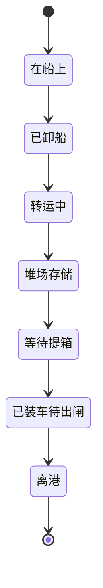

### 10.2 预约状态

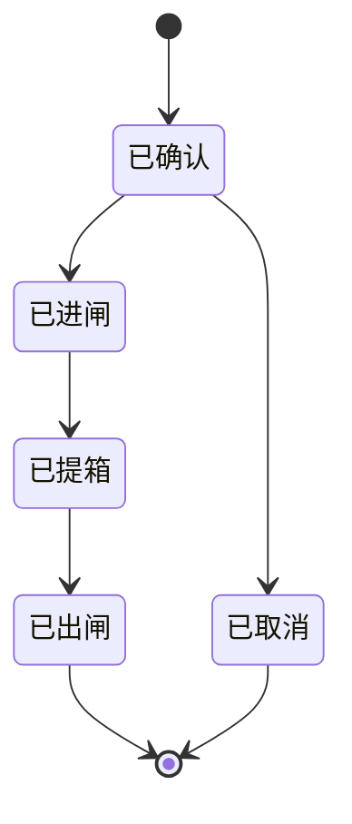

### 10.3 船舶状态

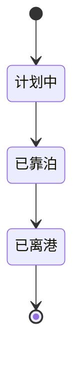

### 10.4 设备状态

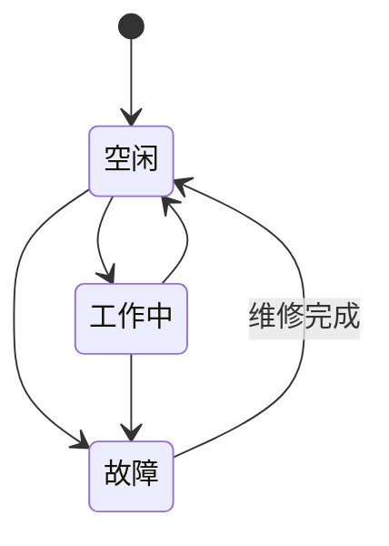

## 11. 系统实现评价

### 11.1 已实现优势

1. 业务模块较完整，覆盖集装箱码头的船、箱、堆场、任务、设备、进口提箱等核心对象。
2. 后端模块划分清晰，Blueprint 按业务域拆分，便于维护。
3. 前端页面与后端接口对应明确，每个子系统都有独立页面。
4. Manifest 导入实现具有实际业务价值，可以从 Excel 批量生成船舶、箱和作业任务。
5. 自动卸船入堆工作流体现了码头作业连续性，包含泊位、设备、缓冲区、箱位分配等约束。
6. 进口生命周期补齐了海关放行、提箱预约、进闸、提箱、出闸、异常记录，使进口箱具备完整闭环。
7. 堆场分配考虑箱属性和堆场用途，具备初步智能调度思想。
8. 闸口拦截与异常记录使业务风险可追踪。

### 11.2 当前不足

1. 数据库外键约束不够严格，很多关联字段是普通 Integer，没有在实际 SQLite 表中完整建立外键。
2. `yard_slot` 已设计但业务主逻辑仍主要依赖 `container` 表中的位置字段判断占用，箱位锁能力还可以加强。
3. 用户密码明文保存，缺少密码哈希和角色级接口权限控制。
4. 后台工作流状态保存在内存字典中，Flask 重启后会丢失，真实系统应持久化为 `workflow_run` 表。
5. SQLite 适合课程设计和单机演示，高并发写入场景下容易出现数据库锁。
6. 部分业务状态仍使用字符串硬编码，建议统一抽象为枚举或常量表。
7. 设备调度算法较简单，当前主要是按空闲设备顺序匹配，尚未考虑路径距离、任务优先级动态变化、设备负载均衡等高级因素。
8. 旧字段和新字段并存，例如 `equipment` 表中保留了旧字段，说明数据库演进过程还可以进一步清理。

### 11.3 优化建议

1. 增强数据库约束：为 `ship_id`、`container_id`、`equipment_id`、`appointment_id` 等建立明确外键和索引。
2. 强化箱位表：让 `yard_slot` 成为箱位占用的唯一事实来源，入堆和提箱时原子锁定/释放箱位。
3. 持久化工作流：新增 `workflow_run`、`workflow_step` 表记录后台作业阶段，避免服务重启丢失状态。
4. 安全优化：用户密码使用哈希存储，接口按 `role` 实施访问控制。
5. 状态枚举化：将集装箱状态、任务状态、设备状态、预约状态统一为枚举，减少字符串拼写错误。
6. 并发控制：提箱预约、闸口出场、箱位分配等关键动作应使用数据库事务和唯一约束，避免重复预约、重复提箱。
7. 调度算法升级：设备调度可引入任务优先级、设备距离、设备效率、故障率等评分机制。
8. 异常流程细化：残损、箱号不符、海关扣留、超窗进闸、设备故障可分别形成专门处理流程。

## 12. 课程设计要求覆盖说明

| 要求 | 本报告对应章节 |
|---|---|
| 数据库概念模型 | 第 6 章 |
| 数据表格设计 | 第 7 章 |
| 数据库实现过程 | 第 8 章 |
| 面向对象：用例定义，含三类参与者 | 第 4.1、4.2、4.3 节 |
| 面向对象：业务流程图/活动图 | 第 4.4 节 |
| 面向对象：对象时序图 | 第 4.5 节 |
| 面向对象：类设计 | 第 4.6 节 |
| 结构化：代码设计 | 第 5.1 节 |
| 结构化：数据库设计 | 第 6、7、8 章 |
| 结构化：模块设计 HIPO 图 | 第 5.2 节 |
| 系统实现 | 第 2、3、8、9 章 |
| 总体架构 | 第 2 章 |
| 核心业务实现 | 第 9 章 |

## 13. 总结

本系统以集装箱码头进口业务为核心，采用 Flask + SQLite + 前端多页面 Vue 脚本的架构实现了一个轻量但较完整的码头管理系统。系统围绕集装箱状态流转建立了船舶计划、Manifest 导入、卸船入堆、堆场管理、任务执行、设备调度、海关放行、提箱预约、闸口核验和异常处理等模块。

从课程设计角度看，系统已经具备管理信息系统的主要特征：有明确的业务对象、数据表设计、功能模块划分、流程控制、状态管理和数据持久化。尤其是 Manifest 导入与自动卸船入堆工作流、进口提箱闭环两个部分，能够体现系统对港口物流业务流程的理解。

后续如果继续完善，应重点加强数据库约束、箱位锁、工作流持久化、权限控制和并发控制，使系统从课程演示型系统进一步接近真实 TOS 的工程化要求。
