# 集装箱码头管理系统模块输入、处理、输出设计图表

## 1. 文档说明

本文档用于描述当前集装箱码头管理系统各业务模块的输入、处理、输出设计。该类设计通常也称为 IPO 设计，即：

```text
Input 输入 -> Process 处理 -> Output 输出
```

本文档可用于课程设计中的：

- 系统功能设计
- 模块设计
- 数据处理流程说明
- 接口设计补充说明
- 答辩时解释系统业务逻辑

系统当前主要模块包括：

| 序号 | 模块 | 说明 |
|---|---|---|
| 1 | 用户登录与权限管理模块 | 登录认证、角色权限、页面和接口访问控制 |
| 2 | 首页驾驶舱模块 | 汇总展示码头关键业务指标 |
| 3 | 集装箱管理模块 | 集装箱基础信息维护、状态流转 |
| 4 | 船舶计划模块 | 船舶计划维护、Excel 清单导入、后台自动作业 |
| 5 | 堆场管理模块 | 堆场维护、箱位分配、智能分配 |
| 6 | 码头作业单模块 | 作业单创建、修改、状态推进 |
| 7 | 设备调度模块 | 设备管理、任务分配、AGV 自动调度、故障维修 |
| 8 | 进口闭环模块 | 放行、预约、闸口、提箱、异常闭环 |
| 9 | 车牌视觉识别模块 | YOLOv5 检测车牌、LPRNet 识别车牌 |
| 10 | 财务计费模块 | 账单生成、账单查询、结算 |
| 11 | 危险品管理模块 | 危险品箱监管、违规箱位纠偏 |

## 2. 系统总体 IPO 图

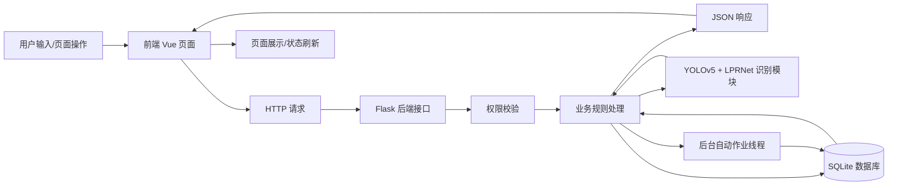

总体输入：

- 用户登录信息
- 集装箱信息
- 船舶计划信息
- Excel 船舶清单
- 堆场箱位信息
- 作业单信息
- 设备调度信息
- 闸口图片
- 预约信息
- 财务账单信息

总体处理：

- 登录认证
- 权限校验
- 业务规则校验
- 数据库增删改查
- 船舶后台自动作业
- 车牌视觉识别
- 异常登记与闭环
- 账单生成与结算

总体输出：

- 页面表格数据
- KPI 统计数据
- 业务处理结果
- 状态变更结果
- 闸口通行/拦截结果
- 账单和财务汇总
- 异常处理结果

## 3. 用户登录与权限管理模块

### 3.1 IPO 设计图

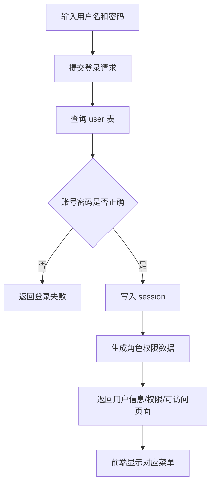

### 3.2 输入、处理、输出表

| 项目 | 内容 |
|---|---|
| 模块名称 | 用户登录与权限管理模块 |
| 输入数据 | 用户名、密码、当前访问路径、HTTP 请求方法 |
| 输入来源 | 登录页面、浏览器 Cookie/session、前端页面请求 |
| 处理逻辑 | 校验用户名和密码；根据角色生成权限列表；写入 session；访问页面和接口前进行权限校验 |
| 业务规则 | 未登录不能访问业务接口；无页面权限不能进入对应页面；无接口权限不能执行对应操作 |
| 输出数据 | 登录成功信息、用户角色、权限列表、可访问页面、401/403 错误响应 |
| 输出去向 | 前端登录页、首页菜单、后端接口响应 |
| 关联数据表 | `user` |
| 主要接口 | `/api/auth/login`、`/api/auth/me`、`/api/auth/logout` |

### 3.3 输入字段设计

| 字段 | 类型 | 必填 | 说明 |
|---|---|---|---|
| `username` | String | 是 | 登录用户名 |
| `password` | String | 是 | 登录密码 |

### 3.4 输出字段设计

| 字段 | 类型 | 说明 |
|---|---|---|
| `message` | String | 登录结果说明 |
| `data.id` | Integer | 用户 ID |
| `data.username` | String | 用户名 |
| `data.role` | String | 中文角色名称 |
| `data.roleKey` | String | 系统角色值 |
| `data.permissions` | Array | 权限列表 |
| `data.pages` | Array | 可访问页面 |

## 4. 首页驾驶舱模块

### 4.1 IPO 设计图

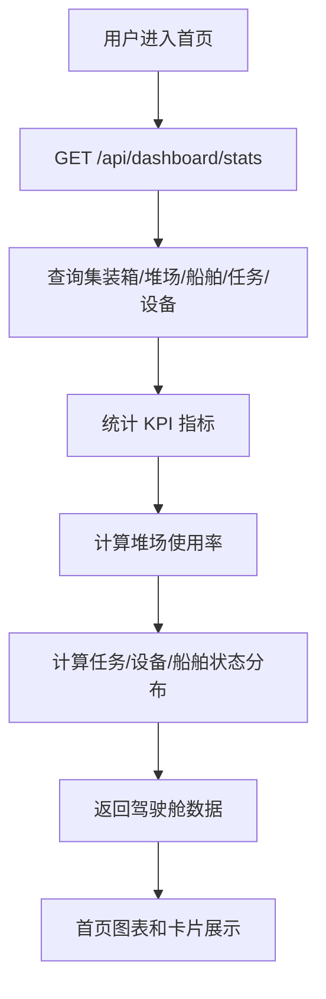

### 4.2 输入、处理、输出表

| 项目 | 内容 |
|---|---|
| 模块名称 | 首页驾驶舱模块 |
| 输入数据 | 当前登录用户、统计请求 |
| 输入来源 | 首页前端自动加载 |
| 处理逻辑 | 查询各业务表；统计箱量、堆场容量、船舶状态、任务状态、设备状态 |
| 业务规则 | 需要具备 `dashboard:read` 权限 |
| 输出数据 | KPI 指标、任务状态分布、船舶状态分布、箱型统计、堆场利用率、设备状态 |
| 输出去向 | 首页仪表盘、码头地图、统计图表 |
| 关联数据表 | `container`、`yard`、`ship`、`task`、`equipment` |
| 主要接口 | `/api/dashboard/stats` |

### 4.3 输出指标设计

| 指标 | 说明 |
|---|---|
| `containerTotal` | 集装箱总数 |
| `yardTotalCapacity` | 堆场总容量 |
| `yardUsedCapacity` | 堆场已用容量 |
| `yardUsageRate` | 堆场使用率 |
| `shipTotal` | 船舶总数 |
| `berthedShips` | 已靠泊船舶数 |
| `taskTotal` | 作业单总数 |
| `runningTasks` | 运行中任务数 |
| `equipmentTotal` | 设备总数 |
| `workingEquipment` | 工作中设备数 |
| `faultEquipment` | 故障设备数 |
| `alerts` | 堆场高负载告警数 |

## 5. 集装箱管理模块

### 5.1 IPO 设计图

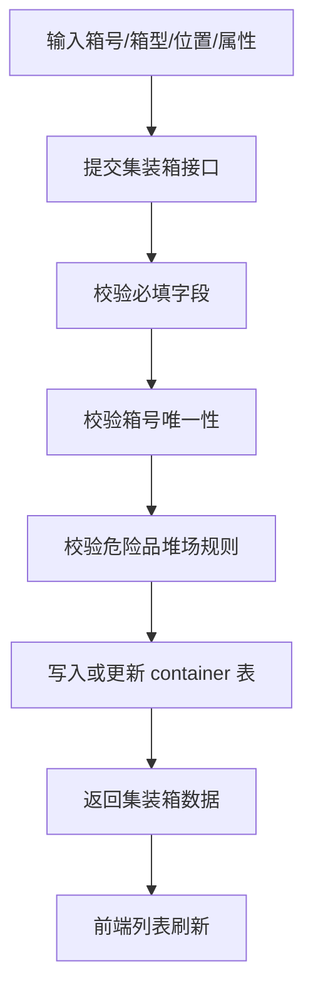

### 5.2 输入、处理、输出表

| 项目 | 内容 |
|---|---|
| 模块名称 | 集装箱管理模块 |
| 输入数据 | 箱号、箱型、重空状态、危险品标志、冷藏标志、堆场位置、业务状态 |
| 输入来源 | 集装箱管理页面、船舶清单导入、堆场分配、进口闭环业务 |
| 处理逻辑 | 新增、查询、修改、删除集装箱；推进状态；更新箱位；校验危险品堆场规则 |
| 业务规则 | 箱号唯一；危险品箱必须放危险品堆场；非危险品箱不能放危险品堆场 |
| 输出数据 | 集装箱列表、单箱详情、状态变更结果、位置更新结果 |
| 输出去向 | 集装箱页面、堆场页面、首页地图、进口闭环页面 |
| 关联数据表 | `container`、`yard`、`ship` |
| 主要接口 | `/containers`、`/containers/{id}`、`/containers/{id}/location`、`/containers/{id}/next_status` |

### 5.3 输入字段设计

| 字段 | 类型 | 必填 | 说明 |
|---|---|---|---|
| `containerNo` | String | 是 | 集装箱号 |
| `containerType` | String | 是 | 箱型，如 `20GP`、`40HQ` |
| `loadStatus` | String | 否 | 重箱/空箱 |
| `isDangerous` | Boolean | 否 | 是否危险品 |
| `isReefer` | Boolean | 否 | 是否冷藏 |
| `yard` | String | 否 | 堆场名称 |
| `zone` | String | 否 | 区域 |
| `row` | Integer | 否 | 列号 |
| `tier` | Integer | 否 | 层号 |
| `status` | String | 否 | 集装箱状态 |
| `customsStatus` | String | 否 | 海关放行状态 |
| `appointmentStatus` | String | 否 | 预约状态 |
| `damageStatus` | String | 否 | 残损状态 |

### 5.4 输出字段设计

| 字段 | 类型 | 说明 |
|---|---|---|
| `id` | Integer | 集装箱 ID |
| `containerNo` | String | 箱号 |
| `containerType` | String | 箱型 |
| `loadStatus` | String | 重空状态 |
| `isDangerous` | Boolean | 是否危险品 |
| `isReefer` | Boolean | 是否冷藏 |
| `yard` | String | 堆场 |
| `zone` | String | 区域 |
| `row` | Integer | 列 |
| `tier` | Integer | 层 |
| `status` | String | 当前状态 |
| `customsStatus` | String | 放行状态 |
| `appointmentStatus` | String | 预约状态 |

## 6. 船舶计划模块

### 6.1 IPO 设计图

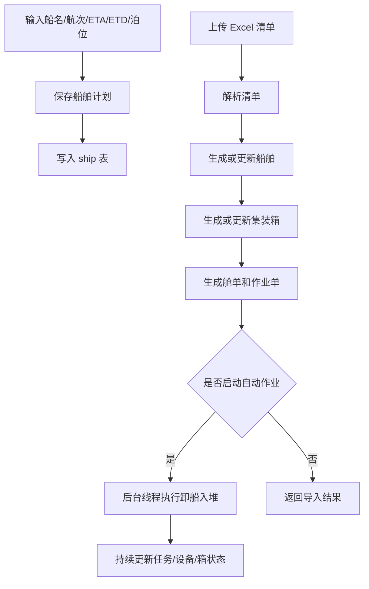

### 6.2 输入、处理、输出表

| 项目 | 内容 |
|---|---|
| 模块名称 | 船舶计划模块 |
| 输入数据 | 船名、航次、ETA、ETD、泊位、船舶状态、Excel 清单、自动作业参数 |
| 输入来源 | 船舶计划页面、Excel 文件上传 |
| 处理逻辑 | 新增/修改/删除船舶；解析 Excel；生成舱单、集装箱和卸船任务；启动后台自动作业 |
| 业务规则 | 船名和航次必填；导入文件必须为 `.xlsx`；Excel 必须包含箱号列 |
| 输出数据 | 船舶列表、导入结果、跳过明细、后台作业状态 |
| 输出去向 | 船舶计划页面、作业状态面板、首页统计 |
| 关联数据表 | `ship`、`manifest`、`manifest_item`、`container`、`task`、`equipment`、`yard` |
| 主要接口 | `/ships`、`/ships/import_manifest`、`/ships/{id}/workflow`、`/ships/{id}/workflow/status` |

### 6.3 船舶计划输入字段

| 字段 | 类型 | 必填 | 说明 |
|---|---|---|---|
| `name` | String | 是 | 船名 |
| `voyage` | String | 是 | 航次 |
| `ETA` | String | 否 | 预计到港时间 |
| `ETD` | String | 否 | 预计离港时间 |
| `berth` | String | 否 | 泊位 |
| `status` | String | 否 | 船舶状态 |

### 6.4 Excel 清单输入字段

| Excel 表头 | 说明 |
|---|---|
| 箱号 / 集装箱号 | 集装箱编号 |
| 箱型 | 集装箱类型 |
| 装载 | 重箱/空箱 |
| 状态 | 箱状态 |
| 堆场 | 目标堆场 |
| 区 / 区域 | 堆场区域 |
| 列层 | 箱位 |
| 危险品 | 是否危险品 |
| 冷藏 | 是否冷藏 |
| 操作 | 备注 |

### 6.5 输出字段设计

| 字段 | 类型 | 说明 |
|---|---|---|
| `ship` | Object | 船舶信息 |
| `manifest` | Object | 导入批次 |
| `createdShip` | Boolean | 是否新建船舶 |
| `importedCount` | Integer | 新增箱数量 |
| `updatedCount` | Integer | 更新箱数量 |
| `skippedCount` | Integer | 跳过数量 |
| `containers` | Array | 成功导入或更新的箱 |
| `skipped` | Array | 跳过明细 |
| `workflow` | Object | 自动作业启动结果 |

## 7. 堆场管理模块

### 7.1 IPO 设计图

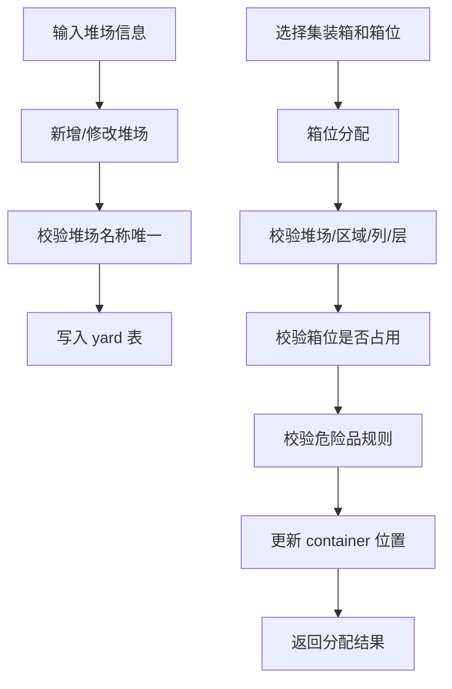

### 7.2 输入、处理、输出表

| 项目 | 内容 |
|---|---|
| 模块名称 | 堆场管理模块 |
| 输入数据 | 堆场名称、类型、容量、地址、负责人、目标箱位、船舶 ID |
| 输入来源 | 堆场管理页面、智能分配操作 |
| 处理逻辑 | 堆场增删改查；箱位合法性校验；箱位占用校验；危险品堆场规则校验；按船舶智能分配箱位 |
| 业务规则 | 堆场名称唯一；启用堆场才能分配；箱位不能重复占用；危险品箱必须放危险品堆场 |
| 输出数据 | 堆场列表、容量利用率、分配结果、智能分配结果 |
| 输出去向 | 堆场页面、首页地图、集装箱位置展示 |
| 关联数据表 | `yard`、`container`、`ship` |
| 主要接口 | `/yards`、`/yards/assign`、`/yards/smart_assign_ship` |

### 7.3 输入字段设计

| 字段 | 类型 | 必填 | 说明 |
|---|---|---|---|
| `yardName` | String | 是 | 堆场名称 |
| `usageType` | String | 否 | 堆场类型 |
| `code` | String | 否 | 堆场编号 |
| `totalCapacity` | Integer | 否 | 总容量 |
| `address` | String | 否 | 地址 |
| `manager` | String | 否 | 负责人 |
| `contactPhone` | String | 否 | 联系电话 |
| `status` | String | 否 | 启用状态 |

箱位分配输入：

| 字段 | 类型 | 必填 | 说明 |
|---|---|---|---|
| `containerId` | Integer | 是 | 集装箱 ID |
| `yardName` | String | 是 | 目标堆场 |
| `zone` | String | 是 | 目标区域 |
| `row` | Integer | 是 | 目标列 |
| `tier` | Integer | 是 | 目标层 |

### 7.4 输出字段设计

| 字段 | 类型 | 说明 |
|---|---|---|
| `yardName` | String | 堆场名称 |
| `usageType` | String | 堆场类型 |
| `totalCapacity` | Integer | 总容量 |
| `usedCapacity` | Integer | 已用容量 |
| `remainingCapacity` | Integer | 剩余容量 |
| `usageRate` | Float | 使用率 |
| `assignments` | Array | 智能分配成功明细 |
| `skipped` | Array | 智能分配跳过明细 |

## 8. 码头作业单模块

### 8.1 IPO 设计图

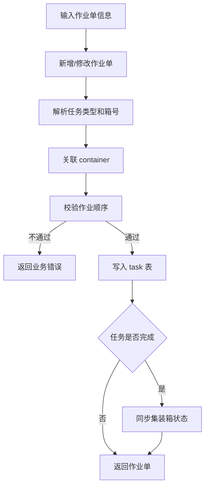

### 8.2 输入、处理、输出表

| 项目 | 内容 |
|---|---|
| 模块名称 | 码头作业单模块 |
| 输入数据 | 任务名称、箱号、起点、终点、优先级、状态、备注 |
| 输入来源 | 码头作业页面、船舶清单导入、后台自动作业、进口提箱 |
| 处理逻辑 | 创建任务；修改任务；推进任务状态；校验任务阶段；完成任务后同步箱状态 |
| 业务规则 | 任务名称必填；后续作业不能越过前置作业；任务完成后释放设备并同步集装箱 |
| 输出数据 | 作业单列表、作业单详情、状态更新结果 |
| 输出去向 | 码头作业页面、设备页面、首页统计 |
| 关联数据表 | `task`、`container`、`equipment` |
| 主要接口 | `/tasks`、`/tasks/{id}`、`/tasks/{id}/next_status` |

### 8.3 输入字段设计

| 字段 | 类型 | 必填 | 说明 |
|---|---|---|---|
| `taskName` | String | 是 | 作业名称 |
| `containerNo` | String | 否 | 集装箱号 |
| `containerDbId` | Integer | 否 | 集装箱数据库 ID |
| `origin` | String | 否 | 起点 |
| `destination` | String | 否 | 终点 |
| `yardSlot` | String | 否 | 最终箱位或备注 |
| `status` | String | 否 | 作业状态 |
| `priority` | Integer | 否 | 优先级 |

### 8.4 输出字段设计

| 字段 | 类型 | 说明 |
|---|---|---|
| `taskNo` | String | 作业单号 |
| `taskName` | String | 作业名称 |
| `containerId` | String | 箱号 |
| `origin` | String | 起点 |
| `destination` | String | 终点 |
| `status` | String | 状态 |
| `priority` | Integer | 优先级 |
| `equipmentId` | Integer | 绑定设备 ID |
| `equipmentName` | String | 绑定设备名称 |

## 9. 设备调度模块

### 9.1 IPO 设计图

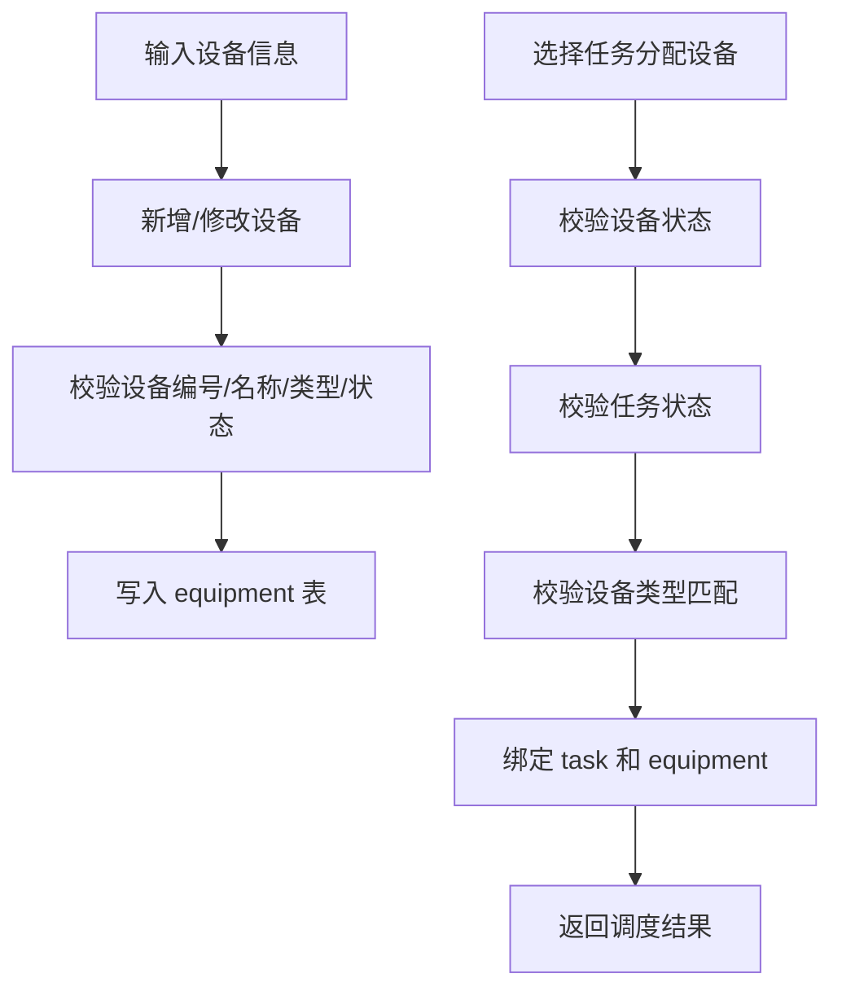

### 9.2 输入、处理、输出表

| 项目 | 内容 |
|---|---|
| 模块名称 | 设备调度模块 |
| 输入数据 | 设备编号、设备名称、设备类型、状态、位置、效率、任务 ID、故障备注 |
| 输入来源 | 设备管理页面、AGV 自动调度操作、作业完成操作 |
| 处理逻辑 | 设备增删改查；分配任务；AGV 自动调度；释放设备；标记故障；维修恢复 |
| 业务规则 | 设备编号唯一；故障设备不能分配任务；工作中设备不能删除；设备类型必须匹配任务 |
| 输出数据 | 设备列表、设备统计、任务分配结果、AGV 调度结果、维修结果 |
| 输出去向 | 设备页面、首页统计、作业单页面 |
| 关联数据表 | `equipment`、`task`、`container` |
| 主要接口 | `/equipment`、`/equipment/summary`、`/equipment/{id}/assign_task`、`/equipment/agv_dispatch` |

### 9.3 输入字段设计

| 字段 | 类型 | 必填 | 说明 |
|---|---|---|---|
| `code` | String | 是 | 设备编号 |
| `name` | String | 是 | 设备名称 |
| `equipmentType` | String | 是 | 岸桥、场桥、AGV |
| `status` | String | 否 | 空闲、工作中、故障 |
| `location` | String | 否 | 当前位置 |
| `efficiency` | Integer | 否 | 作业效率 |
| `remark` | String | 否 | 备注 |
| `taskId` | Integer | 分配任务时必填 | 要分配的任务 |

### 9.4 输出字段设计

| 字段 | 类型 | 说明 |
|---|---|---|
| `code` | String | 设备编号 |
| `name` | String | 设备名称 |
| `equipmentType` | String | 设备类型 |
| `status` | String | 当前状态 |
| `currentTaskId` | Integer | 当前任务 ID |
| `currentTaskName` | String | 当前任务名称 |
| `currentContainer` | String | 当前作业箱号 |
| `assignedCount` | Integer | AGV 调度分配数量 |
| `assignments` | Array | 分配明细 |

## 10. 进口闭环模块

### 10.1 IPO 设计图

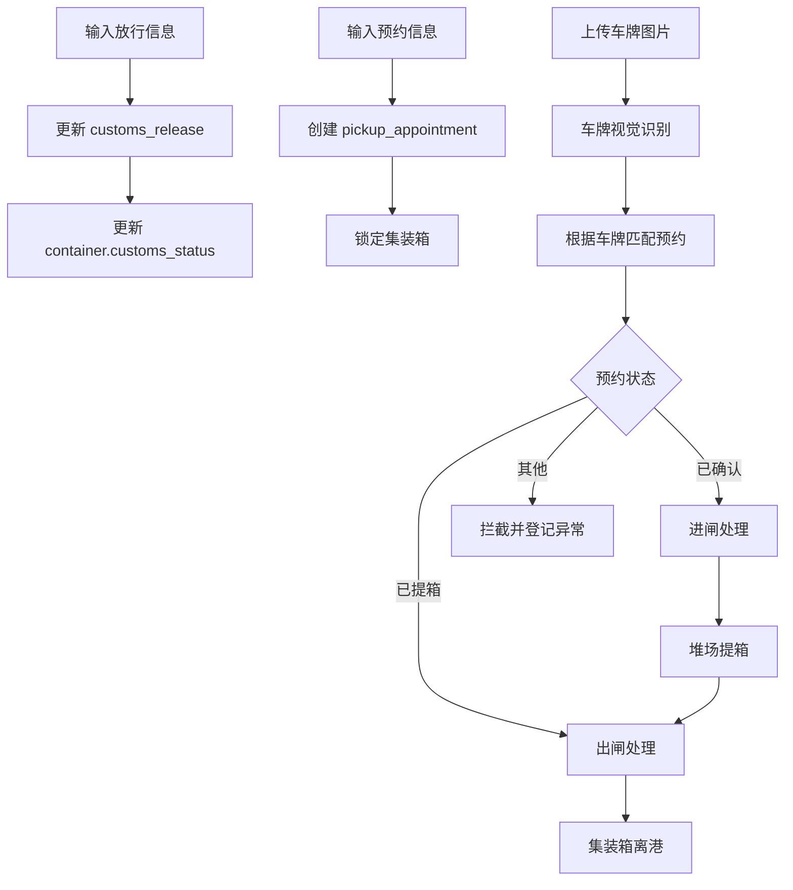

### 10.2 输入、处理、输出表

| 项目 | 内容 |
|---|---|
| 模块名称 | 进口闭环模块 |
| 输入数据 | 放行状态、预约信息、车牌号、闸口图片、人工进出闸信息、异常信息 |
| 输入来源 | 进口闭环页面、车牌识别模块、人工备用表单 |
| 处理逻辑 | 放行；预约；进闸校验；车牌识别；堆场提箱；出闸校验；异常登记和关闭 |
| 业务规则 | 未放行不能预约；未预约不能进闸；未进闸不能提箱；未提箱不能出闸；车牌和预约必须一致 |
| 输出数据 | 总览数据、预约单、闸口记录、异常记录、提箱任务、状态变更结果 |
| 输出去向 | 进口闭环页面、闸口记录表、异常闭环列表 |
| 关联数据表 | `container`、`customs_release`、`pickup_appointment`、`gate_transaction`、`exception_record`、`task` |
| 主要接口 | `/api/import/**` |

### 10.3 输入字段设计

预约输入：

| 字段 | 类型 | 必填 | 说明 |
|---|---|---|---|
| `containerNo` | String | 是 | 预约箱号 |
| `truckPlate` | String | 是 | 预约车牌 |
| `driverName` | String | 否 | 司机 |
| `driverPhone` | String | 否 | 电话 |
| `customer` | String | 否 | 客户 |
| `timeWindowStart` | String | 是 | 预约开始 |
| `timeWindowEnd` | String | 是 | 预约结束 |

闸口输入：

| 字段 | 类型 | 必填 | 说明 |
|---|---|---|---|
| `image` | File | 视觉识别必填 | 闸口图片 |
| `gateType` | String | 否 | auto、in、out |
| `appointmentNo` | String | 人工备用建议填写 | 预约号 |
| `containerNo` | String | 人工备用建议填写 | 箱号 |
| `truckPlate` | String | 人工备用建议填写 | 车牌 |

### 10.4 输出字段设计

| 字段 | 类型 | 说明 |
|---|---|---|
| `recognizedPlate` | String | 识别车牌 |
| `gateType` | String | 进闸/出闸 |
| `appointment` | Object | 预约单 |
| `containerNo` | String | 预约绑定箱号 |
| `data` | Object | 闸口记录 |
| `ticketNo` | String | 闸口小票 |
| `message` | String | 操作结果说明 |

## 11. 车牌视觉识别模块

### 11.1 IPO 设计图

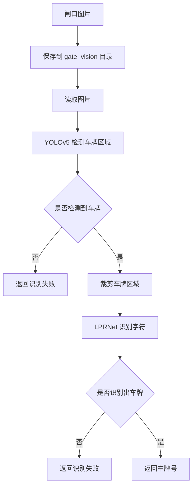

### 11.2 输入、处理、输出表

| 项目 | 内容 |
|---|---|
| 模块名称 | 车牌视觉识别模块 |
| 输入数据 | 闸口车辆图片 |
| 输入来源 | 进口闭环页面上传图片 |
| 处理逻辑 | 保存图片；兼容中文路径读取；YOLOv5 检测车牌区域；LPRNet 识别车牌字符；车牌号规范化 |
| 业务规则 | 只识别车牌，不识别集装箱号；识别结果用于匹配预约单 |
| 输出数据 | 车牌号或识别失败原因 |
| 输出去向 | 进口闭环自动闸口接口 |
| 关联文件 | `license_plate_recognizer.py`、`yolov5_best.pt`、`lprnet_best.pth` |
| 主要接口 | `/api/import/gate/vision` |

### 11.3 输入字段设计

| 字段 | 类型 | 必填 | 说明 |
|---|---|---|---|
| `image` | File | 是 | 闸口图片 |
| `gateType` | String | 否 | 自动判断或指定进出闸 |

### 11.4 输出字段设计

| 字段 | 类型 | 说明 |
|---|---|---|
| `recognizedPlate` | String | 识别出的车牌号 |
| `message` | String | 成功或失败说明 |

识别失败输出示例：

```json
{
  "message": "车牌视觉识别失败：YOLOv5 + LPRNet 车牌识别失败：YOLOv5 未检测到车牌区域"
}
```

## 12. 财务计费模块

### 12.1 IPO 设计图

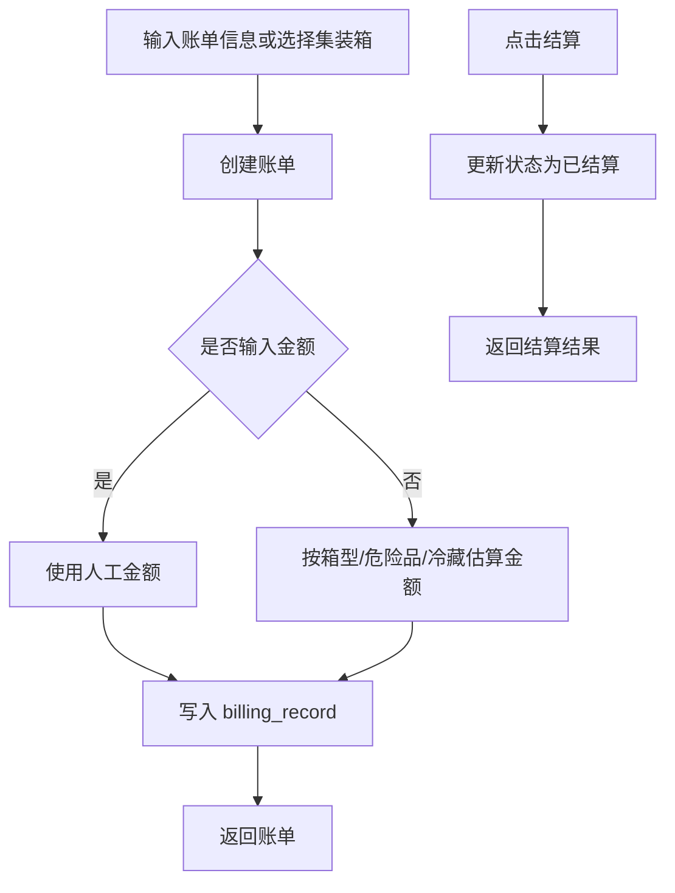

### 12.2 输入、处理、输出表

| 项目 | 内容 |
|---|---|
| 模块名称 | 财务计费模块 |
| 输入数据 | 集装箱、客户、费用类型、金额、备注、结算操作 |
| 输入来源 | 财务计费页面、进口闭环后的结算需求 |
| 处理逻辑 | 财务汇总；账单列表；手动创建账单；按集装箱自动估算费用；账单结算 |
| 业务规则 | 账单号唯一；按箱型、冷藏、危险品估算费用；结算后记录结算时间 |
| 输出数据 | 财务汇总、账单列表、账单详情、结算结果 |
| 输出去向 | 财务计费页面 |
| 关联数据表 | `billing_record`、`container`、`pickup_appointment` |
| 主要接口 | `/api/finance/summary`、`/api/finance/bills`、`/api/finance/bills/{id}/settle` |

### 12.3 输入字段设计

| 字段 | 类型 | 必填 | 说明 |
|---|---|---|---|
| `containerId` | Integer | 否 | 集装箱 ID |
| `containerNo` | String | 否 | 集装箱号 |
| `customer` | String | 否 | 客户 |
| `chargeType` | String | 否 | 费用类型 |
| `amount` | Float | 否 | 金额，不填则自动估算 |
| `status` | String | 否 | 账单状态 |
| `remark` | String | 否 | 备注 |

### 12.4 输出字段设计

| 字段 | 类型 | 说明 |
|---|---|---|
| `billNo` | String | 账单号 |
| `containerNo` | String | 箱号 |
| `customer` | String | 客户 |
| `chargeType` | String | 费用类型 |
| `amount` | Float | 金额 |
| `status` | String | 未结算/已结算 |
| `generatedAt` | String | 生成时间 |
| `settledAt` | String | 结算时间 |

## 13. 危险品管理模块

### 13.1 IPO 设计图

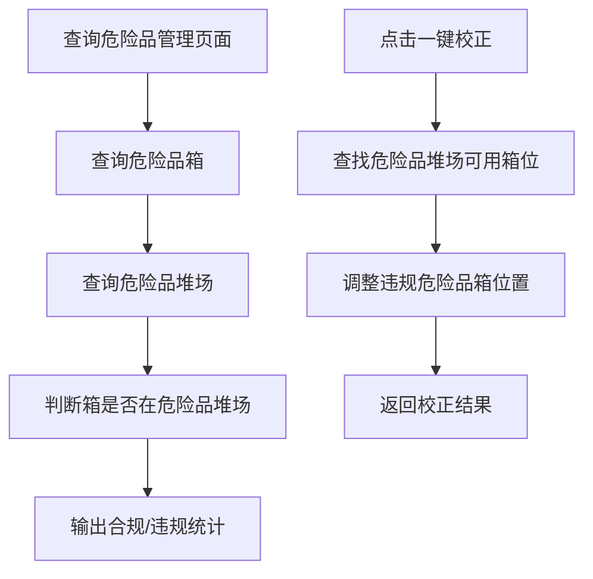

### 13.2 输入、处理、输出表

| 项目 | 内容 |
|---|---|
| 模块名称 | 危险品管理模块 |
| 输入数据 | 危险品箱查询请求、重新分配请求 |
| 输入来源 | 危险品管理页面、集装箱管理、堆场分配 |
| 处理逻辑 | 查询危险品箱；判断是否在危险品堆场；统计违规数量；将违规箱重新分配到危险品堆场 |
| 业务规则 | 危险品箱必须在危险品堆场；危险品堆场不存在时不能自动校正 |
| 输出数据 | 危险品统计、危险品箱列表、违规箱列表、校正结果 |
| 输出去向 | 危险品管理页面 |
| 关联数据表 | `container`、`yard` |
| 主要接口 | `/api/dangerous/overview`、`/api/dangerous/reassign` |

### 13.3 输出字段设计

| 字段 | 类型 | 说明 |
|---|---|---|
| `dangerousCount` | Integer | 危险品箱数量 |
| `compliantCount` | Integer | 合规数量 |
| `violationCount` | Integer | 违规数量 |
| `dangerousYardCount` | Integer | 危险品堆场数量 |
| `containers` | Array | 危险品箱列表 |
| `violations` | Array | 违规箱列表 |
| `dangerousYards` | Array | 危险品堆场列表 |
| `assignedCount` | Integer | 已校正数量 |
| `skippedCount` | Integer | 跳过数量 |

## 14. 模块 IPO 总表

| 模块 | 输入 | 处理 | 输出 |
|---|---|---|---|
| 用户登录与权限 | 用户名、密码、访问路径 | 校验账号、写入 session、角色权限判断 | 用户信息、权限列表、登录结果、401/403 响应 |
| 首页驾驶舱 | 统计请求 | 查询各业务表并汇总 KPI | KPI、图表数据、堆场/设备/任务状态 |
| 集装箱管理 | 箱号、箱型、属性、位置、状态 | 箱信息维护、危险品规则校验、状态流转 | 集装箱列表、详情、状态变更结果 |
| 船舶计划 | 船名、航次、Excel 清单 | 船舶维护、清单解析、自动作业启动 | 船舶列表、导入结果、自动作业状态 |
| 堆场管理 | 堆场信息、箱位信息、船舶 ID | 堆场维护、箱位校验、智能分配 | 堆场列表、容量统计、分配结果 |
| 作业单管理 | 任务名称、箱号、起点、终点、状态 | 作业单维护、作业顺序校验、状态推进 | 作业单列表、任务状态、箱状态同步结果 |
| 设备调度 | 设备信息、任务 ID、故障备注 | 设备维护、任务分配、AGV 调度、故障维修 | 设备列表、调度结果、设备状态 |
| 进口闭环 | 放行信息、预约信息、闸口图片、人工闸口信息 | 放行、预约、识别、进出闸、提箱、异常闭环 | 预约单、闸口记录、异常记录、通行/拦截结果 |
| 车牌识别 | 闸口图片 | YOLOv5 检测车牌、LPRNet 识别字符 | 车牌号、识别失败原因 |
| 财务计费 | 箱号、客户、费用类型、金额 | 费用估算、账单生成、账单结算 | 财务汇总、账单列表、结算结果 |
| 危险品管理 | 查询请求、校正请求 | 危险品合规判断、违规箱位重新分配 | 合规统计、违规列表、校正结果 |

## 15. 模块间数据传递关系

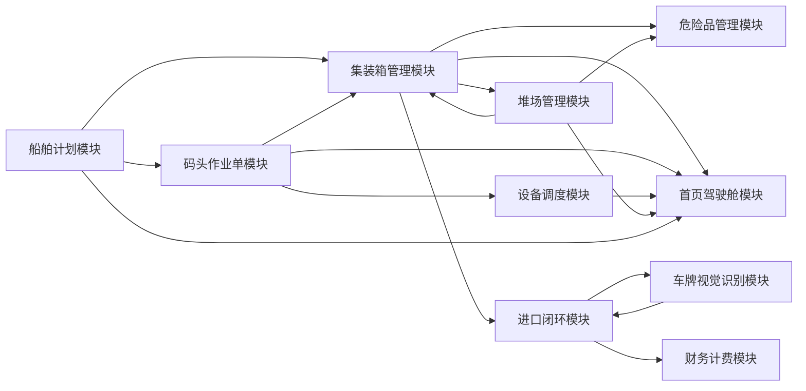

模块间数据说明：

| 来源模块 | 目标模块 | 传递数据 | 说明 |
|---|---|---|---|
| 船舶计划 | 集装箱管理 | 船舶清单中的箱信息 | 导入清单后创建或更新集装箱 |
| 船舶计划 | 作业单管理 | 卸船任务 | 导入清单后生成卸船作业单 |
| 作业单管理 | 设备调度 | 作业单 ID、任务类型 | 设备根据任务类型进行分配 |
| 设备调度 | 作业单管理 | 设备状态、任务状态 | 设备释放后任务完成 |
| 作业单管理 | 集装箱管理 | 箱状态、箱位置 | 作业完成后同步箱状态 |
| 堆场管理 | 集装箱管理 | 堆场、区域、列、层 | 箱位分配后更新箱位置 |
| 集装箱管理 | 进口闭环 | 箱号、放行状态、预约状态 | 进口提箱业务依赖箱状态 |
| 车牌识别 | 进口闭环 | 车牌号 | 闸口自动匹配预约 |
| 进口闭环 | 财务计费 | 箱号、客户、危险品/冷藏属性 | 用于生成账单 |
| 集装箱管理 | 危险品管理 | 危险品标志、箱位 | 判断危险品合规性 |
| 各业务模块 | 首页驾驶舱 | 统计数据 | 首页展示 KPI |

## 16. 输出结果分类

系统输出可以分为以下几类：

| 输出类型 | 示例 | 用途 |
|---|---|---|
| 查询结果 | 集装箱列表、堆场列表、设备列表 | 页面表格展示 |
| 统计结果 | KPI、财务汇总、危险品统计 | 首页和模块仪表盘 |
| 操作结果 | 新增成功、修改成功、删除成功 | 用户操作反馈 |
| 状态变更结果 | 任务状态更新、预约状态更新 | 展示业务推进 |
| 调度结果 | AGV 分配结果、设备释放结果 | 设备管理 |
| 识别结果 | recognizedPlate | 自动闸口 |
| 异常结果 | 闸口拦截、识别失败、箱位占用 | 错误提示和异常闭环 |
| 业务单据 | 预约单、闸口小票、账单 | 业务追踪 |

## 17. 总结

当前系统采用模块化设计，每个模块都有明确的输入、处理和输出：

- 输入侧覆盖用户操作、业务表单、Excel 文件、闸口图片和自动调度请求。
- 处理侧由 Flask 后端完成权限校验、业务规则校验、状态流转、数据库写入和模型识别。
- 输出侧以 JSON 响应、页面表格、统计图表、业务记录和异常提示为主。

从整体上看，系统数据以“集装箱”为核心主线，围绕船舶、堆场、作业、设备、进口闸口、财务和危险品管理形成完整闭环：

```text
船舶清单导入 -> 集装箱生成 -> 作业调度 -> 堆场入堆 -> 放行预约 -> 闸口进出 -> 财务结算
```

该 IPO 设计能够清晰说明每个模块的数据来源、处理规则和输出结果，适合用于系统设计报告和课程设计答辩。

